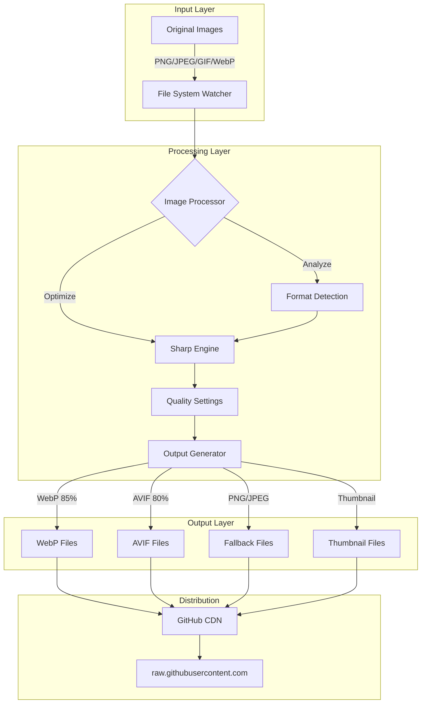
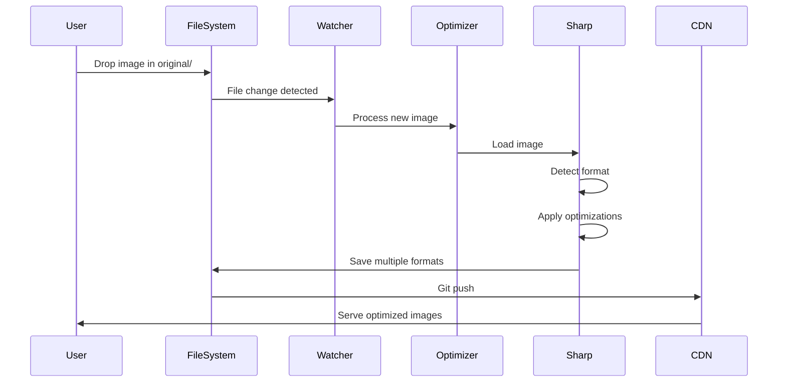
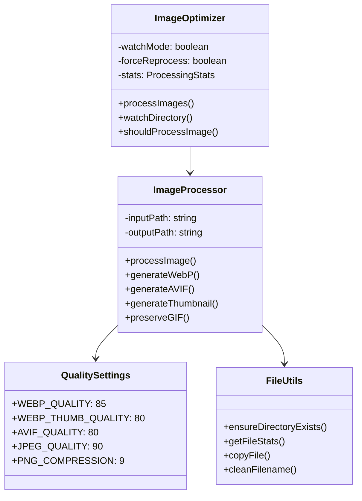
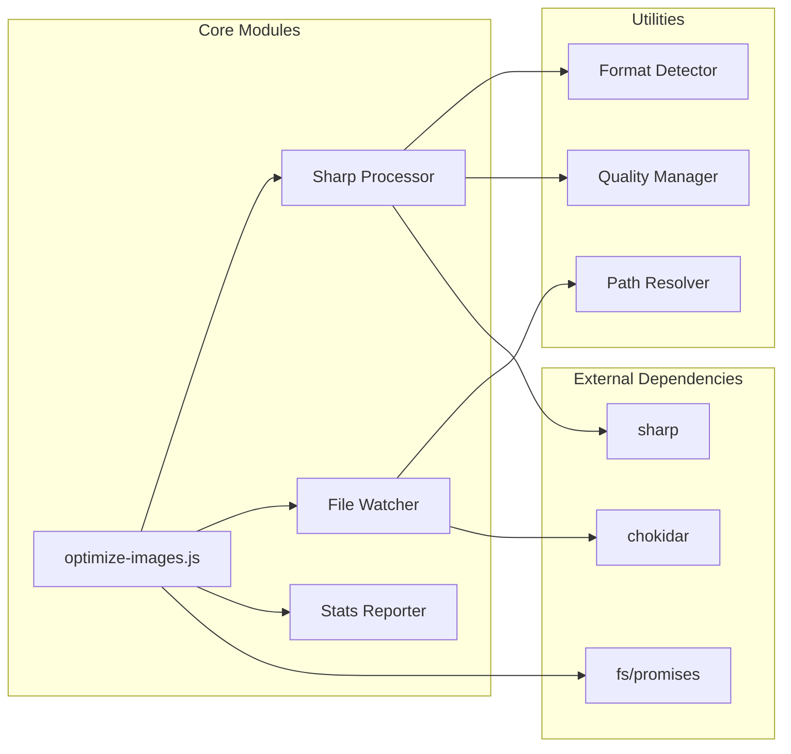
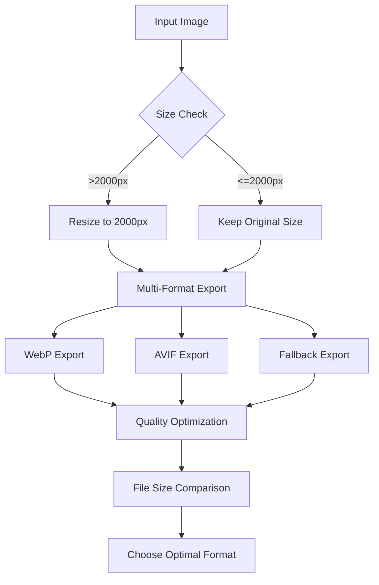
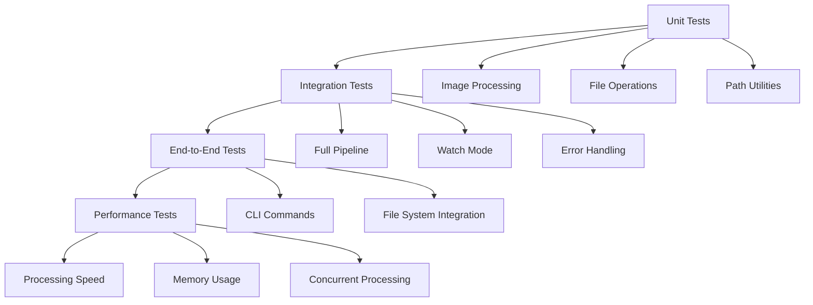

# Image Dump

[](https://github.com/james/image-dump/actions/workflows/test.yml)
[](https://github.com/james/image-dump/actions/workflows/optimize-images.yml)

A personal image hosting repository so I can use GitHub's raw.githubusercontent.com as a free CDN.

## Structure

Repo is prettu simple:

- `original/` - Source images (tracked by Git LFS)
- `optimized/` - Processed images ready for use
- `scripts/` - Image optimization tooling

## Usage

Dump images into the `original` directory, then run `npm run optimize`, or `npm run optimize:watch` if you want to run with a file watcher enabled.

### Adding New Images

1. Drop images into `original/`
2. Run `npm run optimize`
3. Commit and push

### Using Images

**In GitHub READMEs:**
```markdown

```

**In HTML with fallback:**
```html
<picture>
  <source srcset="https://raw.githubusercontent.com/YOUR_USERNAME/image-dump/main/optimized/image.webp" type="image/webp">
  
</picture>
```

## What Gets Generated

For each image in `original/`, the optimization script creates:
- **WebP version** - Modern format, smaller file size
- **AVIF version** - Next-gen format, even better compression (not all browsers support yet)
- **Optimized PNG/JPEG** - Fallback for compatibility (max 2000x2000)
- **Thumbnail** - WebP thumbnail (max 400x400) with `-thumb` suffix

Special handling:
- **GIF files** - Copied as-is to preserve animation
- **WebP input** - Optimized and thumbnailed, but kept as WebP

## Setup

### Using Docker (Recommended)

No need to install Node.js or any dependencies locally!

#### Option 1: Using Make (Simplest)
```bash
# Run optimization
make optimize

# Force reprocess all images
make optimize-force

# Run tests
make test

# See all available commands
make help
```

#### Option 2: Using npm scripts
```bash
# Build Docker images
npm run docker:build

# Run optimization
npm run optimize:docker

# Force reprocess all images
npm run optimize:docker:force

# Run with Git LFS support
npm run optimize:docker:lfs

# Run tests
npm run test:docker

# Run tests with coverage
npm run test:docker:coverage
```

### Using Node.js Directly

```bash
# Install dependencies
npm install

# Run optimization
npm run optimize

# Force reprocess all images (ignores timestamps)
npm run optimize -- --force

# Run with Git LFS support
npm run optimize -- --pull-lfs
```

## Technical Details

- Uses [Sharp](https://sharp.pixelplumbing.com/) for image processing
- Git LFS stores original images efficiently
- Optimized images are version controlled normally for fast CDN access
- Supported input formats: PNG, JPEG, GIF, WebP
- WebP quality: 85% (80% for thumbnails)
- AVIF quality: 80%
- JPEG quality: 90%
- PNG compression: Level 9
- EXIF metadata stripped for privacy

### Docker Architecture

The project is fully dockerized for consistency across environments:

- **Production Image**: Alpine-based, minimal dependencies, optimized for running the optimization script
- **Test Image**: Includes dev dependencies for running the test suite
- **Volume Mounts**: 
  - `./original` → `/app/original` (read-only)
  - `./optimized` → `/app/optimized` (read-write)
  - `./.git` → `/app/.git` (for Git LFS operations)
- **Benefits**:
  - No local Node.js installation required
  - Consistent Sharp/libvips versions across all platforms
  - Isolated environment prevents dependency conflicts
  - Same environment in CI/CD and local development

---

## Technical Architecture

### System Overview



### Data Flow Architecture



### Component Architecture



## Technical Design Document

### 1. System Architecture

#### 1.1 Overview
The Image Dump system is a Node.js-based image optimization pipeline that leverages GitHub as a CDN for serving optimized images. It uses Sharp for high-performance image processing and Git LFS for efficient storage of original assets.

#### 1.2 Technology Stack
- **Runtime**: Node.js (v16+)
- **Image Processing**: Sharp (libvips-based)
- **Version Control**: Git with LFS
- **CDN**: GitHub raw.githubusercontent.com
- **Build Tools**: npm scripts
- **File Watching**: Chokidar

#### 1.3 Design Principles
1. **Incremental Processing**: Only process changed images
2. **Format Diversity**: Support multiple modern formats (WebP, AVIF)
3. **Progressive Enhancement**: Provide fallbacks for older browsers
4. **Performance First**: Optimize for smallest file sizes
5. **Privacy Conscious**: Strip EXIF metadata

### 2. Module Design



### 3. Performance Optimization Strategy



## Feature List

### ✅ Completed Features
- [x] Automatic image optimization on file drop
- [x] Multi-format output (WebP, AVIF, PNG/JPEG)
- [x] Thumbnail generation with `-thumb` suffix
- [x] File watching mode for development
- [x] Incremental processing (skip unchanged files)
- [x] Force reprocess flag
- [x] EXIF metadata stripping
- [x] GIF preservation (no conversion)
- [x] Processing statistics reporting
- [x] Git LFS integration for originals
- [x] Git LFS pointer file detection and handling
- [x] Automated GitHub Actions workflows
- [x] Comprehensive test suite with Jest
- [x] Full Docker containerization
- [x] Docker Compose for local development
- [x] CI/CD pipeline with Docker support

### 🚧 In Progress
- [ ] Batch processing progress bar
- [ ] Configuration file support
- [ ] Custom quality settings per image

### 📋 Planned Features

#### Core Features
- [ ] WebUI for image management
- [ ] API endpoint for programmatic access
- [ ] Image comparison tool
- [ ] Automatic git commit after optimization
- [ ] Webhook notifications on new images
- [ ] S3/CloudFront integration option
- [ ] Image metadata preservation options
- [ ] Smart cropping for thumbnails
- [ ] Batch rename utility
- [ ] Duplicate detection
- [ ] Image optimization reports
- [ ] CDN cache purging
- [ ] Multiple thumbnail sizes
- [ ] Responsive image set generation

#### Security & Validation
- [ ] Image validation (prevent zip bombs, polyglot files)
- [ ] Resource limits (memory/CPU caps in Docker)
- [ ] Strict format whitelist validation
- [ ] Malicious file detection
- [ ] Rate limiting for API endpoints

#### Monitoring & Analytics
- [ ] GitHub LFS bandwidth tracking
- [ ] CDN usage analytics dashboard
- [ ] Performance metrics tracking
- [ ] Error alerting for failed optimizations
- [ ] Compression ratio analytics
- [ ] Processing time metrics

#### Developer Experience
- [ ] Pre-commit hooks for auto-optimization
- [ ] VS Code extension
- [ ] CLI tool packaging (npx/brew)
- [ ] Visual diff tool for before/after
- [ ] IntelliJ IDEA plugin
- [ ] Local development dashboard

#### Advanced Image Features
- [ ] Blurhash/LQIP generation
- [ ] HEIC format support (iPhone images)
- [ ] RAW format support (photographers)
- [ ] Batch ZIP upload/download
- [ ] SVG optimization
- [ ] Video thumbnail extraction
- [ ] Animated WebP support
- [ ] HDR image handling

#### Infrastructure & Optimization
- [ ] Multi-CDN fallback support
- [ ] Selective format generation
- [ ] Automated cleanup of old versions
- [ ] LFS migration tool for existing repos
- [ ] Edge caching optimization
- [ ] Bandwidth optimization mode

## User Stories

### As a Developer
1. **Quick Image Hosting**: As a developer, I want to drop images into a folder and have them automatically optimized and available via CDN so I can quickly use them in my projects.
   - **Acceptance Criteria**:
     - Images are processed within 5 seconds
     - Multiple formats are generated
     - CDN URL is predictable and stable

2. **README Integration**: As a developer, I want to easily embed images in GitHub READMEs with optimal performance.
   - **Acceptance Criteria**:
     - WebP format is used by default
     - Fallback URLs are documented
     - Markdown syntax is provided

3. **Development Workflow**: As a developer, I want a watch mode that automatically processes new images as I add them.
   - **Acceptance Criteria**:
     - File watcher detects new images immediately
     - Console shows processing status
     - Errors are clearly reported

### As a Content Creator
1. **Batch Processing**: As a content creator, I want to process multiple images at once without manual intervention.
   - **Acceptance Criteria**:
     - All images in original/ are processed
     - Progress is shown in terminal
     - Summary statistics are displayed

2. **Quality Control**: As a content creator, I want my images optimized without visible quality loss.
   - **Acceptance Criteria**:
     - Quality settings maintain visual fidelity
     - File sizes are significantly reduced
     - Original images are preserved

### As a Website Owner
1. **Performance Optimization**: As a website owner, I want the smallest possible file sizes for fast page loads.
   - **Acceptance Criteria**:
     - Modern formats (WebP, AVIF) are prioritized
     - Images are properly compressed
     - Appropriate format is served based on browser

2. **SEO Friendly**: As a website owner, I want proper image formats and sizes for better SEO.
   - **Acceptance Criteria**:
     - Multiple sizes available
     - Proper fallbacks for all browsers
     - Clean, descriptive filenames

## Development Roadmap

### Phase 1: Core Functionality ✅
- [x] Basic image optimization script
- [x] Sharp integration
- [x] Multi-format output
- [x] File watching
- [x] Git LFS setup

### Phase 2: Enhanced Processing 🚧
- [x] Incremental processing
- [x] Force reprocess option
- [x] Processing statistics
- [ ] Progress indicators
- [ ] Error recovery

### Phase 3: Configuration & Customization 🚧
- [ ] Config file support (.imagerc)
- [ ] Per-image quality settings
- [ ] Custom output paths
- [ ] Format selection options
- [ ] Metadata preservation options

### Phase 4: Security & Validation 📋
- [ ] Image validation system
- [ ] Resource limits implementation
- [ ] Format whitelist enforcement
- [ ] Malicious file detection
- [ ] Security audit and hardening

### Phase 5: Web Interface & API 📋
- [ ] Express.js API server
- [ ] Upload endpoint with validation
- [ ] Image gallery view
- [ ] Batch operations UI
- [ ] Real-time processing status
- [ ] RESTful API documentation
- [ ] Rate limiting

### Phase 6: Developer Experience 📋
- [ ] Pre-commit hooks
- [ ] VS Code extension
- [ ] CLI packaging (npx)
- [ ] Visual diff tool
- [ ] Homebrew formula
- [ ] Development dashboard

### Phase 7: Advanced Image Processing 📋
- [ ] Blurhash/LQIP generation
- [ ] HEIC format support
- [ ] RAW format support
- [ ] SVG optimization
- [ ] Video thumbnail extraction
- [ ] Animated WebP support
- [ ] HDR image handling

### Phase 8: Infrastructure & Monitoring 📋
- [ ] GitHub LFS bandwidth tracking
- [ ] CDN usage analytics
- [ ] Performance metrics
- [ ] Error alerting
- [ ] Multi-CDN fallback
- [ ] Edge caching optimization

### Phase 9: Intelligence & Automation 📋
- [ ] AI-powered smart cropping
- [ ] Duplicate detection
- [ ] Auto-tagging
- [ ] Content-aware compression
- [ ] Batch renaming with patterns
- [ ] Automated cleanup policies

## Test-Driven Development (TDD) Plan

### Testing Strategy



### Test Coverage Goals
- Unit Tests: 90% coverage
- Integration Tests: 80% coverage
- E2E Tests: Core user journeys
- Performance: Baseline metrics established

### Test Implementation Plan

#### Phase 1: Unit Tests
```javascript
// test/unit/image-processor.test.js
describe('ImageProcessor', () => {
  test('should detect image format correctly')
  test('should apply correct quality settings')
  test('should generate WebP with proper compression')
  test('should generate AVIF when supported')
  test('should preserve GIF animations')
  test('should strip EXIF metadata')
})

// test/unit/file-utils.test.js
describe('FileUtils', () => {
  test('should ensure directory exists')
  test('should get file stats accurately')
  test('should clean filenames properly')
  test('should handle special characters')
})
```

#### Phase 2: Integration Tests
```javascript
// test/integration/pipeline.test.js
describe('Image Pipeline', () => {
  test('should process single image through full pipeline')
  test('should handle multiple images concurrently')
  test('should skip already processed images')
  test('should force reprocess when flag is set')
  test('should handle corrupted images gracefully')
})
```

#### Phase 3: E2E Tests
```javascript
// test/e2e/cli.test.js
describe('CLI Operations', () => {
  test('npm run optimize processes all images')
  test('npm run optimize:watch detects new files')
  test('--force flag reprocesses all images')
  test('proper error messages on failure')
})
```

### Continuous Integration

```yaml
# .github/workflows/test.yml
name: Test Suite
on: [push, pull_request]
jobs:
  test:
    runs-on: ubuntu-latest
    steps:
      - uses: actions/checkout@v3
      - uses: actions/setup-node@v3
      - run: npm ci
      - run: npm test
      - run: npm run test:coverage
```

## Task Tracking

### Completed Tasks ✅
- [x] Initial repository setup
- [x] Basic optimization script
- [x] Sharp integration for image processing
- [x] Multi-format output (WebP, AVIF, PNG/JPEG)
- [x] Thumbnail generation
- [x] File watching mode
- [x] Git LFS configuration
- [x] Incremental processing
- [x] Force reprocess flag
- [x] EXIF metadata stripping
- [x] Processing statistics
- [x] README documentation

### In Progress 🚧
- [ ] Unit test framework setup
- [ ] Configuration file support
- [ ] Progress bar implementation

### Upcoming Tasks 📋
- [ ] Docker containerization
- [ ] GitHub Actions workflow
- [ ] Web UI development
- [ ] API endpoint creation
- [ ] S3 integration
- [ ] Performance benchmarking
- [ ] Security audit
- [ ] Load testing
- [ ] Documentation website
- [ ] Video tutorial creation

---

## Sections to Consider Removing

Based on the comprehensive tech plan above, you might consider consolidating or removing these sections from the original README to avoid redundancy:

1. **"Technical Details" section** - Now covered more comprehensively in the Technical Architecture and Design Document
2. **"What Gets Generated" section** - Could be merged into the Feature List or kept as a quick reference
3. **"Structure" section** - The typo ("prettu") should be fixed, but this could be merged into the Technical Architecture