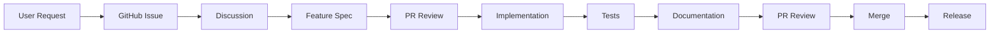

# Project Organization Guide

## Overview

This document explains how the Image Dump project is organized, how to manage features, and how to contribute effectively.

## 📁 Repository Structure

```
image-dump/
├── .github/                    # GitHub configuration
│   ├── workflows/             # CI/CD pipelines
│   └── ISSUE_TEMPLATE/        # Issue templates
├── docs/                      # Documentation
│   ├── architecture/          # System design docs
│   ├── features/             # Feature specifications
│   ├── guides/               # How-to guides
│   ├── development/          # Dev guides
│   └── api/                  # API documentation
├── scripts/                   # Source code
│   └── lib/                  # Modular components
├── tests/                     # Test suite
├── original/                  # Input images
└── optimized/                # Output images
```

## 🎯 Feature Management Process

### 1. Feature Request
1. Check the [Roadmap](ROADMAP.md) to see if it's planned
2. Search existing issues
3. Create issue using the Feature Request template
4. Discuss in issue comments

### 2. Feature Specification
1. Copy [FEATURE_TEMPLATE.md](features/FEATURE_TEMPLATE.md)
2. Create `docs/features/your-feature.md`
3. Fill out all sections:
   - User stories with acceptance criteria
   - Technical specification
   - Implementation plan
   - Test plan
4. Submit PR for review

### 3. Implementation
1. Feature spec must be approved
2. Create feature branch from main
3. Implement following the spec
4. Write tests (TDD preferred)
5. Update documentation
6. Submit PR linking to issue

### 4. Review & Merge
1. Code review by maintainers
2. All tests must pass
3. Documentation updated
4. Merge to main
5. Close related issue

## 📊 Project Milestones

We organize features into phases/milestones:

- **Phase 3**: Configuration & Customization
- **Phase 4**: Security & Validation
- **Phase 5**: Web Interface & API
- **Phase 6**: Developer Experience
- **Phase 7**: Advanced Image Processing
- **Phase 8**: Infrastructure & Monitoring
- **Phase 9**: Intelligence & Automation

## 🏷️ Issue Labels

- `enhancement` - New features
- `bug` - Something isn't working
- `documentation` - Documentation improvements
- `priority:high/medium/low` - Priority levels
- `phase:N` - Associated milestone
- `good-first-issue` - Good for newcomers
- `help-wanted` - Extra attention needed

## 🤖 Automation

### GitHub Actions
- **Test Workflow**: Runs on all code changes
- **Optimize Workflow**: Runs when images added to `original/`
- Both workflows use Docker for consistency

### Creating Issues from Specs
```bash
# See what issues would be created
node scripts/create-github-issues.js --dry-run

# Get commands to create issues
node scripts/create-github-issues.js
```

## 📝 Documentation Standards

### Feature Specifications
- Use the template exactly
- Include all sections
- Be specific in acceptance criteria
- Include test scenarios
- Consider security and performance

### Code Documentation
- JSDoc for all public APIs
- Inline comments for complex logic
- README in each major directory
- Keep examples up to date

## 🔄 Workflow Example

Here's how a typical feature flows through the system:



## 🚀 Getting Started with Development

1. **Setup Environment**
   ```bash
   git clone <repo>
   cd image-dump
   make test  # Verify everything works
   ```

2. **Pick an Issue**
   - Check issues labeled `good-first-issue`
   - Read the linked feature spec
   - Comment that you're working on it

3. **Development Cycle**
   ```bash
   git checkout -b feature/your-feature
   # Make changes
   make test  # Run tests
   git commit -m "feat: add your feature"
   git push origin feature/your-feature
   ```

4. **Submit PR**
   - Reference the issue number
   - Ensure all checks pass
   - Request review

## 📊 Project Metrics

Track project health through:
- Test coverage (target: 90%)
- Open issues by priority
- PR review turnaround time
- Feature completion rate
- Performance benchmarks

## 🤝 Contributing

See [Contributing Guide](development/contributing.md) for detailed instructions.

Quick tips:
- Read existing code for style
- Write tests first (TDD)
- Keep PRs focused
- Update docs with code
- Be responsive to feedback

## 📮 Communication

- **Issues**: Bug reports and features
- **Discussions**: General questions
- **PRs**: Code contributions
- **Docs**: Keep them updated!

---

*This organization structure helps us maintain quality while moving fast. When in doubt, ask!*