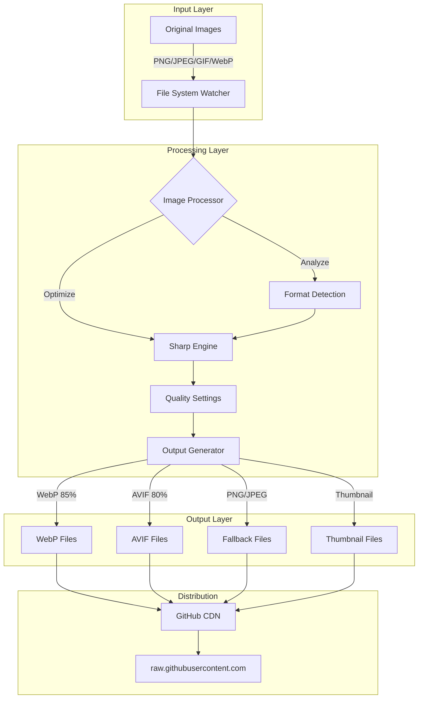
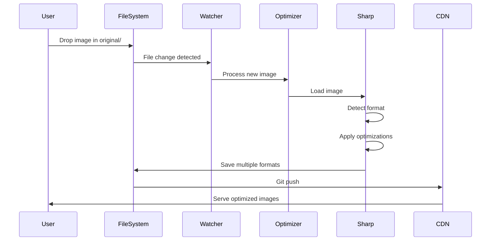
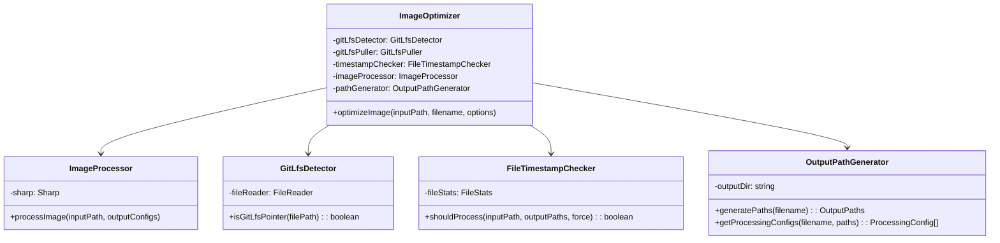
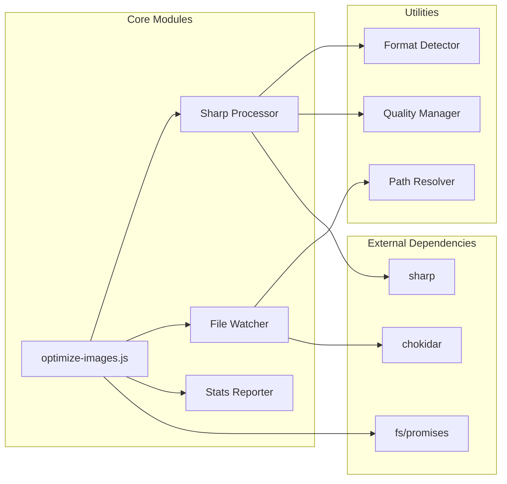
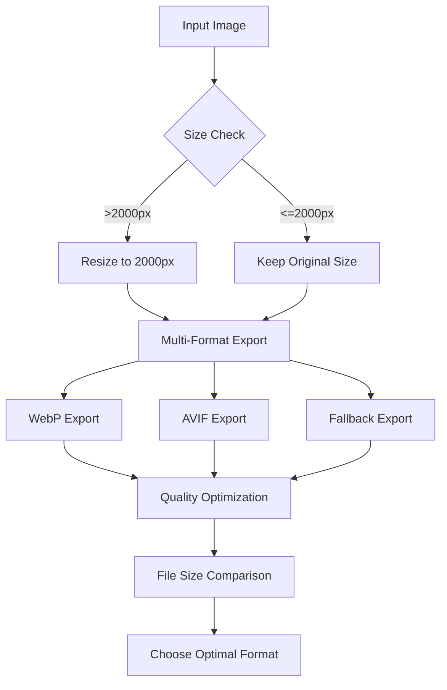

# Technical Architecture

## System Overview

## Data Flow Architecture

## Component Architecture

## Module Design

## Performance Optimization Strategy

## Docker Architecture

The project is fully dockerized for consistency across environments:

- **Production Image**: Alpine-based, minimal dependencies, optimized for running the optimization script
- **Test Image**: Includes dev dependencies for running the test suite
- **Volume Mounts**: 
  - `./original` → `/app/original` (read-only)
  - `./optimized` → `/app/optimized` (read-write)
  - `./.git` → `/app/.git` (for Git LFS operations)
- **Benefits**:
  - No local Node.js installation required
  - Consistent Sharp/libvips versions across all platforms
  - Isolated environment prevents dependency conflicts
  - Same environment in CI/CD and local development

## Technology Stack

- **Runtime**: Node.js (v16+)
- **Image Processing**: Sharp (libvips-based)
- **Version Control**: Git with LFS
- **CDN**: GitHub raw.githubusercontent.com
- **Build Tools**: npm scripts
- **File Watching**: Chokidar
- **Testing**: Jest
- **Containerization**: Docker & Docker Compose
- **CI/CD**: GitHub Actions

## Design Principles

1. **Incremental Processing**: Only process changed images
2. **Format Diversity**: Support multiple modern formats (WebP, AVIF)
3. **Progressive Enhancement**: Provide fallbacks for older browsers
4. **Performance First**: Optimize for smallest file sizes
5. **Privacy Conscious**: Strip EXIF metadata
6. **Modularity**: Single Responsibility Principle throughout
7. **Testability**: Dependency injection for easy testing
8. **Consistency**: Docker ensures same environment everywhere