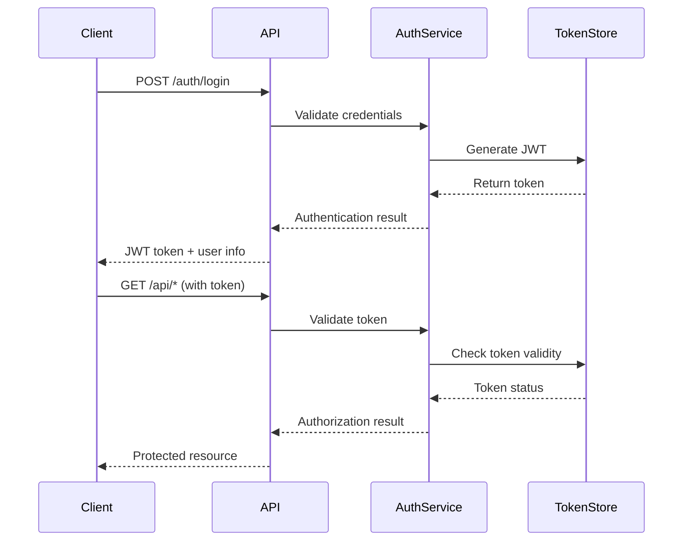

# Authentication System

## 📋 Overview

**Feature ID**: `authentication-system`  
**Phase**: 5 - Web Interface & API  
**Priority**: High  
**Dependencies**: Express.js API Server  
**Status**: Planned  

## 🎯 Description

Implement a comprehensive authentication and authorization system supporting multiple authentication methods, role-based access control, and secure session management for the Image Dump API.

## ✨ Features

### JWT-Based Authentication
- **Token Generation**: Secure JWT token creation with configurable expiration
- **Token Validation**: Middleware for automatic token verification
- **Token Refresh**: Automatic token renewal for active sessions
- **Token Revocation**: Blacklist compromised or expired tokens
- **Payload Security**: Encrypted sensitive data in JWT payload

### OAuth2 Integration
- **Provider Support**: Google, GitHub, Microsoft, Discord integrations
- **OAuth Flow**: Standard authorization code flow implementation
- **Scope Management**: Configurable permission scopes
- **Provider Fallback**: Multiple provider support with preferences
- **Account Linking**: Connect multiple OAuth accounts to single user

### API Key Management
- **Key Generation**: Secure API key creation with entropy validation
- **Key Rotation**: Scheduled and manual key rotation capabilities
- **Usage Tracking**: Monitor API key usage patterns and limits
- **Scope Restrictions**: Limit API key permissions by endpoint/operation
- **Key Revocation**: Immediate key invalidation for security

### Role-Based Access Control (RBAC)
- **Role Definitions**: Admin, Power User, Standard User, Read-Only
- **Permission Matrix**: Granular permissions per operation
- **Dynamic Permissions**: Runtime permission evaluation
- **Role Inheritance**: Hierarchical role relationships
- **Custom Roles**: User-defined roles with specific permissions

### Session Management
- **Session Storage**: Redis-backed session store for scalability
- **Session Security**: Secure session cookies with HTTPOnly/Secure flags
- **Session Timeout**: Configurable idle and absolute timeouts
- **Concurrent Sessions**: Multiple device session management
- **Session Monitoring**: Track active sessions and suspicious activity

### Password Reset Flow
- **Reset Token Generation**: Cryptographically secure reset tokens
- **Email Integration**: Automated password reset emails
- **Token Expiration**: Short-lived reset tokens (15-30 minutes)
- **Security Questions**: Optional secondary verification
- **Account Lockout**: Protection against brute force attacks

## 🔧 Technical Specifications

### Authentication Flow


### JWT Configuration
```javascript
const jwtConfig = {
  secret: process.env.JWT_SECRET,
  expiresIn: '1h',
  refreshExpiresIn: '7d',
  algorithm: 'HS256',
  issuer: 'image-dump-api',
  audience: 'image-dump-client'
};
```

### Role Permission Matrix
```javascript
const permissions = {
  admin: ['*'], // All permissions
  powerUser: [
    'images:upload', 'images:process', 'images:delete',
    'images:bulk-operations', 'api-keys:manage'
  ],
  standardUser: [
    'images:upload', 'images:process', 'images:view'
  ],
  readOnly: [
    'images:view', 'images:download'
  ]
};
```

## 🔒 Security Features

### Password Security
- **Hashing**: bcrypt with configurable salt rounds (12+)
- **Password Policy**: Minimum length, complexity requirements
- **Password History**: Prevent reuse of recent passwords
- **Breach Detection**: Check against known compromised passwords
- **Strength Validation**: Real-time password strength feedback

### Account Security
- **Brute Force Protection**: Rate limiting and account lockout
- **Failed Login Tracking**: Monitor and alert on suspicious activity
- **Device Fingerprinting**: Track and verify known devices
- **Geographic Anomaly**: Alert on logins from unusual locations
- **Multi-Factor Authentication**: TOTP and SMS 2FA support

### Token Security
- **Short Expiration**: Access tokens expire within 1 hour
- **Refresh Rotation**: Refresh tokens rotate on each use
- **Secure Storage**: HTTPOnly, Secure, SameSite cookie attributes
- **Token Binding**: Bind tokens to specific client characteristics
- **Revocation Lists**: Maintain blacklist of revoked tokens

## 📊 Database Schema

### Users Table
```sql
CREATE TABLE users (
  id UUID PRIMARY KEY DEFAULT gen_random_uuid(),
  email VARCHAR(255) UNIQUE NOT NULL,
  password_hash VARCHAR(255),
  role VARCHAR(50) DEFAULT 'standardUser',
  is_active BOOLEAN DEFAULT true,
  email_verified BOOLEAN DEFAULT false,
  created_at TIMESTAMP DEFAULT NOW(),
  updated_at TIMESTAMP DEFAULT NOW(),
  last_login TIMESTAMP,
  failed_login_attempts INTEGER DEFAULT 0,
  locked_until TIMESTAMP
);
```

### Sessions Table
```sql
CREATE TABLE sessions (
  id UUID PRIMARY KEY DEFAULT gen_random_uuid(),
  user_id UUID REFERENCES users(id) ON DELETE CASCADE,
  token_hash VARCHAR(255) NOT NULL,
  expires_at TIMESTAMP NOT NULL,
  created_at TIMESTAMP DEFAULT NOW(),
  last_accessed TIMESTAMP DEFAULT NOW(),
  ip_address INET,
  user_agent TEXT,
  is_active BOOLEAN DEFAULT true
);
```

### API Keys Table
```sql
CREATE TABLE api_keys (
  id UUID PRIMARY KEY DEFAULT gen_random_uuid(),
  user_id UUID REFERENCES users(id) ON DELETE CASCADE,
  key_hash VARCHAR(255) NOT NULL,
  name VARCHAR(100) NOT NULL,
  scopes TEXT[] DEFAULT '{}',
  last_used TIMESTAMP,
  expires_at TIMESTAMP,
  created_at TIMESTAMP DEFAULT NOW(),
  is_active BOOLEAN DEFAULT true
);
```

## 🧪 Testing Strategy

### Authentication Tests
- Login/logout functionality
- Token generation and validation
- Password reset flow
- OAuth integration flows
- Account lockout scenarios

### Authorization Tests
- Role-based access control
- Permission enforcement
- API key restrictions
- Session management
- Cross-user data access prevention

### Security Tests
- Brute force protection
- Token manipulation attempts
- Session hijacking prevention
- Password policy enforcement
- OAuth security vulnerabilities

## 📈 Monitoring & Analytics

### Authentication Metrics
- Login success/failure rates
- Session duration patterns
- API key usage statistics
- OAuth provider preferences
- Geographic login distribution

### Security Monitoring
- Failed login attempts
- Suspicious activity patterns
- Token manipulation attempts
- Account lockout events
- Password reset frequency

### Performance Metrics
- Authentication response times
- Token validation performance
- Database query efficiency
- Cache hit rates
- Concurrent session counts

## 🚀 Implementation Phases

### Phase 5.1: Core Authentication (Week 1-2)
- [ ] JWT token generation and validation
- [ ] Basic login/logout endpoints
- [ ] Password hashing and verification
- [ ] Session management implementation

### Phase 5.2: RBAC System (Week 2-3)
- [ ] Role and permission framework
- [ ] Authorization middleware
- [ ] Permission checking utilities
- [ ] Admin role management

### Phase 5.3: Advanced Features (Week 3-4)
- [ ] OAuth2 provider integration
- [ ] API key management system
- [ ] Password reset flow
- [ ] Account security features

### Phase 5.4: Security Hardening (Week 4-5)
- [ ] Brute force protection
- [ ] Multi-factor authentication
- [ ] Security monitoring
- [ ] Penetration testing

## 🔗 API Endpoints

### Authentication Endpoints
```
POST   /api/v1/auth/register
POST   /api/v1/auth/login
POST   /api/v1/auth/logout
POST   /api/v1/auth/refresh
POST   /api/v1/auth/reset-password
POST   /api/v1/auth/verify-email
```

### OAuth Endpoints
```
GET    /api/v1/auth/oauth/:provider
GET    /api/v1/auth/oauth/:provider/callback
POST   /api/v1/auth/oauth/link
DELETE /api/v1/auth/oauth/unlink/:provider
```

### API Key Endpoints
```
GET    /api/v1/auth/api-keys
POST   /api/v1/auth/api-keys
PUT    /api/v1/auth/api-keys/:id
DELETE /api/v1/auth/api-keys/:id
POST   /api/v1/auth/api-keys/:id/rotate
```

### User Management
```
GET    /api/v1/users/profile
PUT    /api/v1/users/profile
PUT    /api/v1/users/password
GET    /api/v1/users/sessions
DELETE /api/v1/users/sessions/:id
```

## ✅ Success Criteria

- [ ] Secure user registration and login
- [ ] JWT token system operational
- [ ] Role-based access control enforced
- [ ] OAuth integration with major providers
- [ ] API key management functional
- [ ] Password reset flow working
- [ ] Session management secure
- [ ] Security monitoring active
- [ ] Performance requirements met
- [ ] Comprehensive test coverage

---

**Estimated Effort**: 4-5 weeks  
**Risk Level**: High (Security critical)  
**Dependencies**: Express.js, JWT library, OAuth libraries, Redis