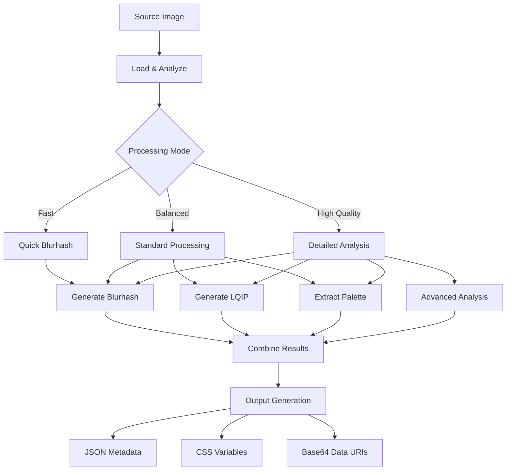

# Blurhash/LQIP Generation - Intelligent Image Placeholders

## 📋 Overview

**Feature ID**: `blurhash-lqip-generation`  
**Phase**: 7 - Advanced Image Processing  
**Priority**: High  
**Dependencies**: Core image processing pipeline, Sharp.js  
**Status**: Planned  

## 🎯 Description

Generate intelligent image placeholders using Blurhash algorithm and Low Quality Image Placeholders (LQIP) to provide instant visual feedback while full images load, dramatically improving perceived performance and user experience.

## ✨ Features

### Blurhash Algorithm Implementation
- **Compact Representation**: 20-30 character string representing image essence
- **Fast Generation**: Sub-second creation for most images
- **Perceptual Accuracy**: Maintains color palette and basic composition
- **Universal Compatibility**: Works across all modern browsers and frameworks
- **Customizable Quality**: Adjustable component resolution for size vs. quality trade-offs

### LQIP Generation
- **Ultra-Small Images**: 20-400 byte micro-images with maximum visual information
- **Progressive Enhancement**: Seamless transition from placeholder to full image
- **Format Optimization**: WebP, AVIF, and base64-encoded options
- **Smart Scaling**: Optimal resolution selection based on display context
- **Batch Processing**: Efficient generation for large image sets

### Base64 Encoded Micro-Images
- **Inline Embedding**: Direct HTML/CSS integration without additional requests
- **Size Optimization**: Typically 100-500 bytes per placeholder
- **Format Selection**: JPEG, WebP, or custom format based on source
- **Quality Tuning**: Aggressive compression while maintaining recognizability
- **Caching Strategy**: Efficient storage and retrieval of generated placeholders

### Color Palette Extraction
- **Dominant Colors**: Extract 2-8 most significant colors from image
- **Perceptual Weighting**: Colors weighted by visual importance and area coverage
- **Accessibility Considerations**: Contrast analysis for text overlay compatibility
- **Format Output**: CSS custom properties, JSON, or design token formats
- **Gradient Generation**: Create CSS gradients from extracted palettes

### Configurable Detail Levels
- **Quality Presets**: Ultra-fast, balanced, high-quality generation modes
- **Component Resolution**: Fine-tune Blurhash X/Y components (3x3 to 9x9)
- **LQIP Dimensions**: Configurable micro-image dimensions (16x16 to 64x64)
- **Color Depth**: Control palette extraction complexity (2-16 colors)
- **Processing Trade-offs**: Balance generation speed vs. visual fidelity

## 🔧 Technical Specifications

### Blurhash Implementation
```typescript
interface BlurhashOptions {
  componentX: number; // 1-9, default 4
  componentY: number; // 1-9, default 4
  quality: 'fast' | 'balanced' | 'high';
  threading: boolean; // Use worker threads for large images
}

interface BlurhashResult {
  hash: string; // The blurhash string
  aspectRatio: number;
  dominantColor: string; // Fallback color
  generationTime: number;
  size: number; // Hash string length in bytes
}

async function generateBlurhash(
  imagePath: string, 
  options: BlurhashOptions
): Promise<BlurhashResult>;
```

### LQIP Generation
```typescript
interface LQIPOptions {
  width: number; // Target width (10-64)
  height?: number; // Auto-calculated if not provided
  quality: number; // 1-20 for aggressive compression
  format: 'jpeg' | 'webp' | 'avif';
  base64: boolean; // Encode as base64 data URI
  progressive: boolean; // Use progressive JPEG
}

interface LQIPResult {
  buffer: Buffer; // Raw image data
  base64: string; // Data URI if requested
  dimensions: { width: number; height: number };
  fileSize: number; // Size in bytes
  format: string;
  generationTime: number;
}
```

### Color Palette Extraction
```typescript
interface PaletteOptions {
  colorCount: number; // 2-16 colors
  algorithm: 'kmeans' | 'median-cut' | 'dominant';
  format: 'hex' | 'rgb' | 'hsl' | 'css-props';
  includeWeights: boolean; // Include color importance weights
  accessibilityAnalysis: boolean; // Analyze contrast ratios
}

interface ColorPalette {
  colors: Color[];
  dominantColor: Color;
  accentColor: Color; // Contrasting color for overlays
  backgroundSafe: boolean; // Safe for text overlays
  generationTime: number;
}

interface Color {
  hex: string;
  rgb: [number, number, number];
  hsl: [number, number, number];
  weight: number; // 0-1, importance in image
  luminance: number; // For accessibility calculations
}
```

## 🎨 Visual Examples

### Blurhash Progression
```html
<!-- 1. Initial Blurhash placeholder -->
<div style="background: linear-gradient(135deg, #667eea 0%, #764ba2 100%); width: 400px; height: 300px;">
  <!-- Blurhash-generated background -->
</div>

<!-- 2. LQIP overlay (when available) -->
<div style="background-image: url('data:image/jpeg;base64,/9j/4AAQSkZJRgABAQAAAQABAAD...');">
  <!-- 20x15 pixel LQIP, heavily blurred -->
</div>

<!-- 3. Final high-quality image -->

```

### CSS Integration
```css
.image-container {
  /* Extracted color palette as CSS custom properties */
  --primary-color: #4a90e2;
  --secondary-color: #f5a623;
  --background-color: #f8f9fa;
  --accent-color: #7ed321;
  
  /* Blurhash fallback gradient */
  background: linear-gradient(45deg, var(--primary-color), var(--secondary-color));
  
  /* LQIP overlay */
  background-image: url('data:image/webp;base64,UklGRh4AAABXRUJQVlA4TBEAAAAv...');
  background-size: cover;
  filter: blur(5px);
  transition: filter 0.3s ease;
}

.image-container.loaded {
  filter: none;
}
```

## 🚀 User Stories

### Story 1: Instant Visual Feedback
**As a** web user  
**I want** to see image placeholders immediately when a page loads  
**So that** I understand content is loading and get a preview of what's coming  

**Acceptance Criteria:**
- Placeholders appear instantly (<50ms)
- Placeholders visually represent final image content
- Smooth transition from placeholder to full image
- No visual "pop" or layout shift during loading

### Story 2: Reduced Perceived Loading Time
**As a** website visitor  
**I want** pages to feel fast even with large images  
**So that** I have a better browsing experience  

**Acceptance Criteria:**
- Perceived loading time reduced by 30-50%
- Progressive image enhancement feels natural
- Color scheme maintained throughout loading process
- Content appears "ready" even before full images load

### Story 3: Bandwidth-Conscious Loading
**As a** mobile user on limited data  
**I want** meaningful image previews without extra data usage  
**So that** I can decide whether to wait for full images  

**Acceptance Criteria:**
- Placeholders add <1KB to page size per image
- Full image loading is optional/progressive
- Preview quality sufficient for content decisions
- No unnecessary network requests

### Story 4: Developer Integration
**As a** frontend developer  
**I want** to easily integrate intelligent placeholders  
**So that** I can improve my app's perceived performance  

**Acceptance Criteria:**
- Simple API for generating placeholders
- Multiple output formats (CSS, JSON, base64)
- Framework-agnostic implementation
- Build tool integration available

## 🔧 Implementation Architecture

### Generation Pipeline


### Processing Optimization
```typescript
class PlaceholderGenerator {
  private cache: Map<string, PlaceholderResult> = new Map();
  private workerPool: WorkerPool;
  
  async generatePlaceholders(
    imagePath: string,
    options: PlaceholderOptions
  ): Promise<PlaceholderResult> {
    // Check cache first
    const cacheKey = this.getCacheKey(imagePath, options);
    if (this.cache.has(cacheKey)) {
      return this.cache.get(cacheKey)!;
    }
    
    // Process in worker thread for large images
    const shouldUseWorker = await this.shouldUseWorkerThread(imagePath);
    
    let result: PlaceholderResult;
    if (shouldUseWorker) {
      result = await this.workerPool.execute('generatePlaceholders', {
        imagePath,
        options
      });
    } else {
      result = await this.generateInMainThread(imagePath, options);
    }
    
    // Cache result
    this.cache.set(cacheKey, result);
    return result;
  }
  
  private async generateInMainThread(
    imagePath: string,
    options: PlaceholderOptions
  ): Promise<PlaceholderResult> {
    const image = sharp(imagePath);
    const metadata = await image.metadata();
    
    // Generate components in parallel
    const [blurhash, lqip, palette] = await Promise.all([
      this.generateBlurhash(image, options.blurhash),
      this.generateLQIP(image, options.lqip),
      this.extractPalette(image, options.palette)
    ]);
    
    return {
      blurhash,
      lqip,
      palette,
      metadata: {
        width: metadata.width!,
        height: metadata.height!,
        aspectRatio: metadata.width! / metadata.height!
      }
    };
  }
}
```

## 🧪 Testing Strategy

### Visual Regression Tests
- Compare generated placeholders against reference images
- Perceptual similarity testing using SSIM/PSNR
- Color accuracy validation across different images
- Progressive enhancement visual flow testing

### Performance Tests
- Generation speed benchmarks across image sizes
- Memory usage optimization validation
- Worker thread efficiency testing
- Cache performance measurement

### Quality Tests
- Blurhash visual fidelity assessment
- LQIP compression vs. quality balance
- Color palette accuracy validation
- Cross-browser rendering consistency

### Integration Tests
- Build tool integration testing
- Framework compatibility validation
- API contract compliance
- Error handling scenarios

## 📊 Performance Benchmarks

### Generation Speed Targets
- **Small images** (< 500KB): <200ms total generation
- **Medium images** (500KB - 2MB): <500ms total generation
- **Large images** (2MB+): <1000ms total generation
- **Batch processing**: >10 images/second sustained

### Output Size Targets
- **Blurhash**: 20-30 characters (20-30 bytes)
- **LQIP**: 100-500 bytes (base64 encoded)
- **Color palette**: 50-200 bytes (JSON format)
- **Total overhead**: <1KB per image placeholder

### Quality Metrics
- **Perceptual similarity**: >85% SSIM score vs. downscaled original
- **Color accuracy**: >90% dominant color match
- **Visual coherence**: Smooth transition rated >4/5 by users
- **Loading improvement**: 30-50% perceived speed increase

## 🔗 Integration Examples

### React Component
```tsx
import { usePlaceholder } from '@image-dump/react';

function OptimizedImage({ src, alt }: ImageProps) {
  const { blurhash, lqip, palette, isLoading } = usePlaceholder(src);
  
  return (
    <div 
      className="image-container"
      style={{
        '--primary-color': palette.dominantColor,
        '--secondary-color': palette.accentColor,
        background: `linear-gradient(45deg, ${palette.colors.join(', ')})`
      }}
    >
      {isLoading && (
        <BlurhashCanvas 
          hash={blurhash}
          width={400}
          height={300}
        />
      )}
       setIsLoading(false)}
        style={{ opacity: isLoading ? 0 : 1 }}
      />
    </div>
  );
}
```

### CSS-in-JS Integration
```javascript
// Generated during build time
const placeholders = {
  'hero-image.jpg': {
    blurhash: 'LGF5]+Yk^6#M@-5c,1J5@[or[Q6.',
    lqip: 'data:image/webp;base64,UklGRiIAAABXRUJQ...',
    palette: ['#4a90e2', '#f5a623', '#7ed321'],
    dimensions: { width: 1200, height: 800 }
  }
};

// Runtime usage
const imagePlaceholder = styled.div`
  background: linear-gradient(45deg, ${props => props.palette.join(', ')});
  background-image: url('${props => props.lqip}');
  filter: blur(5px);
  transition: all 0.3s ease;
  
  &.loaded {
    filter: none;
  }
`;
```

## ✅ Success Criteria

- [ ] Sub-second placeholder generation for typical images
- [ ] <1KB total placeholder data per image
- [ ] >85% perceptual similarity to downscaled originals
- [ ] Smooth progressive enhancement in all major browsers
- [ ] Build tool integration for automatic generation
- [ ] Framework-agnostic component libraries
- [ ] Comprehensive documentation with examples
- [ ] Performance benchmarks meet or exceed targets
- [ ] Visual regression test suite with >95% accuracy
- [ ] Cache efficiency reduces regeneration by >90%

---

**Estimated Effort**: 4-5 weeks  
**Risk Level**: Medium-High (Algorithm complexity)  
**Dependencies**: Sharp.js, Blurhash library, Canvas API, Worker threads