# Development Milestones

This directory contains detailed dependency graphs and implementation plans for each development phase of the Image Dump project.

## Phase Overview

```mermaid
graph TD
    %% Completed phases
    P1[Phase 1: Core Functionality ✅]
    P2[Phase 2: Enhanced Processing ✅]
    
    %% Current phase
    P3[Phase 3: Configuration 🚧]
    
    %% Future phases
    P4[Phase 4: Security & Validation]
    P5[Phase 5: Web Interface & API]
    P6[Phase 6: Developer Experience]
    P7[Phase 7: Advanced Processing]
    P8[Phase 8: Infrastructure & Monitoring]
    P9[Phase 9: Intelligence & Automation]
    
    %% Phase dependencies
    P1 --> P2
    P2 --> P3
    P3 --> P4
    P4 --> P5
    P5 --> P6
    P5 --> P8
    P7 -.->|can start independently| P5
    P8 --> P9
    
    %% Cross-phase dependencies
    P4 -.->|validation used by| P5
    P5 -.->|API used by| P6
    P5 -.->|API monitored by| P8
    P8 -.->|metrics used by| P9
    
    %% Styling
    classDef completed fill:#90EE90,stroke:#333,stroke-width:2px
    classDef current fill:#FFFFE0,stroke:#333,stroke-width:3px
    classDef future fill:#E0E0E0,stroke:#333,stroke-width:2px
    
    class P1,P2 completed
    class P3 current
    class P4,P5,P6,P7,P8,P9 future
```

## Phase Dependencies

### Sequential Dependencies
1. **Phase 1 → 2**: Enhanced processing builds on core functionality
2. **Phase 2 → 3**: Configuration requires stable processing pipeline
3. **Phase 3 → 4**: Security validates configuration options
4. **Phase 4 → 5**: API requires security measures
5. **Phase 5 → 8**: Monitoring needs API to instrument
6. **Phase 8 → 9**: AI features use monitoring data

### Cross-Phase Dependencies
- **Phase 4 → 5**: Image validation integrates with upload endpoints
- **Phase 5 → 6**: Developer tools can integrate with API
- **Phase 5 → 8**: API provides data for monitoring
- **Phase 8 → 9**: Metrics trigger intelligent automation

### Independent Tracks
- **Phase 7** (Advanced Processing) can proceed independently once Phase 5 starts
- Some **Phase 6** tools (pre-commit hooks, CLI) can be built without API

## Implementation Strategy

### Critical Path
The critical path for full system functionality:
1. Complete Phase 3 (Configuration)
2. Implement Phase 4 (Security)
3. Build Phase 5 (API)
4. Add Phase 8 (Monitoring)
5. Deploy Phase 9 (Intelligence)

### Parallel Development Opportunities
- **Phase 6** developer tools can start after Phase 3
- **Phase 7** format support can begin independently
- Security audit (Phase 4) can review completed phases

### Risk Mitigation
- Each phase provides value independently
- Features within phases can be released incrementally
- Cross-phase dependencies are clearly documented
- Fallback options for advanced features

## Phase Details

- [Phase 3: Configuration & Customization](phase-3.md) - *In Progress*
- [Phase 4: Security & Validation](phase-4.md)
- [Phase 5: Web Interface & API](phase-5.md)
- [Phase 6: Developer Experience](phase-6.md)
- [Phase 7: Advanced Image Processing](phase-7.md)
- [Phase 8: Infrastructure & Monitoring](phase-8.md)
- [Phase 9: Intelligence & Automation](phase-9.md)

## Success Metrics by Phase

### Near Term (Phases 3-4)
- Complete configuration system
- Zero security vulnerabilities
- 100% validation coverage

### Mid Term (Phases 5-6)
- API handling 1000+ req/min
- Developer tool adoption
- 90% satisfaction score

### Long Term (Phases 7-9)
- 15+ supported formats
- 99.9% uptime
- 50% storage reduction via AI

## Resource Requirements

### Phase 3-4: 1-2 developers
- Configuration system
- Security implementation
- Testing and documentation

### Phase 5-6: 2-3 developers
- Frontend developer for UI
- Backend developer for API
- Developer experience specialist

### Phase 7-9: 3-4 developers
- Image processing specialist
- DevOps/Infrastructure engineer
- ML engineer for AI features
- Full-stack for integration

## Next Steps

1. Complete remaining Phase 3 tasks
2. Create detailed technical designs for Phase 4
3. Plan API architecture for Phase 5
4. Identify parallel development opportunities