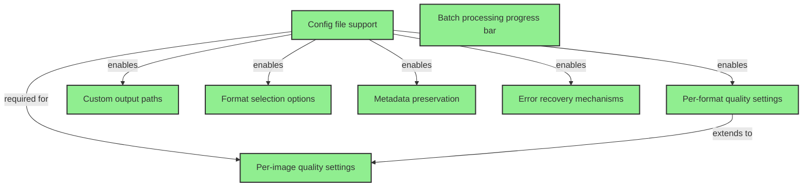

# Phase 3: Configuration & Customization

**Status**: Completed ✅  
**Goal**: Flexible configuration options  

## Overview

Phase 3 focuses on making the image optimization system highly configurable and customizable. This phase builds upon the core functionality from Phases 1-2 to provide users with fine-grained control over the optimization process.

## Completed Tasks
- ✅ Config file support (.imagerc)
- ✅ Per-format quality settings
- ✅ Custom output paths
- ✅ Format selection options
- ✅ Metadata preservation options
- ✅ Error recovery mechanisms
- ✅ Batch processing progress bar
- ✅ Per-image quality settings

## Task Dependency Graph

## Task Details

### Completed Tasks

1. **Config file support (.imagerc)** ✅
   - Foundation for all configuration features
   - JSON-based configuration with validation
   - Supports both .imagerc and .imagerc.json

2. **Per-format quality settings** ✅
   - Allows different quality levels for WebP, AVIF, JPEG
   - Integrated into ConfigLoader with validation

3. **Custom output paths** ✅
   - Configurable output directory
   - Maintains folder structure

4. **Format selection options** ✅
   - Choose which formats to generate
   - Support for 'original' format preservation

5. **Metadata preservation options** ✅
   - Toggle EXIF/metadata preservation
   - Future support for selective preservation

### Implementation Details

#### Per-image quality settings ✅
**Status**: Completed  
**Implementation**: Fully implemented with QualityRulesEngine supporting:
- Filename patterns (e.g., `*-hero.*` for hero images)
- Directory-based rules (e.g., `products/thumbnails/`)
- Dimension-based rules (min/max width/height)
- Rule specificity and precedence system
- Full integration with the optimization pipeline

#### Batch processing progress bar ✅
**Status**: Completed  
**Implementation**: Fully implemented with ProgressManager featuring:
- Visual progress bar with percentage and ETA
- Current file display and processing speed
- Responsive design for different terminal widths
- TTY and non-TTY fallback modes
- Quiet mode support via --quiet flag
- Real-time stats tracking

#### Error recovery mechanisms ✅
**Status**: Completed  
**Implementation**: Fully implemented with ErrorRecoveryManager providing:
- Continue-on-error mode for batch resilience
- Retry mechanism with exponential backoff
- Detailed error logging and reporting
- State persistence for resume capability
- CLI flags: --continue-on-error, --resume, --max-retries, --retry-delay
- Comprehensive error tracking and recovery

## Phase 3 Completion Summary

All Phase 3 tasks have been successfully completed. The implementation order was:

1. **Config file support** - Foundation for all other features
2. **Per-format quality settings** - Basic quality configuration
3. **Custom output paths & format selection** - Core configuration options
4. **Metadata preservation** - Basic boolean implementation
5. **Error recovery mechanisms** - Critical for reliability
6. **Batch processing progress bar** - Enhanced user experience
7. **Per-image quality settings** - Advanced configuration feature

## Success Criteria

- All configuration options are well-documented
- Configuration validation catches common errors
- Progress feedback is clear and informative
- System gracefully handles and recovers from errors
- Performance impact of new features is minimal (<5% overhead)

## Next Phase

Phase 4 (Security & Validation) will build upon the configuration system to add security constraints and validation rules to the configuration options.