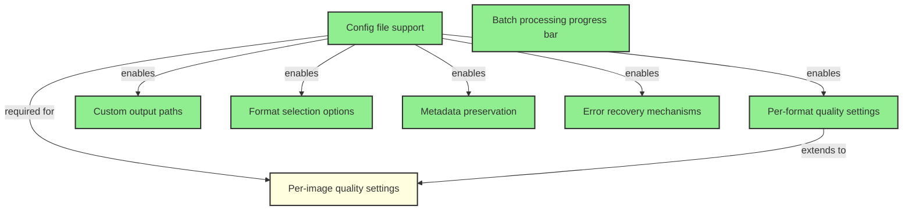

# Phase 3: Configuration & Customization

**Status**: In Progress  
**Goal**: Flexible configuration options  

## Overview

Phase 3 focuses on making the image optimization system highly configurable and customizable. This phase builds upon the core functionality from Phases 1-2 to provide users with fine-grained control over the optimization process.

## Completed Tasks
- ✅ Config file support (.imagerc)
- ✅ Per-format quality settings
- ✅ Custom output paths
- ✅ Format selection options
- ✅ Metadata preservation options
- ✅ Error recovery mechanisms
- ✅ Batch processing progress bar

## Remaining Tasks
- Per-image quality settings

## Task Dependency Graph

## Task Details

### Completed Tasks

1. **Config file support (.imagerc)** ✅
   - Foundation for all configuration features
   - JSON-based configuration with validation
   - Supports both .imagerc and .imagerc.json

2. **Per-format quality settings** ✅
   - Allows different quality levels for WebP, AVIF, JPEG
   - Integrated into ConfigLoader with validation

3. **Custom output paths** ✅
   - Configurable output directory
   - Maintains folder structure

4. **Format selection options** ✅
   - Choose which formats to generate
   - Support for 'original' format preservation

5. **Metadata preservation options** ✅
   - Toggle EXIF/metadata preservation
   - Future support for selective preservation

### Remaining Tasks

#### Per-image quality settings
**Dependencies**: Config file support, Per-format quality settings  
**Description**: Allow quality overrides for specific images through:
- Filename patterns (e.g., `*-hq.png` uses higher quality)
- Directory-based rules
- Metadata tags

**Implementation considerations**:
- Extend ConfigLoader to support pattern matching
- Create a rule evaluation system
- Maintain backwards compatibility

#### Batch processing progress bar
**Dependencies**: None (standalone feature)  
**Description**: Visual feedback during batch operations showing:
- Current file being processed
- Progress percentage
- ETA for completion
- Processing speed (images/second)

**Implementation considerations**:
- Use a library like `cli-progress` or `ora`
- Integrate with existing console output
- Make it optional (--quiet flag)

#### Error recovery mechanisms
**Dependencies**: None (enhances existing error handling)  
**Description**: Graceful handling of processing failures:
- Continue processing after individual file failures
- Retry failed operations with backoff
- Generate error report at end
- Option to resume interrupted batch operations

**Implementation considerations**:
- Implement retry logic with exponential backoff
- Create error log file
- Add --continue-on-error flag
- Save progress state for resume capability

## Implementation Order

1. **Error recovery mechanisms** - Most critical for reliability
2. **Batch processing progress bar** - Improves user experience
3. **Per-image quality settings** - Advanced feature, less critical

## Success Criteria

- All configuration options are well-documented
- Configuration validation catches common errors
- Progress feedback is clear and informative
- System gracefully handles and recovers from errors
- Performance impact of new features is minimal (<5% overhead)

## Next Phase

Phase 4 (Security & Validation) will build upon the configuration system to add security constraints and validation rules to the configuration options.