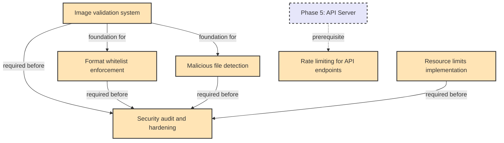

# Phase 4: Security & Validation

**Status**: Planned  
**Goal**: Secure and robust image handling  

## Overview

Phase 4 focuses on hardening the image optimization system against malicious inputs and resource exhaustion attacks. This phase is critical for any deployment that accepts user-uploaded images.

## Tasks
- Image validation system
- Resource limits implementation
- Format whitelist enforcement
- Malicious file detection
- Security audit and hardening
- Rate limiting for API endpoints

## Task Dependency Graph

## Task Details

### Image validation system
**Dependencies**: None (foundational)  
**Description**: Core validation framework to check images before processing:
- File header validation (magic bytes)
- Image dimension limits
- File size limits
- Corrupt image detection
- MIME type verification

**Key features**:
- Pluggable validator architecture
- Configurable validation rules
- Detailed error reporting
- Performance optimized (fail fast)

### Format whitelist enforcement
**Dependencies**: Image validation system  
**Description**: Strict control over accepted image formats:
- Configurable allowed formats list
- Deep format verification (not just extension)
- Polyglot file detection
- Format-specific validation rules

### Malicious file detection
**Dependencies**: Image validation system  
**Description**: Detect and prevent processing of malicious images:
- ZIP bomb detection
- SVG script injection prevention
- EXIF data sanitization
- Steganography awareness
- Known exploit signature detection

### Resource limits implementation
**Dependencies**: None (standalone)  
**Description**: Prevent resource exhaustion:
- Memory usage caps per image
- CPU time limits
- Concurrent processing limits
- Disk space quotas
- Network bandwidth limits (for LFS)

**Implementation approach**:
- Use Sharp's built-in limits where available
- Implement process-level resource monitoring
- Graceful degradation when limits reached

### Security audit and hardening
**Dependencies**: All other security features  
**Description**: Comprehensive security review:
- Dependency vulnerability scanning
- Code security analysis
- Penetration testing scenarios
- Security documentation
- Incident response procedures

### Rate limiting for API endpoints
**Dependencies**: API server from Phase 5  
**Description**: Prevent API abuse:
- Request rate limiting per IP
- Authenticated user quotas
- Endpoint-specific limits
- Distributed rate limiting (Redis)

**Note**: This task has a cross-phase dependency on Phase 5's API implementation. It may need to be moved to Phase 5 or implemented as part of the API development.

## Implementation Considerations

### Security-First Design
- All validators should fail closed (reject when uncertain)
- Comprehensive logging for security events
- Clear security documentation for users

### Performance Impact
- Validation should add <100ms per image
- Use streaming validation where possible
- Cache validation results when appropriate

### Configuration
- Security settings in .imagerc
- Environment variable overrides for production
- Sensible secure defaults

## Feature Specification Needed

Given the complexity of the image validation system, this warrants a detailed feature specification. The spec should cover:
- Threat model
- Validation pipeline architecture
- Specific validation rules
- Error handling and reporting
- Performance requirements
- Configuration schema

## Success Criteria

- Zero security vulnerabilities in audit
- 100% validation coverage for known attack vectors
- <100ms validation overhead per image
- Clear security documentation
- Automated security testing in CI/CD

## Next Phase

Phase 5 (Web Interface & API) will build upon these security features to provide a secure web-based interface for image optimization.