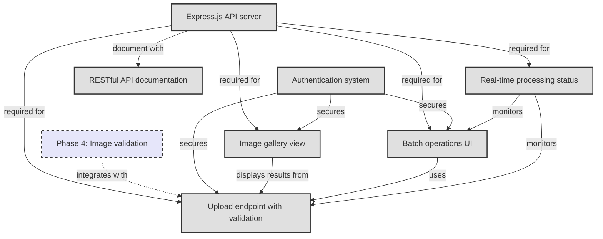

# Phase 5: Web Interface & API

**Status**: Planned  
**Goal**: Web-based access and API  

## Overview

Phase 5 transforms the command-line image optimization tool into a web service with a RESTful API and user interface. This enables remote access, integration with other services, and a more user-friendly experience for non-technical users.

## Tasks
- Express.js API server
- Upload endpoint with validation
- Image gallery view
- Batch operations UI
- Real-time processing status
- RESTful API documentation
- Authentication system

## Task Dependency Graph

## Task Details

### Express.js API server
**Dependencies**: None (foundational)  
**Description**: Core web server setup:
- Express.js application structure
- Middleware configuration (CORS, body parser, etc.)
- Route organization
- Error handling middleware
- Health check endpoints
- Logging infrastructure

**Key endpoints**:
- `POST /api/images` - Upload images
- `GET /api/images/:id` - Get image info
- `GET /api/images/:id/download/:format` - Download optimized image
- `DELETE /api/images/:id` - Remove image
- `GET /api/health` - Health check

### Upload endpoint with validation
**Dependencies**: API server, Image validation (Phase 4)  
**Description**: Secure image upload handling:
- Multipart form data parsing (multer)
- File size limits
- Integration with Phase 4 validation
- Virus scanning (optional)
- Storage to filesystem/S3
- Upload progress tracking

**Features**:
- Single and bulk uploads
- Drag-and-drop support
- Upload resumption
- Duplicate detection

### Image gallery view
**Dependencies**: API server  
**Description**: Web UI for browsing optimized images:
- Grid/list view toggle
- Thumbnail previews
- Image metadata display
- Search and filtering
- Pagination
- Lazy loading

**Technical stack**:
- React or Vue.js frontend
- Responsive design
- Image comparison tools
- Download options

### Batch operations UI
**Dependencies**: API server, Upload endpoint  
**Description**: Interface for bulk image operations:
- Multi-file selection
- Batch upload progress
- Queue management
- Batch configuration options
- Export/download all
- Operation history

### Real-time processing status
**Dependencies**: API server  
**Description**: Live updates on processing progress:
- WebSocket/Server-Sent Events
- Processing queue visualization
- Individual file progress
- Error notifications
- Performance metrics

**Implementation options**:
- Socket.io for WebSocket
- Bull for job queue
- Redis for pub/sub

### RESTful API documentation
**Dependencies**: API server implementation  
**Description**: Comprehensive API documentation:
- OpenAPI/Swagger specification
- Interactive API explorer
- Code examples in multiple languages
- Authentication guide
- Rate limit documentation
- Webhook documentation

**Tools**:
- Swagger UI
- Postman collection
- API versioning strategy

### Authentication system
**Dependencies**: Can be developed in parallel  
**Description**: Secure access control:
- JWT-based authentication
- OAuth2 integration (GitHub, Google)
- API key management
- Role-based access control
- Session management
- Password reset flow

**Features**:
- User registration/login
- API token generation
- Usage quotas
- Admin panel

## Implementation Considerations

### Architecture Decisions
- **Storage**: Local filesystem vs S3/cloud storage
- **Database**: PostgreSQL for metadata, Redis for caching
- **Job Queue**: Bull/BullMQ for async processing
- **Frontend**: SPA vs SSR considerations

### Security Requirements
- HTTPS enforcement
- CSRF protection
- Input sanitization
- Rate limiting (from Phase 4)
- Secure file storage
- API authentication

### Scalability Planning
- Horizontal scaling support
- Load balancer ready
- CDN integration for outputs
- Database connection pooling
- Caching strategy

## Feature Specifications Needed

1. **API Design Specification**
   - Endpoint definitions
   - Request/response schemas
   - Error code standards
   - Versioning strategy

2. **UI/UX Design Specification**
   - Wireframes
   - User flows
   - Responsive breakpoints
   - Accessibility requirements

## Success Criteria

- API handling 1000+ requests/minute
- <2s upload response time for typical images
- 99.9% uptime
- Comprehensive API documentation
- Intuitive user interface
- Secure authentication system

## Next Phase

Phase 6 (Developer Experience) will build developer tools that integrate with the API, making it easier for developers to use the service in their workflows.