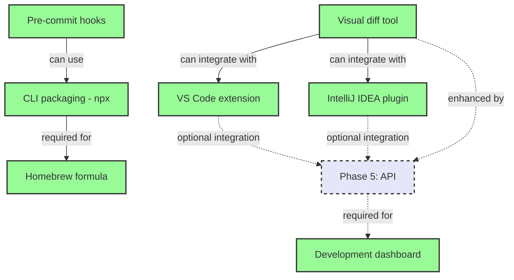

# Phase 6: Developer Experience

**Status**: Planned  
**Goal**: Tools for developers  

## Overview

Phase 6 focuses on creating a suite of developer tools that make it easy to integrate image optimization into development workflows. This includes IDE extensions, CLI tools, and automation hooks.

## Tasks
- Pre-commit hooks
- VS Code extension
- CLI packaging (npx)
- Visual diff tool
- Homebrew formula
- Development dashboard
- IntelliJ IDEA plugin

## Task Dependency Graph



## Task Details

### Pre-commit hooks
**Dependencies**: None (can use npx package when available)  
**Description**: Automated image optimization before commits:
- Git pre-commit hook script
- Husky integration
- Configurable file patterns
- Skip optimization option
- Optimization report in commit message

**Features**:
- Auto-detect new/modified images
- Apply project optimization settings
- Fail commit on optimization errors (optional)
- Progress indication
- Bypass flag for emergencies

### VS Code extension
**Dependencies**: Optional API integration  
**Description**: Visual Studio Code integration:
- Image preview with optimization options
- Side-by-side comparison
- One-click optimization
- Project-wide optimization commands
- Configuration UI for .imagerc
- Real-time optimization estimates

**Key features**:
- Explorer context menu integration
- Command palette commands
- Status bar optimization stats
- Settings sync support
- Multi-root workspace support

### CLI packaging (npx)
**Dependencies**: None  
**Description**: Zero-install CLI usage:
- npm package with bin entry
- npx compatibility
- Global installation option
- Auto-update checks
- Cross-platform support

**Usage examples**:
```bash
npx @flyingrobots/image-optimizer optimize ./images
npx @flyingrobots/image-optimizer init
npx @flyingrobots/image-optimizer watch
```

### Visual diff tool
**Dependencies**: None (enhanced by API)  
**Description**: Before/after comparison tool:
- Side-by-side image comparison
- Slider/onion skin modes
- Zoom and pan synchronization
- Metadata comparison
- File size analysis
- Quality metrics (SSIM, PSNR)

**Implementation options**:
- Web-based tool
- CLI with terminal image support
- Integration with IDE extensions

### Homebrew formula
**Dependencies**: CLI packaging  
**Description**: macOS/Linux package manager support:
- Homebrew tap repository
- Formula for easy installation
- Automatic updates
- Dependency management
- Shell completion scripts

```bash
brew tap flyingrobots/tools
brew install image-optimizer
```

### Development dashboard
**Dependencies**: API from Phase 5  
**Description**: Local development monitoring:
- Real-time optimization stats
- Project optimization history
- Performance metrics
- Configuration testing
- Batch operation management
- LFS bandwidth monitoring

**Features**:
- Electron or web-based UI
- Project switching
- Watch folder status
- Optimization queue
- Error logs
- Performance graphs

### IntelliJ IDEA plugin
**Dependencies**: Optional API integration  
**Description**: JetBrains IDE integration:
- Image asset management
- Optimization actions
- Project view decorators
- Inspection warnings
- Quick fixes
- Refactoring support

**Features**:
- Similar to VS Code extension
- Java/Kotlin specific features
- Android resource optimization
- Build tool integration

## Implementation Considerations

### Cross-Platform Support
- Ensure all tools work on Windows, macOS, Linux
- Handle path differences
- Platform-specific optimizations

### Performance
- Fast startup times for CLI tools
- Minimal IDE performance impact
- Efficient file watching

### User Experience
- Consistent UI/UX across tools
- Helpful error messages
- Progressive disclosure of features
- Good defaults with customization

### Integration
- Work with existing tools (webpack, gulp, etc.)
- Support various project structures
- CI/CD compatibility

## Feature Specifications Needed

1. **VS Code Extension Specification**
   - Command list
   - UI mockups
   - Configuration schema
   - API integration points

2. **CLI Tool Specification**
   - Command structure
   - Option flags
   - Output formats
   - Exit codes

## Success Criteria

- VS Code extension with 100+ installs
- CLI tool with <500ms startup time
- 90% developer satisfaction score
- All tools well-documented
- Active community adoption
- Regular updates and bug fixes

## Next Phase

Phase 7 (Advanced Image Processing) will extend the core optimization engine with support for additional formats and advanced processing features.