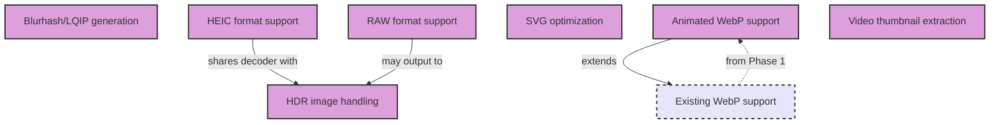

# Phase 7: Advanced Image Processing

**Status**: Planned  
**Goal**: Extended format support  

## Overview

Phase 7 expands the image optimization system's capabilities with support for modern formats, advanced compression techniques, and specialized image types. This phase addresses emerging format standards and professional photography needs.

## Tasks
- Blurhash/LQIP generation
- HEIC format support
- RAW format support
- SVG optimization
- Video thumbnail extraction
- Animated WebP support
- HDR image handling

## Task Dependency Graph

## Task Details

### Blurhash/LQIP generation
**Dependencies**: None  
**Description**: Generate ultra-light placeholders for lazy loading:
- Blurhash algorithm implementation
- LQIP (Low Quality Image Placeholder)
- Base64 encoded micro-images
- Color palette extraction
- Configurable detail levels

**Benefits**:
- Improved perceived performance
- Better UX during image loading
- Small data footprint (20-30 bytes)
- Smooth transitions

**Implementation**:
- Integrate blurhash library
- Add to processing pipeline
- Store in metadata or separate files

### HEIC format support
**Dependencies**: None (may share HDR support)  
**Description**: Support Apple's High Efficiency Image Format:
- HEIC/HEIF decoding
- Conversion to web formats
- Metadata preservation
- Multi-image container support
- HDR content handling

**Challenges**:
- Patent/licensing considerations
- Limited library support
- Cross-platform compatibility

**Libraries**:
- libheif bindings
- heic-convert npm package

### RAW format support
**Dependencies**: None  
**Description**: Professional camera RAW file processing:
- Support major formats (CR2, NEF, ARW, DNG)
- Exposure adjustment options
- White balance correction
- Output to standard formats
- Batch processing presets

**Supported formats**:
- Canon CR2/CR3
- Nikon NEF
- Sony ARW
- Adobe DNG
- More via LibRaw

**Implementation approach**:
- LibRaw integration
- dcraw as fallback
- Configurable processing parameters

### SVG optimization
**Dependencies**: None  
**Description**: Vector image optimization:
- Remove unnecessary metadata
- Minify path data
- Merge similar paths
- Remove hidden elements
- Compress with gzip/brotli

**Tools**:
- SVGO integration
- Custom optimization rules
- Safe optimization defaults
- Preserve animations option

### Video thumbnail extraction
**Dependencies**: None  
**Description**: Generate thumbnails from video files:
- Extract at specific timestamps
- Smart frame selection
- Multiple thumbnail sizes
- Animated preview generation
- Format detection

**Features**:
- FFmpeg integration
- Hardware acceleration support
- Batch processing
- Scene detection
- GIF preview generation

### Animated WebP support
**Dependencies**: Existing WebP support  
**Description**: Optimize animated images:
- GIF to animated WebP conversion
- Frame optimization
- Lossy/lossless options
- Duration preservation
- Fallback generation

**Benefits**:
- 50-90% smaller than GIF
- Better quality
- Alpha channel support
- Modern browser support

### HDR image handling
**Dependencies**: May share with HEIC support  
**Description**: High Dynamic Range image support:
- HDR format detection
- Tone mapping options
- SDR version generation
- Metadata preservation
- Display capability detection

**Formats**:
- HDR10
- Dolby Vision
- HLG (Hybrid Log-Gamma)
- OpenEXR

## Implementation Considerations

### Library Dependencies
- Evaluate native vs. JavaScript implementations
- Consider WebAssembly for performance
- Handle optional dependencies gracefully

### Performance
- Format detection should be fast
- Parallel processing where possible
- Caching of expensive operations
- Memory usage monitoring

### Quality Preservation
- Maintain color accuracy
- Preserve important metadata
- Configurable quality/size tradeoffs
- Format-specific optimizations

### Error Handling
- Graceful fallback for unsupported formats
- Clear error messages
- Alternative format suggestions
- Partial success handling

## Feature Specifications Needed

1. **LQIP Generation Specification**
   - Algorithm comparison
   - Size/quality tradeoffs
   - Integration patterns
   - Storage strategies

2. **RAW Processing Specification**
   - Supported camera models
   - Processing parameters
   - Preset management
   - Batch operations

## Success Criteria

- Support for 15+ image formats
- <2s processing time for typical images
- Quality parity with specialized tools
- Comprehensive format documentation
- Stable performance across formats

## Next Phase

Phase 8 (Infrastructure & Monitoring) will add production-grade monitoring and infrastructure features to support large-scale deployments.