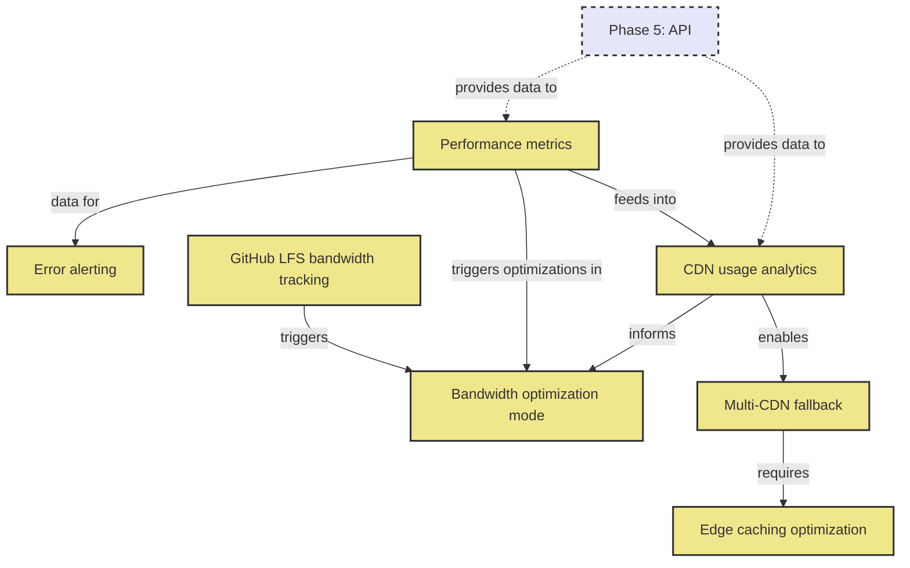

# Phase 8: Infrastructure & Monitoring

**Status**: Planned  
**Goal**: Production monitoring and optimization  

## Overview

Phase 8 focuses on production-grade infrastructure, monitoring, and optimization features. This phase ensures the system can scale, perform reliably, and provide insights into usage patterns and performance.

## Tasks
- GitHub LFS bandwidth tracking
- CDN usage analytics
- Performance metrics
- Error alerting
- Multi-CDN fallback
- Edge caching optimization
- Bandwidth optimization mode

## Task Dependency Graph

## Task Details

### Performance metrics
**Dependencies**: API endpoints to instrument  
**Description**: Comprehensive performance monitoring:
- Processing time per image
- Queue wait times
- Format conversion speeds
- Memory usage patterns
- CPU utilization
- Disk I/O metrics

**Metrics to track**:
- P50/P95/P99 latencies
- Throughput (images/second)
- Error rates by type
- Resource utilization
- Cache hit rates

**Implementation**:
- Prometheus metrics
- StatsD integration
- Custom dashboards
- Historical trending

### Error alerting
**Dependencies**: Performance metrics  
**Description**: Proactive error detection and notification:
- Processing failure alerts
- Resource exhaustion warnings
- Unusual error rate detection
- Service degradation alerts
- Security incident notifications

**Alert channels**:
- Email notifications
- Slack/Discord webhooks
- PagerDuty integration
- SMS for critical alerts
- Dashboard warnings

### GitHub LFS bandwidth tracking
**Dependencies**: None  
**Description**: Monitor Git LFS usage and costs:
- Bandwidth consumption tracking
- Storage usage monitoring
- Cost projection
- Usage by repository
- Historical trends

**Features**:
- GitHub API integration
- Bandwidth alerts
- Cost optimization suggestions
- Usage reports
- Quota management

### CDN usage analytics
**Dependencies**: Performance metrics  
**Description**: CDN performance and cost analysis:
- Bandwidth by region
- Cache hit ratios
- Popular image tracking
- Cost analysis
- Performance by POP

**Integrations**:
- CloudFlare Analytics
- AWS CloudFront
- Fastly Real-time Analytics
- Multi-CDN comparison

### Multi-CDN fallback
**Dependencies**: CDN usage analytics  
**Description**: Reliability through CDN redundancy:
- Primary/secondary CDN setup
- Automatic failover
- Geographic routing
- Performance-based selection
- Cost optimization routing

**Implementation**:
- DNS-based routing
- Application-level switching
- Health checks
- Fallback testing

### Edge caching optimization
**Dependencies**: Multi-CDN setup  
**Description**: Optimize caching strategies:
- Cache warming for popular images
- TTL optimization
- Vary header management
- Purge strategies
- Compression at edge

**Optimizations**:
- Format negotiation
- Geographic pre-positioning
- Predictive caching
- Bandwidth-aware serving

### Bandwidth optimization mode
**Dependencies**: Multiple monitoring inputs  
**Description**: Automatic optimization during high usage:
- Dynamic quality reduction
- Format prioritization
- Request throttling
- Aggressive caching
- Temporary feature disable

**Triggers**:
- LFS quota approaching
- CDN cost spike
- High error rates
- Manual activation

## Implementation Considerations

### Monitoring Infrastructure
- Time-series database selection
- Dashboard tool choice
- Log aggregation strategy
- Metric retention policies

### Alerting Strategy
- Alert fatigue prevention
- Escalation policies
- Runbook integration
- Post-mortem process

### Cost Management
- Budget alerts
- Cost allocation
- Optimization recommendations
- Reserved capacity planning

### Scalability
- Metric cardinality management
- Sampling strategies
- Aggregation rules
- Storage optimization

## Feature Specifications Needed

1. **Monitoring Architecture Specification**
   - Metric naming conventions
   - Dashboard layouts
   - Alert thresholds
   - SLI/SLO definitions

2. **CDN Strategy Specification**
   - CDN selection criteria
   - Failover policies
   - Cache key strategies
   - Geographic distribution

## Success Criteria

- 99.9% uptime for optimization service
- <5 minute alert response time
- 20% reduction in CDN costs
- Complete visibility into system performance
- Automated response to common issues

## Next Phase

Phase 9 (Intelligence & Automation) will leverage the monitoring data and infrastructure to add intelligent features and automation capabilities.