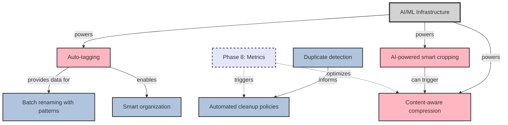

# Phase 9: Intelligence & Automation

**Status**: Planned  
**Goal**: Smart features and automation  

## Overview

Phase 9 represents the culmination of the image optimization system, adding AI-powered features and intelligent automation. This phase leverages machine learning and advanced algorithms to provide smart image processing and management capabilities.

## Tasks
- AI-powered smart cropping
- Duplicate detection
- Auto-tagging
- Content-aware compression
- Batch renaming with patterns
- Automated cleanup policies

## Task Dependency Graph

## Task Details

### AI/ML Infrastructure (Hidden Foundation)
**Dependencies**: None  
**Description**: Shared infrastructure for AI features:
- Model serving framework
- GPU acceleration support
- Model versioning system
- Inference caching
- Edge deployment options

**Components**:
- TensorFlow.js/ONNX runtime
- Model management service
- Feature extraction pipeline
- Batch processing optimization

### AI-powered smart cropping
**Dependencies**: AI infrastructure  
**Description**: Intelligent image cropping:
- Subject detection and centering
- Rule of thirds optimization
- Face/object aware cropping
- Multiple aspect ratios
- Saliency map generation

**Features**:
- Portrait optimization
- Product photo cropping
- Social media presets
- Batch processing
- Manual override options

**Models needed**:
- Object detection (YOLO/SSD)
- Face detection
- Saliency prediction
- Aesthetic scoring

### Duplicate detection
**Dependencies**: None  
**Description**: Find and manage duplicate images:
- Perceptual hashing
- Near-duplicate detection
- Similar image grouping
- Storage optimization
- Automated deduplication

**Algorithms**:
- pHash/dHash implementation
- SSIM comparison
- Feature vector matching
- Clustering algorithms

**Features**:
- Similarity threshold configuration
- Visual duplicate review
- Automated cleanup options
- Keep best quality option

### Auto-tagging
**Dependencies**: AI infrastructure  
**Description**: Automatic image categorization:
- Object recognition
- Scene classification
- Color analysis
- Text extraction (OCR)
- Custom tag training

**Applications**:
- Searchable image library
- Automated organization
- SEO optimization
- Accessibility improvements

**Integration possibilities**:
- Cloud Vision APIs
- Local ML models
- Custom training pipeline

### Content-aware compression
**Dependencies**: AI infrastructure  
**Description**: Optimize compression based on content:
- Region-based quality adjustment
- Preserve important details
- Aggressive background compression
- Format selection by content
- Perceptual quality metrics

**Techniques**:
- Saliency-based compression
- Face/text preservation
- Background simplification
- Adaptive quantization

### Batch renaming with patterns
**Dependencies**: Can use auto-tagging data  
**Description**: Intelligent file renaming:
- Pattern-based renaming
- Metadata extraction
- Sequential numbering
- Date/time formatting
- Tag-based naming

**Features**:
- Template system
- Preview changes
- Undo capability
- Collision handling
- Regular expression support

### Automated cleanup policies
**Dependencies**: Duplicate detection, Metrics  
**Description**: Intelligent storage management:
- Age-based cleanup
- Access frequency tracking
- Duplicate removal
- Format consolidation
- Quota management

**Policies**:
- Keep originals for X days
- Remove unused variants
- Consolidate to efficient formats
- Archive cold storage
- Compression triggers

## Implementation Considerations

### AI/ML Strategy
- Local vs. cloud inference tradeoffs
- Model size and performance balance
- Privacy considerations for cloud APIs
- Continuous learning capabilities

### Performance Optimization
- Batch processing for efficiency
- GPU utilization where available
- Inference result caching
- Progressive enhancement

### User Control
- Opt-in for AI features
- Transparency in AI decisions
- Manual override capabilities
- Explainable AI where possible

### Data Privacy
- On-device processing options
- Data anonymization
- GDPR compliance
- User consent management

## Feature Specifications Needed

Given the complexity of AI features, a comprehensive specification is warranted:

1. **AI-Powered Features Specification**
   - Model architecture decisions
   - Training data requirements
   - Accuracy targets
   - Performance benchmarks
   - Privacy guarantees

2. **Automation Rules Engine Specification**
   - Rule definition language
   - Trigger conditions
   - Action chains
   - Conflict resolution

## Success Criteria

- 50% reduction in storage via smart compression
- 90% accuracy in auto-tagging
- Automated handling of 80% of use cases
- <500ms inference time for AI features
- User satisfaction with AI recommendations

## Future Possibilities

- Custom model training
- Real-time style transfer
- AI-powered image generation
- Predictive optimization
- Cross-image learning