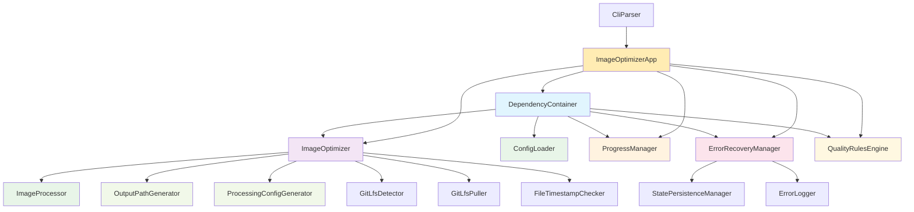

# Module Documentation

This directory contains comprehensive documentation for each module in the `src/` directory. Each module has been refactored to follow SOLID principles, use dependency injection, and maintain clear separation of concerns.

## Core Architecture Modules

### [DependencyContainer](./dependency-container.md)
**Central IoC Container** - Manages dependency injection throughout the application
- **Purpose**: Centralized dependency management and object creation
- **Key Features**: Singleton pattern, factory methods, testability
- **Dependencies**: All other modules
- **Exports**: `DependencyContainer` class

### [ImageOptimizer](./image-optimizer.md) 
**Main Orchestrator** - Coordinates the entire image optimization workflow
- **Purpose**: Business logic orchestration and workflow management  
- **Key Features**: Git LFS integration, error handling, result standardization
- **Dependencies**: All processing components
- **Exports**: `ImageOptimizer` class

### [ConfigLoader](./config-loader.md)
**Configuration Management** - Loads and validates configuration from multiple sources
- **Purpose**: Hierarchical configuration with validation
- **Key Features**: File + CLI merging, comprehensive validation, error reporting
- **Dependencies**: `fs`, `path`
- **Exports**: `ConfigLoader` class

## CLI and Application Layer

### [CliParser](./cli-parser.md)
**Command Line Interface** - Parses command-line arguments into configuration
- **Purpose**: CLI argument parsing and validation
- **Key Features**: Multiple argument types, help generation, testing support
- **Dependencies**: None (standalone)
- **Exports**: `CliParser` class

### [ProgressManager](./progress-manager.md)
**Progress Tracking** - Provides adaptive progress visualization and statistics
- **Purpose**: User feedback and progress tracking during batch operations
- **Key Features**: TTY adaptation, performance metrics, error integration
- **Dependencies**: `cli-progress`, `ansi-colors`
- **Exports**: `ProgressManager` class

## Application Layer

### [ImageOptimizerApp](./image-optimizer-app.md)
**Application Orchestrator** - Main application class that coordinates all components
- **Purpose**: High-level application workflow management and user interface
- **Key Features**: Batch processing, watch mode, progress reporting, state management
- **Dependencies**: All core components
- **Exports**: `ImageOptimizerApp` class

## Image Processing Components

### [ImageProcessor](./image-processor.md)
**Low-Level Processing** - Handles actual image transformations using Sharp
- **Purpose**: Image format conversion and optimization
- **Key Features**: Multiple format support, quality settings, metadata handling
- **Dependencies**: `sharp`
- **Exports**: `ImageProcessor` class

### [OutputPathGenerator](./output-path-generator.md)
**Path Management** - Generates output file paths based on configuration
- **Purpose**: Centralized path generation logic
- **Key Features**: Format-specific paths, directory structure preservation, naming conventions
- **Dependencies**: `path`
- **Exports**: `OutputPathGenerator` class

### [ProcessingConfigGenerator](./processing-config-generator.md)
**Configuration Generation** - Creates processing configurations for different formats
- **Purpose**: Separation of path generation from processing configuration
- **Key Features**: Format-specific configs, quality rules, optimization settings
- **Dependencies**: `path`
- **Exports**: `ProcessingConfigGenerator` class

## Git LFS Integration

### [GitLfsDetector](./git-lfs-detector.md)
**LFS Detection** - Detects Git LFS pointer files
- **Purpose**: Identify files that need Git LFS pulling
- **Key Features**: Content-based detection, pointer file parsing, error handling
- **Dependencies**: Injected file reader
- **Exports**: `GitLfsDetector` class

### [GitLfsPuller](./git-lfs-puller.md)
**LFS File Retrieval** - Pulls actual files from Git LFS
- **Purpose**: Automatic Git LFS file retrieval
- **Key Features**: Command execution, error handling, verification
- **Dependencies**: Injected command executor
- **Exports**: `GitLfsPuller` class

## Utility and Support Modules

### [FileTimestampChecker](./file-timestamp-checker.md)
**Timestamp Validation** - Determines if files need reprocessing based on timestamps
- **Purpose**: Optimization by skipping up-to-date files
- **Key Features**: Multi-file comparison, force override, efficient checking
- **Dependencies**: Injected file stats
- **Exports**: `FileTimestampChecker` class

### [QualityRulesEngine](./quality-rules-engine.md)
**Quality Rule Processing** - Applies conditional quality settings based on rules
- **Purpose**: Per-image quality customization
- **Key Features**: Pattern matching, directory rules, dimension-based rules, specificity scoring
- **Dependencies**: `minimatch`, `path`
- **Exports**: `QualityRulesEngine` class

## Error Handling and Recovery

### [ErrorRecoveryManager](./error-recovery-manager.md)
**Retry Logic** - Handles operation retries and error recovery
- **Purpose**: Resilient processing with retry mechanisms
- **Key Features**: Exponential backoff, configurable retries, error classification
- **Dependencies**: `StatePersistenceManager`, `ErrorLogger`
- **Exports**: `ErrorRecoveryManager` class

### [StatePersistenceManager](./state-persistence-manager.md)
**State Management** - Saves and loads processing state for resume functionality
- **Purpose**: Enable resume after interruption
- **Key Features**: JSON state format, version validation, atomic operations
- **Dependencies**: Injected file system
- **Exports**: `StatePersistenceManager` class

### [ErrorLogger](./error-logger.md)
**Error Logging** - Centralized error logging and reporting
- **Purpose**: Comprehensive error tracking and analysis
- **Key Features**: Structured logging, file output, error aggregation, reporting
- **Dependencies**: Injected file system
- **Exports**: `ErrorLogger` class

## Module Relationships

## Design Principles Applied

### SOLID Principles
- **Single Responsibility**: Each module has one clear purpose
- **Open/Closed**: Extensible through configuration and injection
- **Liskov Substitution**: Dependencies can be substituted for testing
- **Interface Segregation**: Clean, focused interfaces
- **Dependency Inversion**: High-level modules don't depend on low-level details

### Dependency Injection
All modules use constructor injection for dependencies, enabling:
- **Easy Testing**: Mock dependencies can be injected
- **Loose Coupling**: Modules don't create their own dependencies
- **Configuration**: Different implementations can be swapped
- **Testability**: Unit tests can isolate module behavior

### Error Handling
Consistent error handling patterns:
- **Clear Error Messages**: Descriptive error information
- **Error Propagation**: Structured error passing
- **Recovery Mechanisms**: Retry logic where appropriate
- **Logging Integration**: Comprehensive error tracking

## Testing Strategy

Each module is designed for comprehensive testing:

### Unit Tests
- **Isolated Testing**: Dependencies are mocked/stubbed
- **Behavior Verification**: Tests verify outcomes, not implementation
- **Edge Cases**: Comprehensive coverage of error conditions
- **Performance**: Tests verify efficiency where relevant

### Integration Tests
- **Component Interaction**: Tests verify module collaboration
- **End-to-End**: Full workflows tested with real dependencies
- **Configuration**: Various configuration scenarios tested
- **Error Scenarios**: Error handling and recovery tested

## Future Enhancements

The modular architecture enables easy extension:

1. **New Image Formats**: Add support through ImageProcessor
2. **Cloud Storage**: New output generators for S3, CDN, etc.
3. **AI Processing**: Smart cropping, object detection modules
4. **Performance**: Parallel processing, caching modules
5. **Monitoring**: Metrics collection and reporting modules

## Contributing

When adding new modules:

1. Follow the established patterns (dependency injection, SOLID principles)
2. Create comprehensive documentation using this template
3. Include class diagrams, sequence diagrams, and usage examples
4. Write thorough unit and integration tests
5. Update this index with the new module information