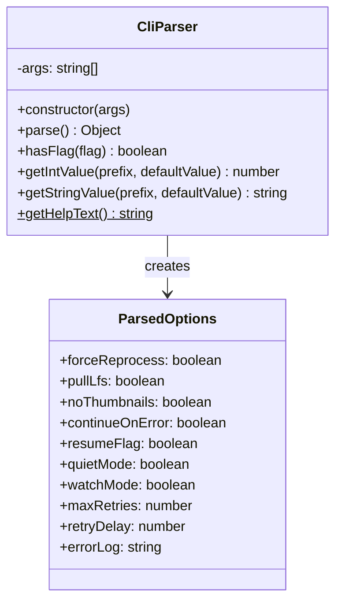
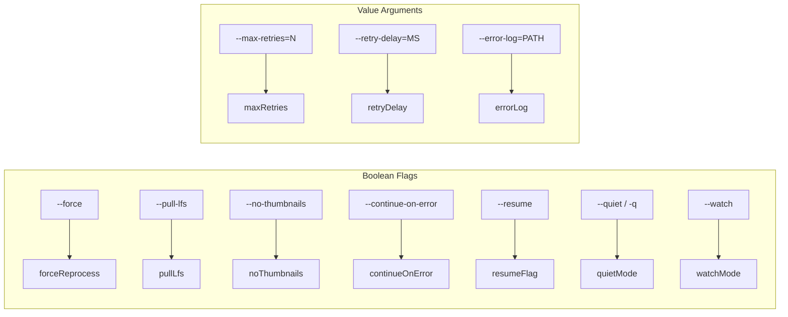
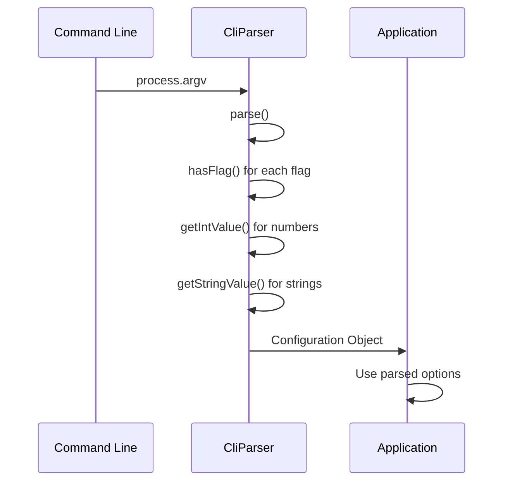

# CliParser

## Overview

The `CliParser` class is responsible for parsing command-line arguments and converting them into a structured configuration object. It provides a clean interface between the command-line interface and the application logic, following the Single Responsibility Principle by focusing solely on argument parsing.

## Exports

```javascript
module.exports = CliParser;
```

## Class Definition

```javascript
class CliParser {
  constructor(args = process.argv.slice(2))
  
  parse()
  hasFlag(flag)
  getIntValue(prefix, defaultValue)
  getStringValue(prefix, defaultValue)
  
  static getHelpText()
}
```

## Rationale

### Why This Module Exists

1. **Separation of Concerns**: Isolates CLI parsing logic from business logic
2. **Testability**: Can be easily tested with mock arguments without touching process.argv
3. **Maintainability**: All CLI argument definitions are centralized in one place
4. **Flexibility**: Supports various argument types (flags, integers, strings)
5. **Consistency**: Provides a standardized interface for all CLI operations
6. **Documentation**: Self-documenting help text generation

### Design Patterns

- **Command Pattern**: Encapsulates CLI argument parsing as a command
- **Factory**: Creates configuration objects from raw arguments
- **Strategy**: Different parsing strategies for different argument types

## Class Diagram



## Supported Arguments



## Method Documentation

### constructor(args)

Initializes the parser with command-line arguments.

**Parameters**:
- `args` (string[]): Array of command-line arguments (defaults to `process.argv.slice(2)`)

**Example**:
```javascript
const parser = new CliParser(['--force', '--quiet']);
```

### parse()

Parses the arguments and returns a configuration object.

**Returns**: Object with parsed options

```javascript
{
  forceReprocess: boolean,
  pullLfs: boolean,
  noThumbnails: boolean,
  continueOnError: boolean,
  resumeFlag: boolean,
  quietMode: boolean,
  watchMode: boolean,
  maxRetries: number,
  retryDelay: number,
  errorLog: string
}
```

### hasFlag(flag)

Checks if a boolean flag is present in the arguments.

**Parameters**:
- `flag` (string): The flag to check for (e.g., '--force')

**Returns**: boolean

### getIntValue(prefix, defaultValue)

Extracts an integer value from arguments with a specific prefix.

**Parameters**:
- `prefix` (string): The argument prefix (e.g., '--max-retries=')
- `defaultValue` (number): Default value if argument not found

**Returns**: number

### getStringValue(prefix, defaultValue)

Extracts a string value from arguments with a specific prefix.

**Parameters**:
- `prefix` (string): The argument prefix (e.g., '--error-log=')
- `defaultValue` (string): Default value if argument not found

**Returns**: string

### static getHelpText()

Returns the help text for the CLI.

**Returns**: string containing formatted help information

## Usage Example

```javascript
const CliParser = require('./cli-parser');

// Parse command line arguments
const parser = new CliParser();
const options = parser.parse();

// Use parsed options
if (options.forceReprocess) {
  console.log('Force reprocessing enabled');
}

if (options.quietMode) {
  // Suppress output
}

// Display help
if (process.argv.includes('--help')) {
  console.log(CliParser.getHelpText());
  process.exit(0);
}
```

## Argument Flow



## Configuration Mapping

| CLI Argument | Object Property | Type | Default |
|-------------|----------------|------|---------|
| `--force` | `forceReprocess` | boolean | false |
| `--pull-lfs` | `pullLfs` | boolean | false |
| `--no-thumbnails` | `noThumbnails` | boolean | false |
| `--continue-on-error` | `continueOnError` | boolean | false |
| `--resume` | `resumeFlag` | boolean | false |
| `--quiet`, `-q` | `quietMode` | boolean | false |
| `--watch` | `watchMode` | boolean | false |
| `--max-retries=N` | `maxRetries` | number | 3 |
| `--retry-delay=MS` | `retryDelay` | number | 1000 |
| `--error-log=PATH` | `errorLog` | string | 'image-optimization-errors.log' |

## Testing

The CliParser is designed for easy testing:

```javascript
describe('CliParser', () => {
  it('should parse force flag', () => {
    const parser = new CliParser(['--force']);
    const options = parser.parse();
    expect(options.forceReprocess).toBe(true);
  });
  
  it('should parse numeric values', () => {
    const parser = new CliParser(['--max-retries=5']);
    const options = parser.parse();
    expect(options.maxRetries).toBe(5);
  });
  
  it('should use defaults for missing values', () => {
    const parser = new CliParser([]);
    const options = parser.parse();
    expect(options.maxRetries).toBe(3);
  });
});
```

## Error Handling

The parser gracefully handles malformed arguments:

- Invalid numbers default to the specified default value
- Missing value arguments use their defaults
- Unknown flags are ignored (fail-safe behavior)

## Extensions

To add new arguments:

1. Add the flag check in `parse()`
2. Use appropriate helper method (`hasFlag`, `getIntValue`, `getStringValue`)
3. Update `getHelpText()` with documentation
4. Add tests for the new argument

```javascript
// Example: Adding a new boolean flag
parse() {
  const options = {
    // ... existing options
    newFlag: this.hasFlag('--new-flag')
  };
  return options;
}
```

## Benefits

1. **Clean Separation**: CLI concerns separate from business logic
2. **Easy Testing**: Can test with mock arguments
3. **Self-Documenting**: Help text is co-located with parsing logic
4. **Type Safety**: Automatic type conversion for numeric arguments
5. **Flexible**: Easy to add new argument types
6. **Robust**: Graceful handling of malformed input