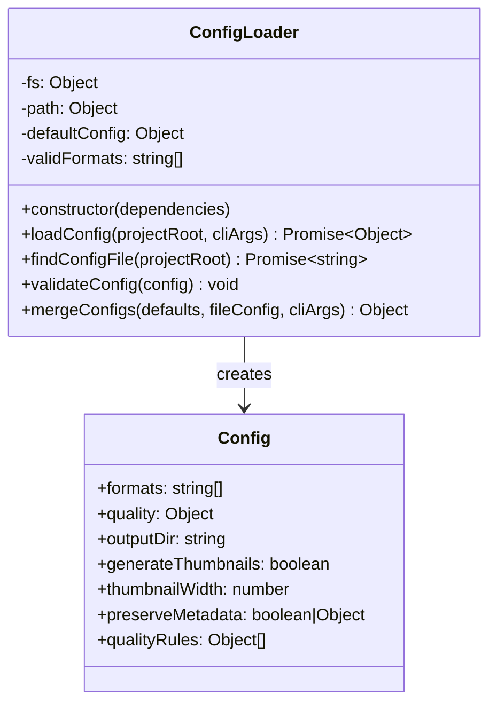
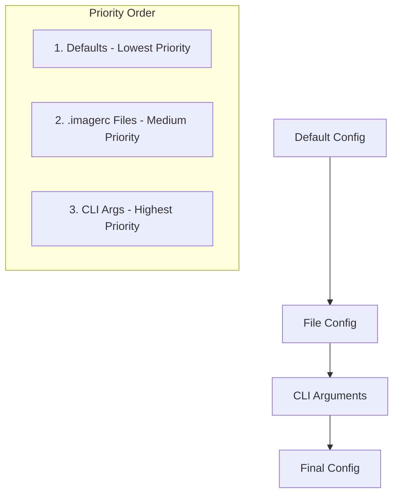
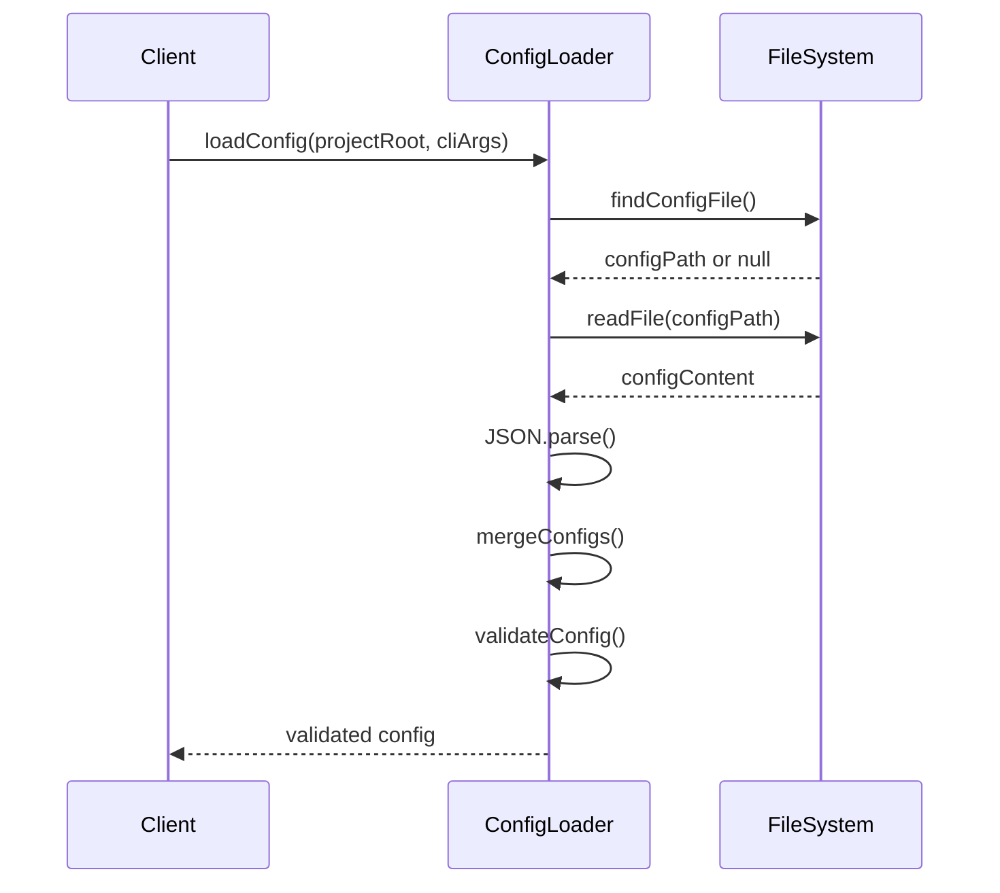
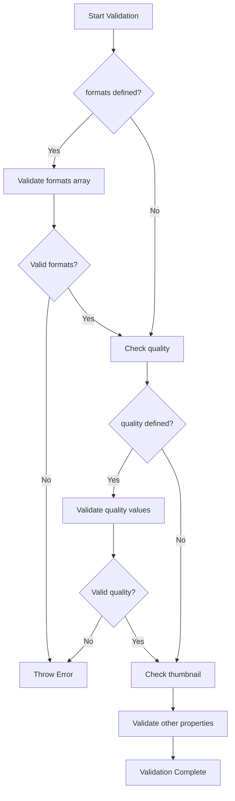

# ConfigLoader

## Overview

The `ConfigLoader` class is responsible for loading, validating, and merging configuration from multiple sources (defaults, config files, and CLI arguments). It implements a hierarchical configuration system with comprehensive validation to ensure the application receives valid settings.

## Exports

```javascript
module.exports = ConfigLoader;
```

## Class Definition

```javascript
class ConfigLoader {
  constructor(dependencies = {})
  
  async loadConfig(projectRoot = process.cwd(), cliArgs = {})
  async findConfigFile(projectRoot)
  validateConfig(config)
  mergeConfigs(defaults, fileConfig, cliArgs)
}
```

## Rationale

### Why This Module Exists

1. **Configuration Management**: Centralizes all configuration loading and validation logic
2. **Multiple Sources**: Handles defaults, file-based config, and CLI overrides
3. **Validation**: Ensures configuration integrity with comprehensive validation rules
4. **Dependency Injection**: Testable through injected file system dependencies
5. **Error Handling**: Provides clear error messages for configuration issues
6. **Flexibility**: Supports various configuration file formats and naming conventions

### Design Patterns

- **Builder**: Constructs configuration objects step by step
- **Strategy**: Different loading strategies for different config sources
- **Template Method**: Consistent validation process for all configuration types
- **Dependency Injection**: File system operations are injected for testability

## Class Diagram



## Configuration Hierarchy



## Configuration Sources

### 1. Default Configuration

```javascript
{
  formats: ['webp', 'avif', 'original'],
  quality: {
    webp: 80,
    avif: 80,
    jpeg: 80
  },
  outputDir: 'optimized',
  generateThumbnails: true,
  thumbnailWidth: 200,
  preserveMetadata: false
}
```

### 2. Config Files

Supports two file naming conventions:
- `.imagerc` (preferred)
- `.imagerc.json`

**Example .imagerc**:
```json
{
  "formats": ["webp", "avif"],
  "quality": {
    "webp": 85,
    "avif": 75
  },
  "outputDir": "dist/images",
  "qualityRules": [
    {
      "pattern": "*-hero.*",
      "quality": { "webp": 95, "avif": 90 }
    }
  ]
}
```

### 3. CLI Arguments

Override any file-based configuration.

## Method Documentation

### constructor(dependencies)

Initializes the ConfigLoader with optional dependency injection.

**Parameters**:
- `dependencies` (Object): Optional dependencies for testing
  - `fs` (Object): File system operations interface
  - `path` (Object): Path manipulation interface

### loadConfig(projectRoot, cliArgs)

Main method that loads and merges configuration from all sources.

**Parameters**:
- `projectRoot` (string): Root directory to search for config files
- `cliArgs` (Object): CLI arguments to merge with config

**Returns**: Promise\<Object\> - Validated configuration object

**Process Flow**:


### findConfigFile(projectRoot)

Searches for configuration files in the project root.

**Parameters**:
- `projectRoot` (string): Directory to search in

**Returns**: Promise\<string|null\> - Path to config file or null if not found

**Search Order**:
1. `.imagerc`
2. `.imagerc.json`

### validateConfig(config)

Comprehensive validation of configuration object.

**Parameters**:
- `config` (Object): Configuration to validate

**Throws**: Error with descriptive message if validation fails

**Validation Rules**:

| Property | Validation |
|----------|------------|
| `formats` | Must be array, non-empty, valid format names |
| `quality.*` | Numbers between 1-100 |
| `thumbnailWidth` | Number between 10-1000 |
| `outputDir` | Non-empty string |
| `preserveMetadata` | Boolean or valid metadata object |
| `qualityRules` | Array of valid rule objects |

### mergeConfigs(defaults, fileConfig, cliArgs)

Merges configuration objects with proper precedence.

**Parameters**:
- `defaults` (Object): Default configuration
- `fileConfig` (Object): Configuration from file
- `cliArgs` (Object): CLI argument overrides

**Returns**: Object - Merged configuration

**Merge Strategy**:
- Shallow merge for simple properties
- Deep merge for `quality` object
- CLI args have highest priority

## Configuration Schema

### Core Properties

```typescript
interface Config {
  formats: ('webp' | 'avif' | 'original' | 'jpeg' | 'png')[];
  quality: {
    webp?: number;     // 1-100
    avif?: number;     // 1-100
    jpeg?: number;     // 1-100
    thumbnail?: number; // 1-100
  };
  outputDir: string;
  generateThumbnails: boolean;
  thumbnailWidth: number; // 10-1000
  preserveMetadata: boolean | MetadataOptions;
}
```

### Quality Rules

```typescript
interface QualityRule {
  // Matching criteria (at least one required)
  pattern?: string;      // Glob pattern
  directory?: string;    // Directory path
  minWidth?: number;     // Minimum image width
  minHeight?: number;    // Minimum image height
  maxWidth?: number;     // Maximum image width
  maxHeight?: number;    // Maximum image height
  
  // Quality settings to apply
  quality: {
    webp?: number;       // 1-100
    avif?: number;       // 1-100
    jpeg?: number;       // 1-100
    thumbnail?: number;  // 1-100
  };
}
```

### Metadata Options

```typescript
interface MetadataOptions {
  copyright?: boolean;
  creator?: boolean;
  datetime?: boolean;
  camera?: boolean;
  gps?: boolean;
  all?: boolean;
}
```

## Usage Examples

### Basic Usage

```javascript
const ConfigLoader = require('./config-loader');

const loader = new ConfigLoader();
const config = await loader.loadConfig();

console.log(config.formats);  // ['webp', 'avif', 'original']
console.log(config.quality);  // { webp: 80, avif: 80, jpeg: 80 }
```

### With CLI Arguments

```javascript
const cliArgs = {
  outputDir: 'dist/optimized',
  quality: { webp: 90 }
};

const config = await loader.loadConfig(process.cwd(), cliArgs);
// CLI args override file/default settings
```

### Testing with Mocks

```javascript
const mockFs = {
  readFile: jest.fn().mockResolvedValue('{"formats": ["webp"]}'),
  stat: jest.fn().mockResolvedValue({ isFile: () => true })
};

const mockPath = {
  join: jest.fn().mockReturnValue('/project/.imagerc')
};

const loader = new ConfigLoader({ fs: mockFs, path: mockPath });
```

## Error Handling

### Configuration Errors

```javascript
try {
  const config = await loader.loadConfig();
} catch (error) {
  if (error.message.includes('Invalid JSON')) {
    // Handle JSON parsing errors
  } else if (error.message.includes('formats must be an array')) {
    // Handle validation errors
  }
}
```

### Common Error Messages

- `"Invalid JSON in .imagerc: Unexpected token..."`
- `"formats must be an array"`
- `"At least one output format must be specified"`
- `"Quality for webp must be between 1 and 100"`
- `"Output directory cannot be empty"`
- `"qualityRules[0] must have at least one matching criteria"`

## Validation Flow



## Benefits

1. **Centralized Configuration**: Single source of truth for all settings
2. **Flexible Sources**: Supports defaults, files, and CLI overrides
3. **Comprehensive Validation**: Catches configuration errors early
4. **Clear Error Messages**: Helpful feedback for configuration issues
5. **Testable**: Dependency injection enables easy testing
6. **Extensible**: Easy to add new configuration options
7. **Type Safety**: Runtime validation ensures type correctness

## Future Enhancements

1. **Schema Validation**: JSON Schema integration for more robust validation
2. **Environment Variables**: Support for environment variable overrides
3. **Configuration Profiles**: Development/production configuration profiles
4. **Auto-completion**: IDE support for configuration files
5. **Migration**: Automatic migration for configuration format changes