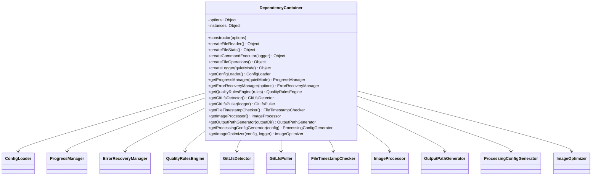

# DependencyContainer

## Overview

The `DependencyContainer` class is the central IoC (Inversion of Control) container that manages dependency injection throughout the image optimization application. It implements the Singleton pattern for component instances and acts as a factory for creating properly configured objects with their dependencies injected.

## Exports

```javascript
module.exports = DependencyContainer;
```

## Class Definition

```javascript
class DependencyContainer {
  constructor(options = {})
  
  // Factory methods for external dependencies
  createFileReader()
  createFileStats()
  createCommandExecutor(logger)
  createFileOperations()
  createLogger(quietMode)
  
  // Singleton getters for application components
  getConfigLoader()
  getProgressManager(quietMode)
  getErrorRecoveryManager(options)
  getQualityRulesEngine(rules)
  getGitLfsDetector()
  getGitLfsPuller(logger)
  getFileTimestampChecker()
  getImageProcessor()
  getOutputPathGenerator(outputDir)
  getProcessingConfigGenerator(config)
  getImageOptimizer(config, logger)
}
```

## Rationale

### Why This Module Exists

1. **Dependency Injection**: Centralizes the creation and management of dependencies, following SOLID principles
2. **Testability**: Enables easy mocking and testing by injecting dependencies rather than hardcoding them
3. **Single Responsibility**: Each class only needs to know about its direct dependencies, not how to create them
4. **Configuration Management**: Provides a single place to configure how objects are wired together
5. **Lifecycle Management**: Ensures singleton instances where appropriate to prevent resource waste

### Design Patterns

- **Dependency Injection Container**: Central registry for all dependencies
- **Singleton**: Ensures single instances of expensive-to-create objects
- **Factory**: Creates properly configured objects with dependencies

## Class Diagram



## Dependency Graph


## Factory Methods

### createFileReader()
Creates a file reading interface wrapper around Node.js fs.promises.

**Returns**: `{ readFile: Function }`

### createFileStats()
Creates a file statistics interface wrapper around Node.js fs.promises.

**Returns**: `{ stat: Function }`

### createCommandExecutor(logger)
Creates a command execution interface with error handling and logging.

**Parameters**:
- `logger` (Object): Logger instance for command output

**Returns**: `{ exec: Function }`

### createFileOperations()
Creates a file operations interface wrapper around Node.js fs.promises.

**Returns**: `{ copyFile: Function }`

### createLogger(quietMode)
Creates a logger interface that respects quiet mode settings.

**Parameters**:
- `quietMode` (boolean): Whether to suppress non-error output

**Returns**: `{ log: Function, error: Function }`

## Singleton Getters

All getter methods implement lazy initialization with singleton pattern:

```javascript
getComponentName(params) {
  if (!this.instances.componentName) {
    this.instances.componentName = new ComponentClass(dependencies);
  }
  return this.instances.componentName;
}
```

### Component Dependencies

| Component | Dependencies |
|-----------|-------------|
| ConfigLoader | fs, path |
| ProgressManager | cliProgress, colors, stdout |
| ErrorRecoveryManager | options |
| QualityRulesEngine | rules, minimatch, path |
| GitLfsDetector | fileReader |
| GitLfsPuller | commandExecutor |
| FileTimestampChecker | fileStats |
| ImageProcessor | sharp |
| OutputPathGenerator | outputDir |
| ProcessingConfigGenerator | config |
| ImageOptimizer | All of the above + config + logger |

## Usage Example

```javascript
const DependencyContainer = require('./dependency-container');

// Create container
const container = new DependencyContainer();

// Get configured components
const optimizer = container.getImageOptimizer({
  formats: ['webp', 'avif'],
  quality: { webp: 85, avif: 80 },
  outputDir: './optimized'
}, logger);

// Use the optimizer
await optimizer.optimizeImage('input.jpg', 'photo.jpg');
```

## Testing

The DependencyContainer makes testing easy by allowing dependency injection:

```javascript
// In tests
const mockContainer = {
  getImageProcessor: () => mockImageProcessor,
  getProgressManager: () => mockProgressManager
  // ... other mocks
};

const optimizer = new ImageOptimizer(mockContainer.getImageOptimizer());
```

## Benefits

1. **Loose Coupling**: Components don't create their own dependencies
2. **Easy Testing**: Dependencies can be easily mocked or stubbed
3. **Configuration**: Single place to configure how components are wired
4. **Performance**: Singleton pattern prevents creating duplicate expensive objects
5. **Maintainability**: Clear separation of concerns and dependency management

## Anti-Patterns Avoided

- **Service Locator**: Components don't need to know about the container
- **Hardcoded Dependencies**: No `new` statements scattered throughout the codebase
- **God Object**: Each component has a single, well-defined responsibility
- **Tight Coupling**: Components can be easily swapped or configured differently