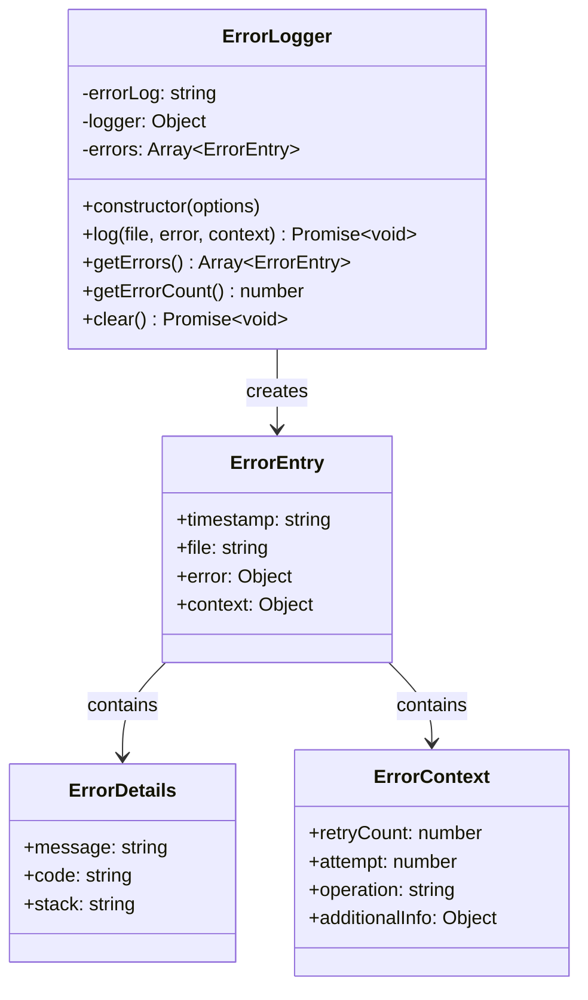
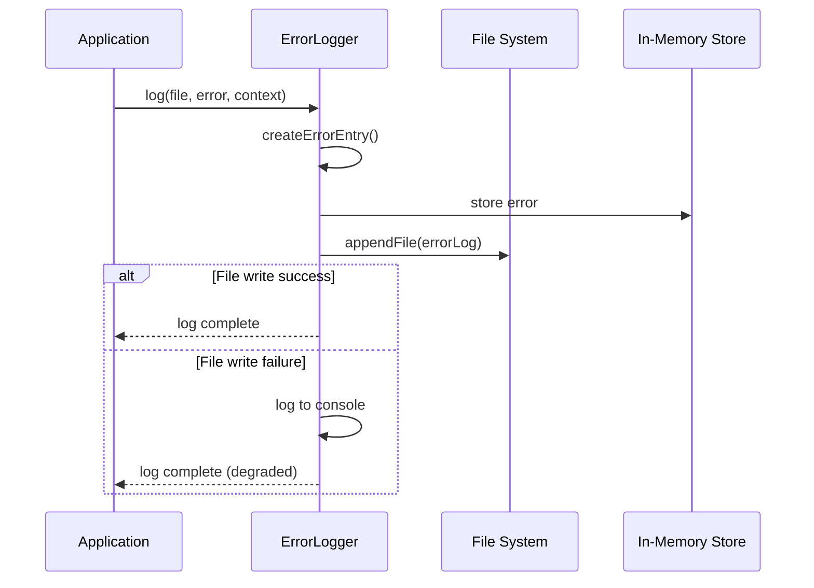

# ErrorLogger

## Overview

The `ErrorLogger` class provides centralized error logging functionality for the image optimization pipeline. It captures detailed error information including context, timestamps, and retry attempts, persisting them to both memory and a log file for debugging and monitoring purposes.

## Exports

```javascript
module.exports = ErrorLogger;
```

## Class Definition

```javascript
class ErrorLogger {
  constructor(options = {})
  
  async log(file, error, context)
  getErrors()
  getErrorCount()
  async clear()
}
```

## Rationale

### Why This Module Exists

1. **Centralized Error Logging**: Provides a single point for capturing all errors during image processing
2. **Persistent Storage**: Maintains error logs in files for post-processing analysis
3. **Structured Data**: Captures errors in a consistent, structured format
4. **Context Preservation**: Records important context information for debugging
5. **Monitoring Support**: Enables easy error tracking and reporting
6. **Debugging Aid**: Provides detailed error information for troubleshooting

### Design Patterns

- **Singleton Pattern**: Typically used as a single instance across the application
- **Observer Pattern**: Collects and logs errors from various components
- **Repository Pattern**: Abstracts error storage operations
- **Data Transfer Object**: Structures error data consistently

## Class Diagram



## Error Flow



## Method Documentation

### constructor(options)

Initializes the ErrorLogger with configuration options.

**Parameters**:
- `options` (Object): Configuration options
  - `errorLog` (string): Path to error log file (default: 'image-optimization-errors.log')
  - `logger` (Object): Logger interface for fallback logging (default: console)

**Example**:
```javascript
const errorLogger = new ErrorLogger({
  errorLog: './logs/errors.log',
  logger: customLogger
});
```

### log(file, error, context)

Logs an error with detailed context information.

**Parameters**:
- `file` (string): Path or name of the file being processed when error occurred
- `error` (Error): The error object to log
- `context` (Object): Additional context information
  - `attempt` (number): Current retry attempt number
  - `operation` (string): Operation being performed
  - `additionalInfo` (Object): Any additional context data

**Returns**: Promise\<void\>

**Error Entry Structure**:
```javascript
{
  timestamp: "2024-01-15T10:30:00.000Z",
  file: "image.jpg",
  error: {
    message: "Failed to process image",
    code: "ENOENT",
    stack: "Error: Failed to process image\n    at ..."
  },
  context: {
    retryCount: 2,
    operation: "resize",
    additionalInfo: {}
  }
}
```

### getErrors()

Retrieves all logged errors from memory.

**Returns**: Array\<ErrorEntry\> - Array of error entries

### getErrorCount()

Gets the total number of errors logged.

**Returns**: number - Total error count

### clear()

Clears all errors from memory and removes the error log file.

**Returns**: Promise\<void\>

## Error Entry Schema

```typescript
interface ErrorEntry {
  timestamp: string;           // ISO timestamp
  file: string;               // File being processed
  error: {
    message: string;          // Error message
    code?: string;            // Error code (ENOENT, etc.)
    stack?: string;           // Stack trace
  };
  context: {
    retryCount: number;       // Number of retry attempts
    operation?: string;       // Operation being performed
    additionalInfo?: object;  // Additional context data
  };
}
```

## Usage Examples

### Basic Error Logging

```javascript
const ErrorLogger = require('./error-logger');

const errorLogger = new ErrorLogger();

try {
  // Some operation that might fail
  await processImage('photo.jpg');
} catch (error) {
  await errorLogger.log('photo.jpg', error, {
    operation: 'resize',
    attempt: 1
  });
}
```

### Custom Configuration

```javascript
const errorLogger = new ErrorLogger({
  errorLog: './logs/image-errors.log',
  logger: {
    error: (msg) => console.error(`[ERROR] ${msg}`),
    log: (msg) => console.log(`[INFO] ${msg}`)
  }
});
```

### Error Analysis

```javascript
// Process multiple images and analyze errors
const errors = errorLogger.getErrors();
const errorCount = errorLogger.getErrorCount();

console.log(`Total errors: ${errorCount}`);

// Group errors by type
const errorsByType = errors.reduce((acc, entry) => {
  const errorType = entry.error.code || 'unknown';
  acc[errorType] = (acc[errorType] || 0) + 1;
  return acc;
}, {});

console.log('Error breakdown:', errorsByType);
```

### Error Reporting

```javascript
// Generate error report
const generateErrorReport = (errorLogger) => {
  const errors = errorLogger.getErrors();
  const report = {
    summary: {
      totalErrors: errors.length,
      timeRange: {
        first: errors[0]?.timestamp,
        last: errors[errors.length - 1]?.timestamp
      }
    },
    byFile: {},
    byErrorType: {},
    recentErrors: errors.slice(-10)
  };
  
  errors.forEach(entry => {
    // Group by file
    if (!report.byFile[entry.file]) {
      report.byFile[entry.file] = [];
    }
    report.byFile[entry.file].push(entry);
    
    // Group by error type
    const errorType = entry.error.code || entry.error.message;
    report.byErrorType[errorType] = (report.byErrorType[errorType] || 0) + 1;
  });
  
  return report;
};
```

### Integration with Retry Logic

```javascript
const retryOperation = async (operation, file, maxRetries = 3) => {
  for (let attempt = 1; attempt <= maxRetries; attempt++) {
    try {
      return await operation();
    } catch (error) {
      await errorLogger.log(file, error, {
        operation: 'image-processing',
        attempt,
        maxRetries
      });
      
      if (attempt === maxRetries) {
        throw error;
      }
      
      // Wait before retry
      await new Promise(resolve => setTimeout(resolve, 1000 * attempt));
    }
  }
};
```

## Error Log File Format

The error log file contains one JSON object per line (JSONL format):

```json
{"timestamp":"2024-01-15T10:30:00.000Z","file":"image1.jpg","error":{"message":"ENOENT: no such file","code":"ENOENT","stack":"Error: ENOENT..."},"context":{"retryCount":1,"operation":"resize"}}
{"timestamp":"2024-01-15T10:31:00.000Z","file":"image2.jpg","error":{"message":"Invalid image format","code":"INVALID_FORMAT","stack":"Error: Invalid..."},"context":{"retryCount":0,"operation":"validate"}}
```

## Error Categories

### File System Errors
- `ENOENT`: File not found
- `EACCES`: Permission denied
- `EBUSY`: File busy
- `EMFILE`: Too many open files

### Image Processing Errors
- `INVALID_FORMAT`: Unsupported image format
- `CORRUPT_IMAGE`: Image file corrupted
- `MEMORY_ERROR`: Insufficient memory
- `PROCESSING_FAILED`: General processing failure

### Network Errors (Git LFS)
- `ECONNRESET`: Connection reset
- `ETIMEDOUT`: Request timeout
- `ENOTFOUND`: DNS resolution failed

## Testing Approach

### Unit Tests

```javascript
describe('ErrorLogger', () => {
  let errorLogger;
  let mockFs;
  
  beforeEach(() => {
    mockFs = {
      appendFile: jest.fn().mockResolvedValue(),
      unlink: jest.fn().mockResolvedValue()
    };
    
    errorLogger = new ErrorLogger({
      errorLog: 'test-errors.log'
    });
  });
  
  test('should log error with context', async () => {
    const error = new Error('Test error');
    error.code = 'TEST_CODE';
    
    await errorLogger.log('test.jpg', error, {
      operation: 'test',
      attempt: 1
    });
    
    expect(errorLogger.getErrorCount()).toBe(1);
    
    const errors = errorLogger.getErrors();
    expect(errors[0].file).toBe('test.jpg');
    expect(errors[0].error.message).toBe('Test error');
    expect(errors[0].context.retryCount).toBe(1);
  });
  
  test('should handle file write errors gracefully', async () => {
    const consoleSpy = jest.spyOn(console, 'error').mockImplementation();
    
    // Mock file write failure
    mockFs.appendFile.mockRejectedValue(new Error('Write failed'));
    
    await errorLogger.log('test.jpg', new Error('Test'), {});
    
    expect(consoleSpy).toHaveBeenCalledWith(
      'Failed to write to error log:', 
      'Write failed'
    );
    
    consoleSpy.mockRestore();
  });
});
```

### Integration Tests

```javascript
describe('ErrorLogger Integration', () => {
  test('should persist errors across instances', async () => {
    const errorLog = './test-errors.log';
    
    // First instance
    const logger1 = new ErrorLogger({ errorLog });
    await logger1.log('test.jpg', new Error('Test'), {});
    
    // Second instance should be able to read existing log
    const logger2 = new ErrorLogger({ errorLog });
    // Note: This would require implementing log file reading
    
    // Clean up
    await logger1.clear();
  });
});
```

## Benefits

1. **Centralized Error Management**: Single point for all error handling
2. **Persistent Storage**: Errors survive application restarts
3. **Rich Context**: Detailed information for debugging
4. **Structured Data**: Consistent error format enables analysis
5. **Graceful Degradation**: Continues working even if file writes fail
6. **Memory Efficiency**: Stores minimal error information in memory
7. **Integration Ready**: Easy to integrate with monitoring systems

## Future Enhancements

1. **Log Rotation**: Implement log file rotation to prevent huge files
2. **Structured Logging**: Support for structured logging formats (JSON, etc.)
3. **Remote Logging**: Send errors to remote logging services
4. **Error Classification**: Automatic error categorization and severity levels
5. **Performance Metrics**: Track error rates and patterns over time
6. **Alerting**: Integration with alerting systems for critical errors
7. **Log Parsing**: Tools for analyzing and querying error logs
8. **Compression**: Compress old log files to save space