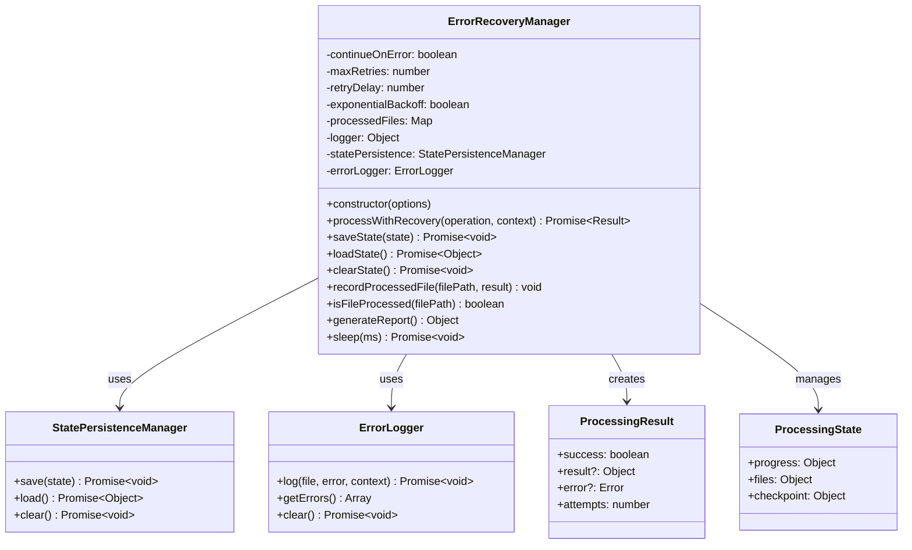
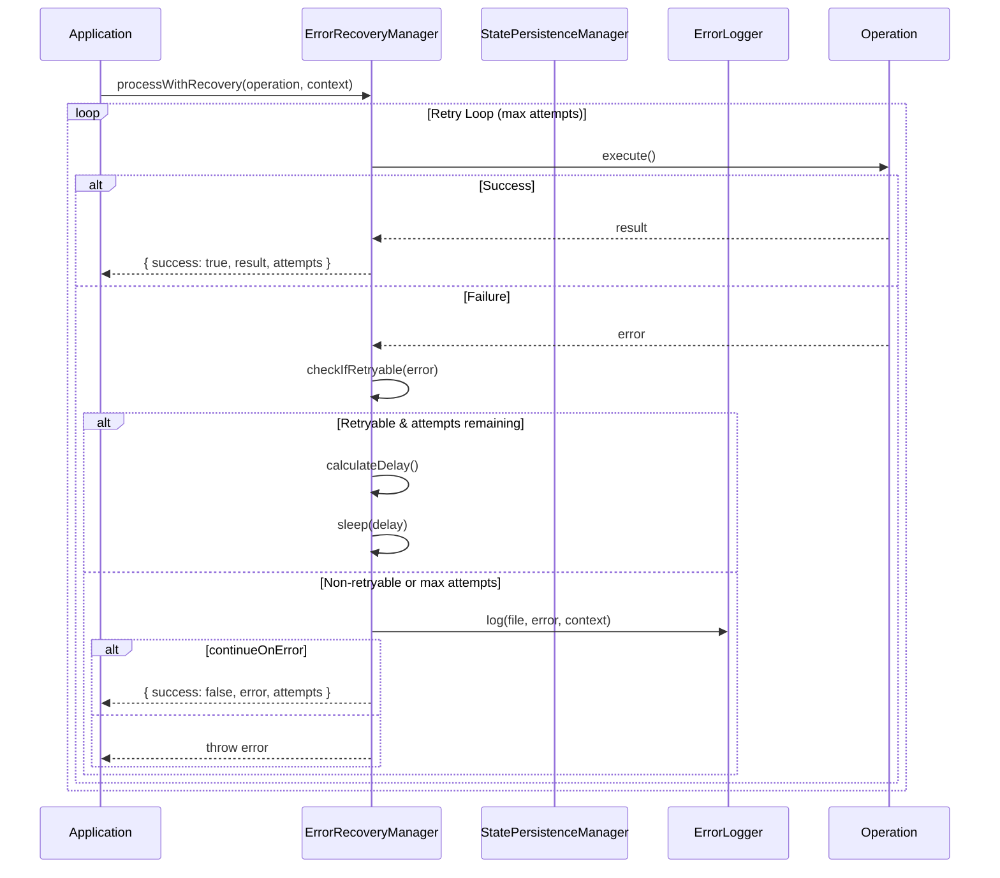
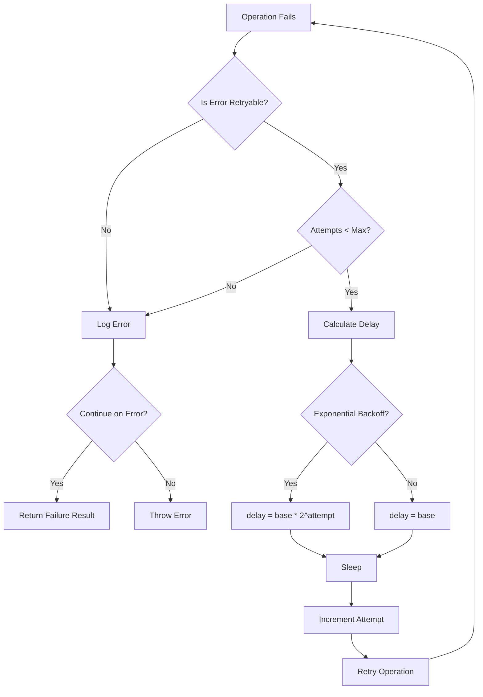
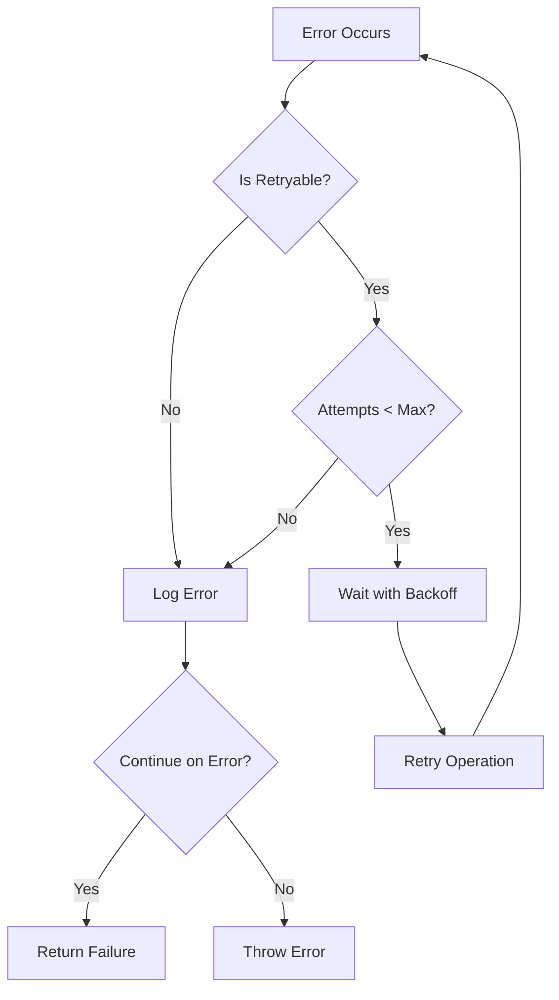

# ErrorRecoveryManager

## Overview

The `ErrorRecoveryManager` class provides comprehensive error recovery and resilience capabilities for the image optimization pipeline. It implements retry logic with exponential backoff, state persistence for resumable operations, and detailed error tracking. This module ensures the application can gracefully handle failures and continue processing even when encountering errors.

## Exports

```javascript
module.exports = ErrorRecoveryManager;
```

## Class Definition

```javascript
class ErrorRecoveryManager {
  constructor(options = {})
  
  async processWithRecovery(operation, context)
  async saveState(state)
  async loadState()
  async clearState()
  recordProcessedFile(filePath, result)
  isFileProcessed(filePath)
  generateReport()
  sleep(ms)
}
```

## Rationale

### Why This Module Exists

1. **Resilience**: Provides robust error handling and recovery mechanisms
2. **Retry Logic**: Implements intelligent retry strategies with exponential backoff
3. **State Persistence**: Enables resumable operations after failures or interruptions
4. **Error Classification**: Distinguishes between retryable and non-retryable errors
5. **Progress Tracking**: Maintains detailed progress information across sessions
6. **Reporting**: Generates comprehensive reports on processing results
7. **Graceful Degradation**: Allows processing to continue despite individual failures

### Design Patterns

- **Command Pattern**: Wraps operations for retry execution
- **State Pattern**: Manages different processing states
- **Strategy Pattern**: Different retry strategies based on error types
- **Observer Pattern**: Tracks and reports on processing progress
- **Memento Pattern**: Saves and restores processing state
- **Circuit Breaker**: Prevents cascading failures
- **Composite Pattern**: Aggregates multiple recovery mechanisms

## Class Diagram



## Recovery Flow



## Retry Strategy



## Method Documentation

### constructor(options)

Initializes the ErrorRecoveryManager with configuration options.

**Parameters**:
- `options` (Object): Configuration options
  - `continueOnError` (boolean): Whether to continue processing after errors (default: false)
  - `maxRetries` (number): Maximum retry attempts (default: 3)
  - `retryDelay` (number): Base delay between retries in ms (default: 1000)
  - `exponentialBackoff` (boolean): Use exponential backoff for delays (default: true)
  - `stateFile` (string): Path to state persistence file
  - `errorLog` (string): Path to error log file
  - `logger` (Object): Logger interface (default: console)

### processWithRecovery(operation, context)

Executes an operation with retry logic and error recovery.

**Parameters**:
- `operation` (Function): Async function to execute
- `context` (Object): Context information for error logging
  - `file` (string): File being processed
  - `operation` (string): Operation name
  - Additional context data

**Returns**: Promise\<ProcessingResult\>

**ProcessingResult Structure**:
```javascript
{
  success: boolean,      // Whether operation succeeded
  result?: any,          // Operation result (if successful)
  error?: Error,         // Error object (if failed)
  attempts: number       // Number of attempts made
}
```

**Retryable Error Codes**:
- `ENOENT`: File not found (temporary)
- `EBUSY`: File busy
- `ETIMEDOUT`: Request timeout
- `ECONNRESET`: Connection reset
- `ENOTFOUND`: DNS resolution failed
- Errors containing 'LFS' in message

### saveState(state)

Persists the current processing state to storage.

**Parameters**:
- `state` (Object): State information to save
  - `total` (number): Total files to process
  - `pending` (Array): Remaining files to process
  - Additional state data

**State Structure**:
```javascript
{
  progress: {
    total: number,
    processed: number,
    succeeded: number,
    failed: number,
    remaining: number
  },
  files: {
    processed: Array<ProcessedFile>,
    pending: Array<string>
  }
}
```

### loadState()

Loads previously saved processing state.

**Returns**: Promise\<Object|null\> - Saved state or null if none exists

### clearState()

Clears all saved state and error logs.

**Returns**: Promise\<void\>

### recordProcessedFile(filePath, result)

Records the result of processing a file.

**Parameters**:
- `filePath` (string): Path to the processed file
- `result` (Object): Processing result
  - `status` (string): 'success' or 'failed'
  - `error` (Error): Error object (if failed)
  - `outputs` (Array): Generated output files

### isFileProcessed(filePath)

Checks if a file has already been processed.

**Parameters**:
- `filePath` (string): Path to check

**Returns**: boolean - True if file was processed

### generateReport()

Generates a comprehensive processing report.

**Returns**: Object - Processing report

**Report Structure**:
```javascript
{
  summary: {
    total: number,
    succeeded: number,
    failed: number,
    successRate: string
  },
  errors: Array<ErrorEntry>,
  errorCount: number
}
```

## Usage Examples

### Basic Error Recovery

```javascript
const ErrorRecoveryManager = require('./error-recovery-manager');

const errorRecovery = new ErrorRecoveryManager({
  maxRetries: 3,
  retryDelay: 1000,
  continueOnError: true
});

// Process with recovery
const result = await errorRecovery.processWithRecovery(
  async () => {
    // Your operation here
    return await processImage('photo.jpg');
  },
  {
    file: 'photo.jpg',
    operation: 'image-optimization'
  }
);

if (result.success) {
  console.log('Processing succeeded:', result.result);
} else {
  console.log('Processing failed after', result.attempts, 'attempts');
}
```

### Resumable Processing

```javascript
const errorRecovery = new ErrorRecoveryManager({
  stateFile: '.processing-state.json',
  continueOnError: true
});

// Load previous state
const savedState = await errorRecovery.loadState();
let filesToProcess = getAllFiles();

if (savedState) {
  console.log('Resuming from previous session...');
  filesToProcess = savedState.files.pending;
}

// Process files
for (const file of filesToProcess) {
  if (errorRecovery.isFileProcessed(file)) {
    console.log(`Skipping already processed file: ${file}`);
    continue;
  }
  
  const result = await errorRecovery.processWithRecovery(
    () => processFile(file),
    { file, operation: 'optimization' }
  );
  
  errorRecovery.recordProcessedFile(file, {
    status: result.success ? 'success' : 'failed',
    error: result.error,
    outputs: result.result?.outputs || []
  });
  
  // Save state periodically
  if (processedCount % 10 === 0) {
    await errorRecovery.saveState({
      total: filesToProcess.length,
      pending: filesToProcess.slice(processedCount)
    });
  }
}

// Generate final report
const report = errorRecovery.generateReport();
console.log('Processing complete:', report.summary);
```

### Custom Retry Configuration

```javascript
const errorRecovery = new ErrorRecoveryManager({
  maxRetries: 5,
  retryDelay: 500,
  exponentialBackoff: true,
  continueOnError: false
});

// This will retry up to 5 times with delays: 500ms, 1000ms, 2000ms, 4000ms, 8000ms
```

### Batch Processing with Recovery

```javascript
const processBatch = async (files) => {
  const errorRecovery = new ErrorRecoveryManager({
    continueOnError: true,
    maxRetries: 3
  });
  
  const results = [];
  
  for (const file of files) {
    const result = await errorRecovery.processWithRecovery(
      () => optimizeImage(file),
      { file, operation: 'batch-optimization' }
    );
    
    results.push({
      file,
      success: result.success,
      attempts: result.attempts,
      error: result.error?.message
    });
    
    errorRecovery.recordProcessedFile(file, {
      status: result.success ? 'success' : 'failed'
    });
  }
  
  // Generate summary report
  const report = errorRecovery.generateReport();
  
  return {
    results,
    summary: report.summary,
    errorDetails: report.errors
  };
};
```

### Error Analysis

```javascript
const analyzeErrors = (errorRecovery) => {
  const report = errorRecovery.generateReport();
  
  // Group errors by type
  const errorsByType = report.errors.reduce((acc, error) => {
    const type = error.error.code || 'unknown';
    acc[type] = (acc[type] || 0) + 1;
    return acc;
  }, {});
  
  // Find most problematic files
  const fileErrors = report.errors.reduce((acc, error) => {
    acc[error.file] = (acc[error.file] || 0) + 1;
    return acc;
  }, {});
  
  const mostProblematicFiles = Object.entries(fileErrors)
    .sort(([,a], [,b]) => b - a)
    .slice(0, 10);
  
  return {
    summary: report.summary,
    errorsByType,
    mostProblematicFiles,
    totalErrors: report.errorCount
  };
};
```

## Configuration Options

### Retry Configuration

```javascript
{
  maxRetries: 3,              // Maximum retry attempts
  retryDelay: 1000,           // Base delay in milliseconds
  exponentialBackoff: true,   // Use exponential backoff
  continueOnError: false      // Continue processing after errors
}
```

### State Persistence Configuration

```javascript
{
  stateFile: '.processing-state.json',  // State file path
  errorLog: 'errors.log'                // Error log file path
}
```

### Exponential Backoff Calculation

```javascript
// With exponentialBackoff: true
const delay = retryDelay * Math.pow(2, attempt - 1);

// Examples with retryDelay: 1000ms
// Attempt 1: 1000ms
// Attempt 2: 2000ms
// Attempt 3: 4000ms
// Attempt 4: 8000ms
```

## Error Handling Strategies

### Retryable vs Non-Retryable Errors

```javascript
const retryableErrors = [
  'ENOENT',      // File not found (might be temporary)
  'EBUSY',       // File busy (might be released)
  'ETIMEDOUT',   // Network timeout
  'ECONNRESET',  // Connection issues
  'ENOTFOUND'    // DNS issues
];

// LFS-related errors are also retryable
const isRetryable = retryableErrors.includes(error.code) || 
                   error.message.includes('LFS');
```

### Error Recovery Decision Tree



## Testing Approach

### Unit Tests

```javascript
describe('ErrorRecoveryManager', () => {
  let errorRecovery;
  
  beforeEach(() => {
    errorRecovery = new ErrorRecoveryManager({
      maxRetries: 3,
      retryDelay: 100,
      continueOnError: true
    });
  });
  
  test('should retry retryable errors', async () => {
    let attempts = 0;
    const operation = jest.fn().mockImplementation(() => {
      attempts++;
      if (attempts < 3) {
        const error = new Error('Temporary failure');
        error.code = 'ENOENT';
        throw error;
      }
      return 'success';
    });
    
    const result = await errorRecovery.processWithRecovery(
      operation,
      { file: 'test.jpg' }
    );
    
    expect(result.success).toBe(true);
    expect(result.attempts).toBe(3);
    expect(operation).toHaveBeenCalledTimes(3);
  });
  
  test('should not retry non-retryable errors', async () => {
    const operation = jest.fn().mockRejectedValue(
      new Error('Invalid format')
    );
    
    const result = await errorRecovery.processWithRecovery(
      operation,
      { file: 'test.jpg' }
    );
    
    expect(result.success).toBe(false);
    expect(result.attempts).toBe(1);
    expect(operation).toHaveBeenCalledTimes(1);
  });
});
```

### Integration Tests

```javascript
describe('ErrorRecoveryManager Integration', () => {
  test('should persist and restore state', async () => {
    const stateFile = './test-state.json';
    const errorRecovery = new ErrorRecoveryManager({ stateFile });
    
    // Save state
    await errorRecovery.saveState({
      total: 100,
      pending: ['file1.jpg', 'file2.jpg']
    });
    
    // Load state in new instance
    const newInstance = new ErrorRecoveryManager({ stateFile });
    const state = await newInstance.loadState();
    
    expect(state.progress.total).toBe(100);
    expect(state.files.pending).toEqual(['file1.jpg', 'file2.jpg']);
    
    // Clean up
    await errorRecovery.clearState();
  });
});
```

## Benefits

1. **Resilience**: Handles transient failures gracefully with intelligent retry logic
2. **Resumability**: Supports resuming operations after interruptions
3. **Comprehensive Logging**: Detailed error tracking and reporting
4. **Flexible Configuration**: Customizable retry strategies and behavior
5. **State Management**: Persistent state tracking across sessions
6. **Error Classification**: Distinguishes between different error types
7. **Progress Tracking**: Detailed progress monitoring and reporting
8. **Graceful Degradation**: Continues processing despite individual failures

## Future Enhancements

1. **Circuit Breaker**: Implement circuit breaker pattern for cascading failure prevention
2. **Adaptive Retry**: Dynamic retry strategies based on error patterns
3. **Parallel Recovery**: Support for parallel operation recovery
4. **Metrics Collection**: Detailed performance and reliability metrics
5. **Custom Retry Strategies**: Pluggable retry strategy implementations
6. **Distributed State**: Support for distributed state management
7. **Real-time Monitoring**: Live monitoring and alerting capabilities
8. **Auto-healing**: Automatic recovery from common failure scenarios