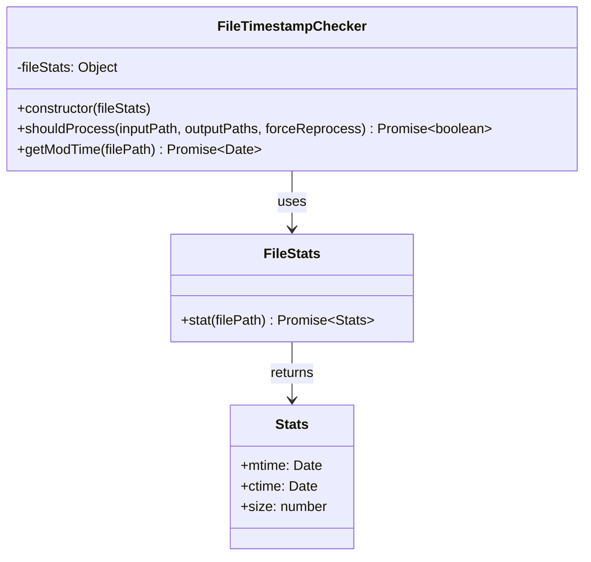
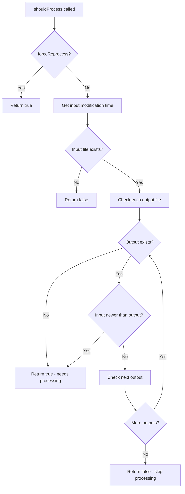
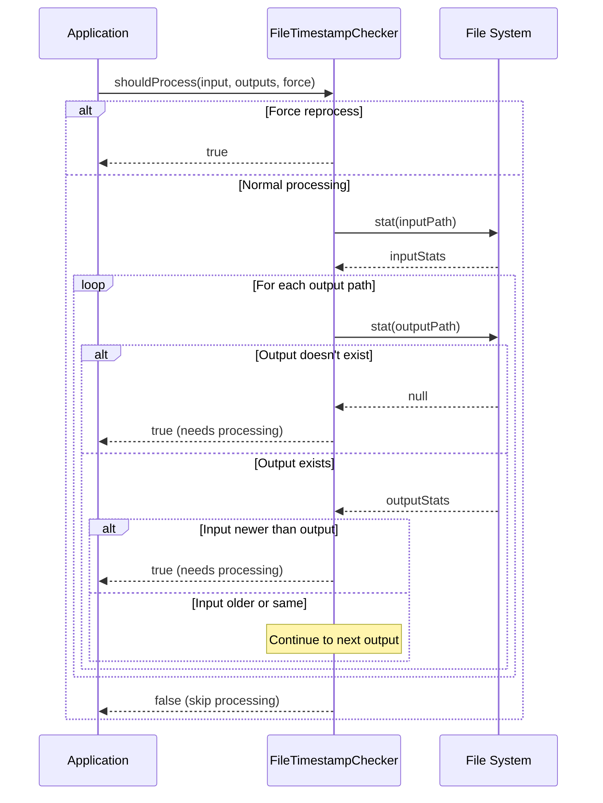

# FileTimestampChecker

## Overview

The `FileTimestampChecker` class provides intelligent file modification time comparison to determine if image processing should occur. It implements timestamp-based change detection to avoid unnecessary reprocessing of images that haven't been modified since their outputs were generated, significantly improving performance and efficiency.

## Exports

```javascript
module.exports = FileTimestampChecker;
```

## Class Definition

```javascript
class FileTimestampChecker {
  constructor(fileStats)
  
  async shouldProcess(inputPath, outputPaths, forceReprocess)
  async getModTime(filePath)
}
```

## Rationale

### Why This Module Exists

1. **Performance Optimization**: Avoids unnecessary reprocessing of unchanged images
2. **Incremental Processing**: Enables efficient incremental builds and updates
3. **Resource Conservation**: Saves CPU, memory, and I/O resources
4. **Time Efficiency**: Reduces processing time for large image collections
5. **Smart Rebuilds**: Only processes files that actually need updating
6. **Dependency Tracking**: Compares input vs output modification times
7. **Force Override**: Supports forced reprocessing when needed

### Design Patterns

- **Strategy Pattern**: Different processing strategies based on timestamp comparison
- **Template Method**: Consistent timestamp checking algorithm
- **Dependency Injection**: File system operations are injected for testability
- **Factory Pattern**: Creates file stat objects for timestamp comparison

## Class Diagram



## Decision Flow



## Timestamp Comparison Logic



## Method Documentation

### constructor(fileStats)

Initializes the FileTimestampChecker with a file system interface.

**Parameters**:
- `fileStats` (Object): File system interface for getting file statistics
  - `stat(filePath)` (Function): Returns file statistics including modification time

**Example**:
```javascript
const fs = require('fs').promises;
const checker = new FileTimestampChecker(fs);
```

### shouldProcess(inputPath, outputPaths, forceReprocess)

Determines if an input file should be processed based on timestamp comparison with its outputs.

**Parameters**:
- `inputPath` (string): Path to the input file
- `outputPaths` (Array\<string\>): Array of output file paths to compare against
- `forceReprocess` (boolean): If true, always returns true regardless of timestamps

**Returns**: Promise\<boolean\> - True if processing should occur, false if it can be skipped

**Logic**:
1. If `forceReprocess` is true, returns true immediately
2. Gets modification time of input file
3. If input file doesn't exist, returns false
4. For each output file:
   - If output doesn't exist, returns true (needs to be created)
   - If input is newer than output, returns true (needs updating)
5. If all outputs exist and are newer than or equal to input, returns false

### getModTime(filePath)

Gets the modification time of a file.

**Parameters**:
- `filePath` (string): Path to the file

**Returns**: Promise\<Date|null\> - Modification time or null if file doesn't exist

**Error Handling**:
- Returns null for any file system errors (file not found, permission denied, etc.)
- Does not throw exceptions for missing files

## Usage Examples

### Basic Usage

```javascript
const fs = require('fs').promises;
const FileTimestampChecker = require('./file-timestamp-checker');

const checker = new FileTimestampChecker(fs);

const shouldProcess = await checker.shouldProcess(
  'original/photo.jpg',
  [
    'optimized/photo.webp',
    'optimized/photo.avif',
    'optimized/photo-thumb.webp'
  ],
  false
);

if (shouldProcess) {
  console.log('Image needs processing');
  // Process the image
} else {
  console.log('Image is up to date, skipping...');
}
```

### Integration with Image Optimizer

```javascript
class ImageOptimizer {
  constructor() {
    this.timestampChecker = new FileTimestampChecker(fs);
  }
  
  async optimizeImage(inputPath, outputConfig, options = {}) {
    const outputPaths = outputConfig.formats.map(format => 
      this.generateOutputPath(inputPath, format)
    );
    
    const shouldProcess = await this.timestampChecker.shouldProcess(
      inputPath,
      outputPaths,
      options.forceReprocess
    );
    
    if (!shouldProcess) {
      return { status: 'skipped', reason: 'up-to-date' };
    }
    
    // Proceed with processing
    return await this.processImage(inputPath, outputConfig);
  }
}
```

### Batch Processing with Timestamp Checking

```javascript
const processBatch = async (inputFiles, forceReprocess = false) => {
  const checker = new FileTimestampChecker(fs);
  const stats = { processed: 0, skipped: 0, errors: 0 };
  
  for (const inputFile of inputFiles) {
    try {
      const outputPaths = generateOutputPaths(inputFile);
      
      const shouldProcess = await checker.shouldProcess(
        inputFile,
        outputPaths,
        forceReprocess
      );
      
      if (shouldProcess) {
        await processImage(inputFile);
        stats.processed++;
        console.log(`✅ Processed: ${inputFile}`);
      } else {
        stats.skipped++;
        console.log(`⏭️  Skipped: ${inputFile} (up to date)`);
      }
    } catch (error) {
      stats.errors++;
      console.error(`❌ Error processing ${inputFile}:`, error);
    }
  }
  
  return stats;
};
```

### Custom File Stats Interface

```javascript
// Mock interface for testing
const mockFileStats = {
  async stat(filePath) {
    // Custom implementation
    if (filePath === 'missing.jpg') {
      throw new Error('ENOENT: no such file');
    }
    
    return {
      mtime: new Date('2024-01-15T10:00:00Z'),
      ctime: new Date('2024-01-15T09:00:00Z'),
      size: 1024000
    };
  }
};

const checker = new FileTimestampChecker(mockFileStats);
```

### Watch Mode Integration

```javascript
const chokidar = require('chokidar');

const watchForChanges = (inputDir, outputDir) => {
  const checker = new FileTimestampChecker(fs);
  
  const watcher = chokidar.watch(inputDir, {
    persistent: true,
    ignoreInitial: false
  });
  
  watcher.on('change', async (inputPath) => {
    const outputPaths = generateOutputPaths(inputPath, outputDir);
    
    // Check if processing is needed
    const shouldProcess = await checker.shouldProcess(
      inputPath,
      outputPaths,
      false
    );
    
    if (shouldProcess) {
      console.log(`🔄 File changed: ${inputPath}`);
      await processImage(inputPath, outputPaths);
    }
  });
  
  return watcher;
};
```

### Detailed Timestamp Analysis

```javascript
const analyzeTimestamps = async (inputPath, outputPaths) => {
  const checker = new FileTimestampChecker(fs);
  
  const inputTime = await checker.getModTime(inputPath);
  const analysis = {
    inputPath,
    inputTime,
    outputs: []
  };
  
  for (const outputPath of outputPaths) {
    const outputTime = await checker.getModTime(outputPath);
    analysis.outputs.push({
      path: outputPath,
      modTime: outputTime,
      exists: outputTime !== null,
      isNewer: outputTime && inputTime ? outputTime > inputTime : false,
      ageDifference: outputTime && inputTime ? 
        outputTime.getTime() - inputTime.getTime() : null
    });
  }
  
  const shouldProcess = await checker.shouldProcess(
    inputPath,
    outputPaths,
    false
  );
  
  analysis.recommendation = shouldProcess ? 'PROCESS' : 'SKIP';
  
  return analysis;
};

// Usage
const analysis = await analyzeTimestamps(
  'original/photo.jpg',
  ['optimized/photo.webp', 'optimized/photo.avif']
);

console.log('Timestamp Analysis:', JSON.stringify(analysis, null, 2));
```

## Edge Cases and Considerations

### Clock Skew Handling

```javascript
// Handle small time differences due to clock skew
const shouldProcessWithTolerance = async (inputPath, outputPaths, tolerance = 1000) => {
  const checker = new FileTimestampChecker(fs);
  const inputTime = await checker.getModTime(inputPath);
  
  if (!inputTime) return false;
  
  for (const outputPath of outputPaths) {
    const outputTime = await checker.getModTime(outputPath);
    
    if (!outputTime) return true;
    
    // Consider files equal if within tolerance (1 second by default)
    const timeDiff = inputTime.getTime() - outputTime.getTime();
    if (timeDiff > tolerance) {
      return true;
    }
  }
  
  return false;
};
```

### Network File System Considerations

```javascript
// Handle NFS timestamp precision issues
const getModTimeWithPrecision = async (filePath, precision = 1000) => {
  try {
    const stats = await fs.stat(filePath);
    const mtime = stats.mtime.getTime();
    
    // Round to nearest second to handle NFS precision
    return new Date(Math.floor(mtime / precision) * precision);
  } catch {
    return null;
  }
};
```

## Testing Approach

### Unit Tests

```javascript
describe('FileTimestampChecker', () => {
  let checker;
  let mockFs;
  
  beforeEach(() => {
    mockFs = {
      stat: jest.fn()
    };
    checker = new FileTimestampChecker(mockFs);
  });
  
  test('should return true when forceReprocess is true', async () => {
    const result = await checker.shouldProcess(
      'input.jpg',
      ['output.webp'],
      true
    );
    
    expect(result).toBe(true);
    expect(mockFs.stat).not.toHaveBeenCalled();
  });
  
  test('should return true when output does not exist', async () => {
    mockFs.stat
      .mockResolvedValueOnce({ mtime: new Date('2024-01-15T10:00:00Z') })
      .mockRejectedValueOnce(new Error('ENOENT'));
    
    const result = await checker.shouldProcess(
      'input.jpg',
      ['output.webp'],
      false
    );
    
    expect(result).toBe(true);
  });
  
  test('should return true when input is newer than output', async () => {
    mockFs.stat
      .mockResolvedValueOnce({ mtime: new Date('2024-01-15T11:00:00Z') })
      .mockResolvedValueOnce({ mtime: new Date('2024-01-15T10:00:00Z') });
    
    const result = await checker.shouldProcess(
      'input.jpg',
      ['output.webp'],
      false
    );
    
    expect(result).toBe(true);
  });
  
  test('should return false when all outputs are newer', async () => {
    mockFs.stat
      .mockResolvedValueOnce({ mtime: new Date('2024-01-15T10:00:00Z') })
      .mockResolvedValueOnce({ mtime: new Date('2024-01-15T11:00:00Z') })
      .mockResolvedValueOnce({ mtime: new Date('2024-01-15T12:00:00Z') });
    
    const result = await checker.shouldProcess(
      'input.jpg',
      ['output1.webp', 'output2.avif'],
      false
    );
    
    expect(result).toBe(false);
  });
});
```

### Integration Tests

```javascript
describe('FileTimestampChecker Integration', () => {
  const testDir = './test-files';
  
  beforeEach(async () => {
    await fs.mkdir(testDir, { recursive: true });
  });
  
  afterEach(async () => {
    await fs.rmdir(testDir, { recursive: true });
  });
  
  test('should work with real files', async () => {
    const inputPath = path.join(testDir, 'input.jpg');
    const outputPath = path.join(testDir, 'output.webp');
    
    // Create input file
    await fs.writeFile(inputPath, 'input content');
    
    const checker = new FileTimestampChecker(fs);
    
    // Should process when output doesn't exist
    let result = await checker.shouldProcess(inputPath, [outputPath], false);
    expect(result).toBe(true);
    
    // Create output file
    await fs.writeFile(outputPath, 'output content');
    
    // Should not process when output is newer
    result = await checker.shouldProcess(inputPath, [outputPath], false);
    expect(result).toBe(false);
    
    // Wait and modify input
    await new Promise(resolve => setTimeout(resolve, 10));
    await fs.writeFile(inputPath, 'modified input');
    
    // Should process when input is newer
    result = await checker.shouldProcess(inputPath, [outputPath], false);
    expect(result).toBe(true);
  });
});
```

## Performance Considerations

### Caching Timestamps

```javascript
class CachedTimestampChecker extends FileTimestampChecker {
  constructor(fileStats) {
    super(fileStats);
    this.cache = new Map();
    this.cacheTimeout = 5000; // 5 seconds
  }
  
  async getModTime(filePath) {
    const cached = this.cache.get(filePath);
    
    if (cached && Date.now() - cached.timestamp < this.cacheTimeout) {
      return cached.mtime;
    }
    
    const mtime = await super.getModTime(filePath);
    
    this.cache.set(filePath, {
      mtime,
      timestamp: Date.now()
    });
    
    return mtime;
  }
}
```

### Batch Stat Operations

```javascript
const batchShouldProcess = async (inputOutputPairs, forceReprocess) => {
  if (forceReprocess) {
    return inputOutputPairs.map(() => true);
  }
  
  const checker = new FileTimestampChecker(fs);
  const results = [];
  
  // Collect all unique file paths
  const allPaths = new Set();
  inputOutputPairs.forEach(([input, outputs]) => {
    allPaths.add(input);
    outputs.forEach(output => allPaths.add(output));
  });
  
  // Batch stat all files
  const timestamps = new Map();
  await Promise.all(
    Array.from(allPaths).map(async (path) => {
      const mtime = await checker.getModTime(path);
      timestamps.set(path, mtime);
    })
  );
  
  // Check each pair using cached timestamps
  for (const [input, outputs] of inputOutputPairs) {
    const inputTime = timestamps.get(input);
    
    if (!inputTime) {
      results.push(false);
      continue;
    }
    
    let shouldProcess = false;
    for (const output of outputs) {
      const outputTime = timestamps.get(output);
      if (!outputTime || inputTime > outputTime) {
        shouldProcess = true;
        break;
      }
    }
    
    results.push(shouldProcess);
  }
  
  return results;
};
```

## Benefits

1. **Performance Optimization**: Avoids unnecessary processing of unchanged files
2. **Resource Efficiency**: Saves CPU, memory, and storage I/O
3. **Incremental Builds**: Enables fast incremental processing workflows
4. **Smart Caching**: Intelligent cache invalidation based on file modifications
5. **Dependency Tracking**: Proper input-output dependency management
6. **Force Override**: Supports manual reprocessing when needed
7. **Error Resilience**: Handles missing files and permission errors gracefully

## Future Enhancements

1. **Content-based Hashing**: Use file content hashes in addition to timestamps
2. **Metadata Tracking**: Consider EXIF and other metadata changes
3. **Dependency Graphs**: Support for complex dependency relationships
4. **Parallel Checking**: Concurrent timestamp checking for large file sets
5. **Watch Integration**: Direct integration with file system watchers
6. **Configuration Tracking**: Invalidate cache when processing configuration changes
7. **Network Optimization**: Optimized checking for network file systems
8. **Database Backend**: Use database for timestamp tracking in large projects