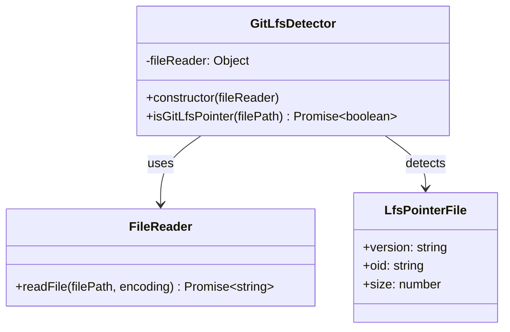
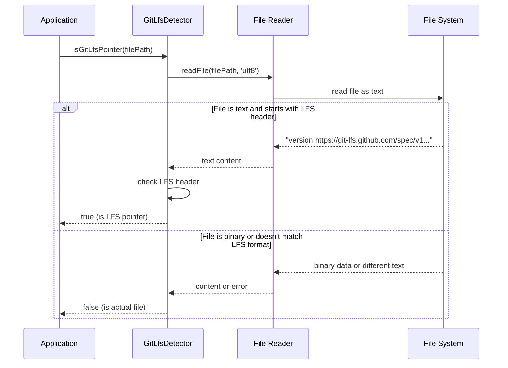

# GitLfsDetector

## Overview

The `GitLfsDetector` class provides functionality to detect Git LFS (Large File Storage) pointer files in the repository. It distinguishes between actual image files and Git LFS pointer files by analyzing file content, enabling the application to handle LFS files appropriately by triggering downloads when needed.

## Exports

```javascript
module.exports = GitLfsDetector;
```

## Class Definition

```javascript
class GitLfsDetector {
  constructor(fileReader)
  
  async isGitLfsPointer(filePath)
}
```

## Rationale

### Why This Module Exists

1. **LFS Detection**: Identifies Git LFS pointer files vs actual binary files
2. **Content Analysis**: Determines file type by examining file content
3. **Processing Decision**: Helps decide whether to download LFS files before processing
4. **Error Prevention**: Prevents attempting to process pointer files as images
5. **Workflow Integration**: Seamlessly integrates with Git LFS workflows
6. **Resource Management**: Avoids unnecessary processing of placeholder files
7. **User Experience**: Provides clear feedback about LFS file status

### Design Patterns

- **Strategy Pattern**: Different detection strategies for different file types
- **Template Method**: Consistent detection algorithm across file types
- **Dependency Injection**: File reading operations are injected for testability
- **Factory Pattern**: Creates appropriate detection logic based on file content

## Class Diagram



## Detection Flow



## LFS Pointer File Format

Git LFS pointer files are small text files that contain metadata about the actual large file:

```
version https://git-lfs.github.com/spec/v1
oid sha256:4d7a214614ab2935c943f9e0ff69d22eadbb8f32b1258daaa5e2ca24d17e2393
size 12345
```

## Method Documentation

### constructor(fileReader)

Initializes the GitLfsDetector with a file reading interface.

**Parameters**:
- `fileReader` (Object): File reading interface
  - `readFile(filePath, encoding)` (Function): Reads file content as text

**Example**:
```javascript
const fs = require('fs').promises;
const detector = new GitLfsDetector(fs);
```

### isGitLfsPointer(filePath)

Determines if a file is a Git LFS pointer file by examining its content.

**Parameters**:
- `filePath` (string): Path to the file to check

**Returns**: Promise\<boolean\> - True if the file is a Git LFS pointer, false otherwise

**Detection Logic**:
1. Attempts to read the file as UTF-8 text
2. Checks if content starts with Git LFS version header
3. Returns false if file cannot be read as text (likely binary)
4. Returns false if content doesn't match LFS pointer format

**Error Handling**:
- Returns false for any file reading errors
- Assumes binary files are not LFS pointers
- Handles permission errors gracefully

## Usage Examples

### Basic LFS Detection

```javascript
const fs = require('fs').promises;
const GitLfsDetector = require('./git-lfs-detector');

const detector = new GitLfsDetector(fs);

// Check if a file is an LFS pointer
const isLfsPointer = await detector.isGitLfsPointer('path/to/image.jpg');

if (isLfsPointer) {
  console.log('File is a Git LFS pointer - needs to be downloaded');
} else {
  console.log('File is an actual image - can be processed');
}
```

### Integration with Image Processing

```javascript
class ImageProcessor {
  constructor() {
    this.lfsDetector = new GitLfsDetector(fs);
    this.lfsPuller = new GitLfsPuller();
  }
  
  async processImage(filePath, options = {}) {
    // Check if file is LFS pointer
    const isLfsPointer = await this.lfsDetector.isGitLfsPointer(filePath);
    
    if (isLfsPointer) {
      if (options.pullLfs) {
        console.log(`Downloading LFS file: ${filePath}`);
        const pullResult = await this.lfsPuller.pullFile(filePath);
        
        if (!pullResult.success) {
          return { status: 'lfs-error', error: pullResult.error };
        }
        
        // Verify file was actually downloaded
        const stillLfsPointer = await this.lfsDetector.isGitLfsPointer(filePath);
        if (stillLfsPointer) {
          return { status: 'lfs-error', error: 'File not downloaded' };
        }
      } else {
        return { status: 'lfs-pointer', message: 'Use --pull-lfs to download' };
      }
    }
    
    // Proceed with normal image processing
    return await this.optimizeImage(filePath);
  }
}
```

### Batch LFS Detection

```javascript
const detectLfsFiles = async (filePaths) => {
  const detector = new GitLfsDetector(fs);
  const lfsFiles = [];
  const binaryFiles = [];
  
  for (const filePath of filePaths) {
    const isLfsPointer = await detector.isGitLfsPointer(filePath);
    
    if (isLfsPointer) {
      lfsFiles.push(filePath);
    } else {
      binaryFiles.push(filePath);
    }
  }
  
  return {
    lfsPointers: lfsFiles,
    binaryFiles: binaryFiles,
    summary: {
      total: filePaths.length,
      lfsCount: lfsFiles.length,
      binaryCount: binaryFiles.length
    }
  };
};

// Usage
const files = ['image1.jpg', 'image2.png', 'image3.gif'];
const result = await detectLfsFiles(files);

console.log(`Found ${result.summary.lfsCount} LFS pointers`);
console.log(`Found ${result.summary.binaryCount} binary files`);
```

### LFS File Analysis

```javascript
const analyzeLfsPointer = async (filePath) => {
  const detector = new GitLfsDetector(fs);
  const isLfsPointer = await detector.isGitLfsPointer(filePath);
  
  if (!isLfsPointer) {
    return { isLfsPointer: false, type: 'binary-file' };
  }
  
  // Read and parse LFS pointer content
  const content = await fs.readFile(filePath, 'utf8');
  const lines = content.trim().split('\n');
  
  const metadata = {};
  for (const line of lines) {
    const [key, value] = line.split(' ', 2);
    if (key === 'version') {
      metadata.version = value;
    } else if (key === 'oid') {
      metadata.oid = value;
    } else if (key === 'size') {
      metadata.size = parseInt(value, 10);
    }
  }
  
  return {
    isLfsPointer: true,
    type: 'lfs-pointer',
    metadata,
    humanReadableSize: formatBytes(metadata.size)
  };
};

const formatBytes = (bytes) => {
  if (bytes === 0) return '0 Bytes';
  const k = 1024;
  const sizes = ['Bytes', 'KB', 'MB', 'GB'];
  const i = Math.floor(Math.log(bytes) / Math.log(k));
  return parseFloat((bytes / Math.pow(k, i)).toFixed(2)) + ' ' + sizes[i];
};
```

### Repository LFS Audit

```javascript
const auditRepositoryLfs = async (directoryPath) => {
  const detector = new GitLfsDetector(fs);
  const path = require('path');
  
  const scanDirectory = async (dir) => {
    const files = [];
    const entries = await fs.readdir(dir, { withFileTypes: true });
    
    for (const entry of entries) {
      const fullPath = path.join(dir, entry.name);
      
      if (entry.isDirectory() && !entry.name.startsWith('.')) {
        const subFiles = await scanDirectory(fullPath);
        files.push(...subFiles);
      } else if (entry.isFile() && /\.(jpg|jpeg|png|gif|webp)$/i.test(entry.name)) {
        files.push(fullPath);
      }
    }
    
    return files;
  };
  
  const imageFiles = await scanDirectory(directoryPath);
  const lfsAnalysis = {
    total: imageFiles.length,
    lfsPointers: [],
    binaryFiles: [],
    errors: []
  };
  
  for (const filePath of imageFiles) {
    try {
      const isLfsPointer = await detector.isGitLfsPointer(filePath);
      
      if (isLfsPointer) {
        const analysis = await analyzeLfsPointer(filePath);
        lfsAnalysis.lfsPointers.push({
          path: filePath,
          ...analysis
        });
      } else {
        lfsAnalysis.binaryFiles.push(filePath);
      }
    } catch (error) {
      lfsAnalysis.errors.push({
        path: filePath,
        error: error.message
      });
    }
  }
  
  return lfsAnalysis;
};
```

### Custom File Reader

```javascript
// Mock file reader for testing
const mockFileReader = {
  async readFile(filePath, encoding) {
    const mockFiles = {
      'lfs-pointer.jpg': 'version https://git-lfs.github.com/spec/v1\noid sha256:abc123\nsize 1024',
      'binary-image.jpg': Buffer.from([0xFF, 0xD8, 0xFF, 0xE0]), // JPEG header
      'text-file.txt': 'This is a regular text file'
    };
    
    const basename = require('path').basename(filePath);
    const content = mockFiles[basename];
    
    if (!content) {
      throw new Error('ENOENT: no such file');
    }
    
    if (Buffer.isBuffer(content) && encoding === 'utf8') {
      throw new Error('Cannot read binary file as text');
    }
    
    return content;
  }
};

const detector = new GitLfsDetector(mockFileReader);
```

## LFS Pointer File Validation

```javascript
const validateLfsPointer = (content) => {
  const lines = content.trim().split('\n');
  
  // Check required fields
  const requiredFields = ['version', 'oid', 'size'];
  const foundFields = new Set();
  
  for (const line of lines) {
    const [key] = line.split(' ', 1);
    if (requiredFields.includes(key)) {
      foundFields.add(key);
    }
  }
  
  const isValid = requiredFields.every(field => foundFields.has(field));
  const missingFields = requiredFields.filter(field => !foundFields.has(field));
  
  return {
    isValid,
    missingFields,
    foundFields: Array.from(foundFields)
  };
};

// Enhanced detection with validation
const isValidLfsPointer = async (filePath) => {
  const detector = new GitLfsDetector(fs);
  
  try {
    const content = await fs.readFile(filePath, 'utf8');
    
    if (!content.startsWith('version https://git-lfs.github.com/spec/v1')) {
      return { isLfsPointer: false, reason: 'Invalid version header' };
    }
    
    const validation = validateLfsPointer(content);
    
    return {
      isLfsPointer: validation.isValid,
      reason: validation.isValid ? 'Valid LFS pointer' : 'Missing required fields',
      missingFields: validation.missingFields
    };
  } catch (error) {
    return { isLfsPointer: false, reason: 'Cannot read as text' };
  }
};
```

## Testing Approach

### Unit Tests

```javascript
describe('GitLfsDetector', () => {
  let detector;
  let mockFileReader;
  
  beforeEach(() => {
    mockFileReader = {
      readFile: jest.fn()
    };
    detector = new GitLfsDetector(mockFileReader);
  });
  
  test('should detect LFS pointer file', async () => {
    const lfsContent = 'version https://git-lfs.github.com/spec/v1\noid sha256:abc123\nsize 1024';
    mockFileReader.readFile.mockResolvedValue(lfsContent);
    
    const result = await detector.isGitLfsPointer('test.jpg');
    
    expect(result).toBe(true);
    expect(mockFileReader.readFile).toHaveBeenCalledWith('test.jpg', 'utf8');
  });
  
  test('should not detect binary file as LFS pointer', async () => {
    mockFileReader.readFile.mockRejectedValue(new Error('Cannot read binary'));
    
    const result = await detector.isGitLfsPointer('binary.jpg');
    
    expect(result).toBe(false);
  });
  
  test('should not detect text file without LFS header', async () => {
    mockFileReader.readFile.mockResolvedValue('This is just a text file');
    
    const result = await detector.isGitLfsPointer('text.txt');
    
    expect(result).toBe(false);
  });
  
  test('should handle file read errors', async () => {
    mockFileReader.readFile.mockRejectedValue(new Error('ENOENT'));
    
    const result = await detector.isGitLfsPointer('missing.jpg');
    
    expect(result).toBe(false);
  });
});
```

### Integration Tests

```javascript
describe('GitLfsDetector Integration', () => {
  const testDir = './test-lfs';
  
  beforeEach(async () => {
    await fs.mkdir(testDir, { recursive: true });
  });
  
  afterEach(async () => {
    await fs.rmdir(testDir, { recursive: true });
  });
  
  test('should work with real LFS pointer file', async () => {
    const lfsContent = 'version https://git-lfs.github.com/spec/v1\noid sha256:4d7a214614ab2935c943f9e0ff69d22eadbb8f32b1258daaa5e2ca24d17e2393\nsize 12345';
    const lfsFile = path.join(testDir, 'lfs-pointer.jpg');
    
    await fs.writeFile(lfsFile, lfsContent);
    
    const detector = new GitLfsDetector(fs);
    const result = await detector.isGitLfsPointer(lfsFile);
    
    expect(result).toBe(true);
  });
  
  test('should work with real binary file', async () => {
    const binaryContent = Buffer.from([0xFF, 0xD8, 0xFF, 0xE0, 0x00, 0x10]);
    const binaryFile = path.join(testDir, 'binary.jpg');
    
    await fs.writeFile(binaryFile, binaryContent);
    
    const detector = new GitLfsDetector(fs);
    const result = await detector.isGitLfsPointer(binaryFile);
    
    expect(result).toBe(false);
  });
});
```

## Performance Considerations

### File Size Optimization

```javascript
// Only read first few bytes to check LFS header
class OptimizedGitLfsDetector extends GitLfsDetector {
  async isGitLfsPointer(filePath) {
    try {
      // Read only first 100 bytes to check header
      const fd = await fs.open(filePath, 'r');
      const buffer = Buffer.alloc(100);
      await fd.read(buffer, 0, 100, 0);
      await fd.close();
      
      const content = buffer.toString('utf8');
      return content.startsWith('version https://git-lfs.github.com/spec/v1');
    } catch {
      return false;
    }
  }
}
```

### Batch Detection

```javascript
const batchDetectLfs = async (filePaths, concurrency = 10) => {
  const detector = new GitLfsDetector(fs);
  const results = new Map();
  
  // Process files in batches to avoid overwhelming the file system
  for (let i = 0; i < filePaths.length; i += concurrency) {
    const batch = filePaths.slice(i, i + concurrency);
    
    const promises = batch.map(async (filePath) => {
      const isLfsPointer = await detector.isGitLfsPointer(filePath);
      return [filePath, isLfsPointer];
    });
    
    const batchResults = await Promise.all(promises);
    batchResults.forEach(([filePath, isLfsPointer]) => {
      results.set(filePath, isLfsPointer);
    });
  }
  
  return results;
};
```

## Benefits

1. **Accurate Detection**: Reliably distinguishes LFS pointers from binary files
2. **Error Resilience**: Handles file reading errors gracefully
3. **Simple Interface**: Easy to integrate into existing workflows
4. **Performance**: Efficient text-based detection method
5. **Testability**: Dependency injection enables easy testing
6. **Git Integration**: Seamlessly works with Git LFS workflows
7. **Resource Optimization**: Prevents unnecessary processing of pointer files

## Future Enhancements

1. **Cached Detection**: Cache detection results for frequently accessed files
2. **Metadata Extraction**: Extract OID, size, and other metadata from pointers
3. **Validation**: Validate LFS pointer file format more strictly
4. **Batch Operations**: Optimize for batch detection of multiple files
5. **Stream Processing**: Support for streaming detection of large files
6. **Configuration**: Configurable LFS version support
7. **Logging**: Detailed logging for debugging LFS detection issues
8. **Metrics**: Performance metrics for detection operations