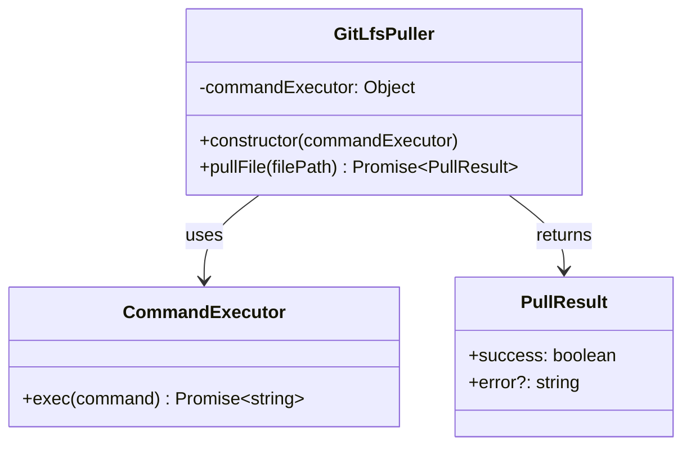
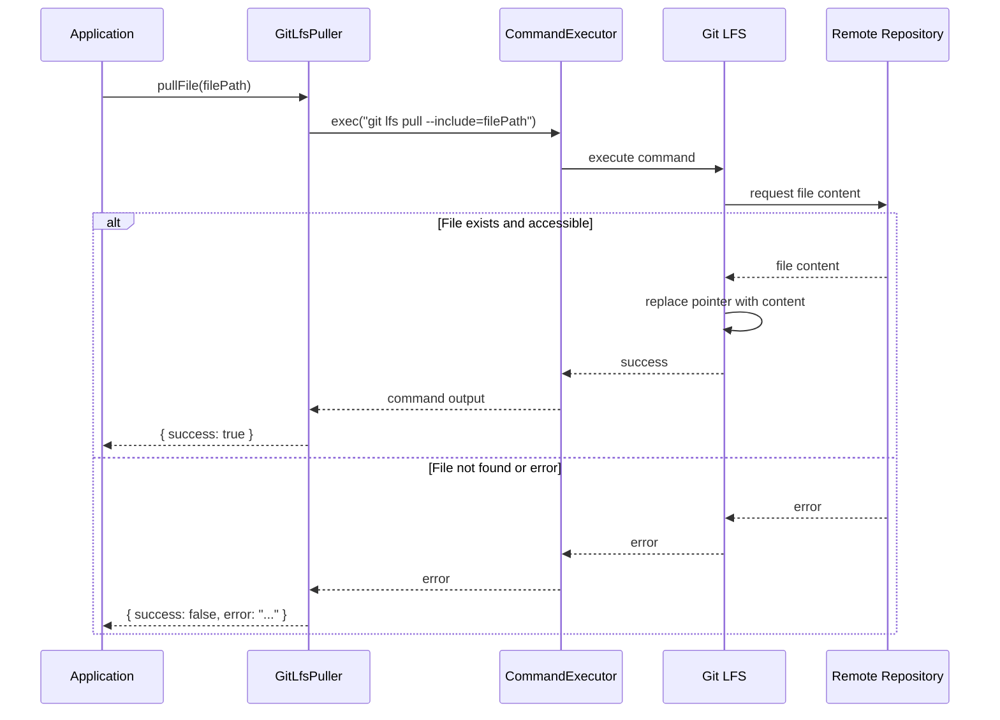
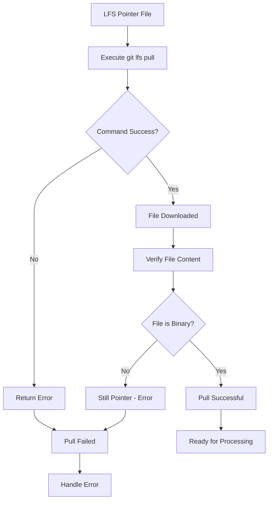

# GitLfsPuller

## Overview

The `GitLfsPuller` class provides functionality to download Git LFS (Large File Storage) files from remote repositories. It executes Git LFS commands to pull specific files, replacing pointer files with their actual binary content, enabling seamless integration with Git LFS workflows in image processing pipelines.

## Exports

```javascript
module.exports = GitLfsPuller;
```

## Class Definition

```javascript
class GitLfsPuller {
  constructor(commandExecutor)
  
  async pullFile(filePath)
}
```

## Rationale

### Why This Module Exists

1. **LFS Integration**: Seamlessly integrates with Git LFS workflows
2. **Automatic Downloads**: Downloads LFS files when needed for processing
3. **Selective Pulling**: Pulls only specific files rather than entire LFS content
4. **Command Abstraction**: Abstracts Git LFS command execution
5. **Error Handling**: Provides structured error handling for LFS operations
6. **Workflow Automation**: Enables automated LFS file management
7. **Resource Management**: Efficient downloading of large files

### Design Patterns

- **Command Pattern**: Encapsulates Git LFS command execution
- **Adapter Pattern**: Adapts Git LFS CLI to application interface
- **Strategy Pattern**: Different pulling strategies for different scenarios
- **Dependency Injection**: Command execution is injected for testability

## Class Diagram



## Pull Flow



## LFS Pull Process



## Method Documentation

### constructor(commandExecutor)

Initializes the GitLfsPuller with a command execution interface.

**Parameters**:
- `commandExecutor` (Object): Command execution interface
  - `exec(command)` (Function): Executes shell commands and returns output

**Example**:
```javascript
const { exec } = require('child_process');
const { promisify } = require('util');

const execAsync = promisify(exec);
const puller = new GitLfsPuller(execAsync);
```

### pullFile(filePath)

Downloads a specific Git LFS file from the remote repository.

**Parameters**:
- `filePath` (string): Path to the LFS file to download (relative to repository root)

**Returns**: Promise\<PullResult\>

**PullResult Structure**:
```javascript
{
  success: boolean,    // Whether the pull operation succeeded
  error?: string       // Error message if pull failed
}
```

**Git Command Executed**:
```bash
git lfs pull --include="filePath"
```

**Success Conditions**:
- Git LFS command exits with code 0
- File is successfully downloaded and replaces pointer
- No network or authentication errors

**Error Conditions**:
- File not found in LFS storage
- Network connectivity issues
- Authentication failures
- Git LFS not installed or configured
- Repository not LFS-enabled

## Usage Examples

### Basic LFS File Pulling

```javascript
const { exec } = require('child_process');
const { promisify } = require('util');
const GitLfsPuller = require('./git-lfs-puller');

const execAsync = promisify(exec);
const puller = new GitLfsPuller(execAsync);

// Pull a specific LFS file
const result = await puller.pullFile('images/large-photo.jpg');

if (result.success) {
  console.log('File downloaded successfully');
} else {
  console.error('Failed to download file:', result.error);
}
```

### Integration with LFS Detection

```javascript
const processLfsFile = async (filePath) => {
  const detector = new GitLfsDetector(fs);
  const puller = new GitLfsPuller(execAsync);
  
  // Check if file is LFS pointer
  const isLfsPointer = await detector.isGitLfsPointer(filePath);
  
  if (isLfsPointer) {
    console.log(`Downloading LFS file: ${filePath}`);
    
    const pullResult = await puller.pullFile(filePath);
    
    if (pullResult.success) {
      // Verify file was actually downloaded
      const stillPointer = await detector.isGitLfsPointer(filePath);
      
      if (stillPointer) {
        throw new Error('File was not properly downloaded');
      }
      
      console.log('File ready for processing');
      return { status: 'downloaded' };
    } else {
      throw new Error(`LFS pull failed: ${pullResult.error}`);
    }
  }
  
  return { status: 'not-lfs' };
};
```

### Batch LFS Pulling

```javascript
const pullLfsFiles = async (filePaths, options = {}) => {
  const puller = new GitLfsPuller(execAsync);
  const { concurrency = 3, continueOnError = true } = options;
  
  const results = [];
  
  // Process files in batches to avoid overwhelming the system
  for (let i = 0; i < filePaths.length; i += concurrency) {
    const batch = filePaths.slice(i, i + concurrency);
    
    const batchPromises = batch.map(async (filePath) => {
      try {
        const result = await puller.pullFile(filePath);
        return {
          filePath,
          success: result.success,
          error: result.error
        };
      } catch (error) {
        return {
          filePath,
          success: false,
          error: error.message
        };
      }
    });
    
    const batchResults = await Promise.all(batchPromises);
    results.push(...batchResults);
    
    // Stop on first error if not continuing on error
    if (!continueOnError && batchResults.some(r => !r.success)) {
      break;
    }
  }
  
  const summary = {
    total: results.length,
    successful: results.filter(r => r.success).length,
    failed: results.filter(r => !r.success).length
  };
  
  return { results, summary };
};

// Usage
const lfsFiles = ['image1.jpg', 'image2.png', 'video.mp4'];
const pullResults = await pullLfsFiles(lfsFiles, { 
  concurrency: 2, 
  continueOnError: true 
});

console.log(`Pulled ${pullResults.summary.successful}/${pullResults.summary.total} files`);
```

### Progress Tracking

```javascript
const pullWithProgress = async (filePaths, onProgress) => {
  const puller = new GitLfsPuller(execAsync);
  const results = [];
  
  for (let i = 0; i < filePaths.length; i++) {
    const filePath = filePaths[i];
    
    onProgress({
      current: i + 1,
      total: filePaths.length,
      filePath,
      status: 'pulling'
    });
    
    const result = await puller.pullFile(filePath);
    results.push({ filePath, ...result });
    
    onProgress({
      current: i + 1,
      total: filePaths.length,
      filePath,
      status: result.success ? 'success' : 'error',
      error: result.error
    });
  }
  
  return results;
};

// Usage with progress callback
await pullWithProgress(lfsFiles, (progress) => {
  console.log(`[${progress.current}/${progress.total}] ${progress.status}: ${progress.filePath}`);
  if (progress.error) {
    console.error(`  Error: ${progress.error}`);
  }
});
```

### Custom Command Executor

```javascript
// Custom executor with logging
const createLoggingExecutor = (logger) => {
  return async (command) => {
    logger.log(`Executing: ${command}`);
    
    try {
      const { stdout, stderr } = await execAsync(command);
      
      if (stderr) {
        logger.warn(`Command stderr: ${stderr}`);
      }
      
      logger.log(`Command completed successfully`);
      return stdout;
    } catch (error) {
      logger.error(`Command failed: ${error.message}`);
      throw error;
    }
  };
};

const puller = new GitLfsPuller(createLoggingExecutor(console));
```

### LFS Status Checking

```javascript
const checkLfsStatus = async () => {
  const executor = execAsync;
  
  try {
    // Check if Git LFS is installed
    await executor('git lfs version');
    
    // Check if repository has LFS enabled
    const lfsFiles = await executor('git lfs ls-files');
    
    return {
      isInstalled: true,
      isEnabled: true,
      trackedFiles: lfsFiles.trim().split('\n').filter(Boolean)
    };
  } catch (error) {
    return {
      isInstalled: false,
      isEnabled: false,
      error: error.message
    };
  }
};

// Use before pulling
const lfsStatus = await checkLfsStatus();

if (!lfsStatus.isInstalled) {
  throw new Error('Git LFS is not installed');
}

if (!lfsStatus.isEnabled) {
  throw new Error('Repository does not have Git LFS enabled');
}
```

### Retry Logic Integration

```javascript
const pullWithRetry = async (filePath, maxRetries = 3) => {
  const puller = new GitLfsPuller(execAsync);
  
  for (let attempt = 1; attempt <= maxRetries; attempt++) {
    try {
      const result = await puller.pullFile(filePath);
      
      if (result.success) {
        return result;
      }
      
      // Check if error is retryable
      const retryableErrors = ['timeout', 'network', 'connection'];
      const isRetryable = retryableErrors.some(error => 
        result.error.toLowerCase().includes(error)
      );
      
      if (!isRetryable || attempt === maxRetries) {
        return result;
      }
      
      // Wait before retry with exponential backoff
      const delay = Math.pow(2, attempt - 1) * 1000;
      await new Promise(resolve => setTimeout(resolve, delay));
      
      console.log(`Retrying pull attempt ${attempt + 1}/${maxRetries} for ${filePath}`);
      
    } catch (error) {
      if (attempt === maxRetries) {
        return { success: false, error: error.message };
      }
    }
  }
};
```

## Error Handling

### Common LFS Errors

```javascript
const handleLfsError = (error) => {
  const errorMessage = error.toLowerCase();
  
  if (errorMessage.includes('not found')) {
    return {
      type: 'FILE_NOT_FOUND',
      message: 'File not found in LFS storage',
      suggestion: 'Check if file was properly committed to LFS'
    };
  }
  
  if (errorMessage.includes('authentication')) {
    return {
      type: 'AUTH_ERROR',
      message: 'Authentication failed',
      suggestion: 'Check Git credentials and LFS access permissions'
    };
  }
  
  if (errorMessage.includes('network') || errorMessage.includes('timeout')) {
    return {
      type: 'NETWORK_ERROR',
      message: 'Network error occurred',
      suggestion: 'Check internet connection and try again'
    };
  }
  
  if (errorMessage.includes('not installed')) {
    return {
      type: 'LFS_NOT_INSTALLED',
      message: 'Git LFS is not installed',
      suggestion: 'Install Git LFS: https://git-lfs.github.io/'
    };
  }
  
  return {
    type: 'UNKNOWN_ERROR',
    message: error,
    suggestion: 'Check Git LFS configuration and logs'
  };
};

// Enhanced puller with better error handling
class EnhancedGitLfsPuller extends GitLfsPuller {
  async pullFile(filePath) {
    try {
      const result = await super.pullFile(filePath);
      
      if (!result.success && result.error) {
        const errorInfo = handleLfsError(result.error);
        return {
          ...result,
          errorType: errorInfo.type,
          suggestion: errorInfo.suggestion
        };
      }
      
      return result;
    } catch (error) {
      const errorInfo = handleLfsError(error.message);
      return {
        success: false,
        error: errorInfo.message,
        errorType: errorInfo.type,
        suggestion: errorInfo.suggestion
      };
    }
  }
}
```

## Testing Approach

### Unit Tests

```javascript
describe('GitLfsPuller', () => {
  let puller;
  let mockExecutor;
  
  beforeEach(() => {
    mockExecutor = {
      exec: jest.fn()
    };
    puller = new GitLfsPuller(mockExecutor);
  });
  
  test('should successfully pull LFS file', async () => {
    mockExecutor.exec.mockResolvedValue('Git LFS: (1 of 1 files) 12.34 MB / 12.34 MB');
    
    const result = await puller.pullFile('images/photo.jpg');
    
    expect(result.success).toBe(true);
    expect(result.error).toBeUndefined();
    expect(mockExecutor.exec).toHaveBeenCalledWith('git lfs pull --include="images/photo.jpg"');
  });
  
  test('should handle pull failure', async () => {
    const errorMessage = 'Error: Object does not exist on the server';
    mockExecutor.exec.mockRejectedValue(new Error(errorMessage));
    
    const result = await puller.pullFile('missing.jpg');
    
    expect(result.success).toBe(false);
    expect(result.error).toBe(errorMessage);
  });
  
  test('should handle network timeout', async () => {
    mockExecutor.exec.mockRejectedValue(new Error('timeout'));
    
    const result = await puller.pullFile('large-file.bin');
    
    expect(result.success).toBe(false);
    expect(result.error).toBe('timeout');
  });
});
```

### Integration Tests

```javascript
describe('GitLfsPuller Integration', () => {
  test('should work with real Git LFS repository', async () => {
    // Skip if not in LFS repository
    try {
      await execAsync('git lfs version');
    } catch {
      return; // Skip test if LFS not available
    }
    
    const puller = new GitLfsPuller(execAsync);
    
    // This would require a real LFS file in the test repository
    // const result = await puller.pullFile('test-assets/test-image.jpg');
    // expect(result.success).toBe(true);
  });
});
```

### Mock Command Executor

```javascript
const createMockExecutor = (responses) => {
  return {
    exec: jest.fn().mockImplementation((command) => {
      const response = responses[command];
      if (response instanceof Error) {
        return Promise.reject(response);
      }
      return Promise.resolve(response || '');
    })
  };
};

// Usage in tests
const mockExecutor = createMockExecutor({
  'git lfs pull --include="success.jpg"': 'Git LFS: (1 of 1 files) downloaded',
  'git lfs pull --include="fail.jpg"': new Error('File not found')
});
```

## Benefits

1. **Seamless Integration**: Works transparently with Git LFS workflows
2. **Selective Downloads**: Downloads only needed files, not entire LFS content
3. **Error Handling**: Provides structured error information for debugging
4. **Command Abstraction**: Simplifies Git LFS command execution
5. **Testability**: Easy to test with mocked command execution
6. **Resource Efficiency**: Downloads files on-demand
7. **Automation Ready**: Suitable for automated processing pipelines

## Future Enhancements

1. **Batch Pulling**: Optimize for pulling multiple files in single command
2. **Progress Tracking**: Real-time progress reporting for large file downloads
3. **Caching**: Cache recently pulled files to avoid re-downloading
4. **Bandwidth Management**: Throttle downloads to manage network usage
5. **Parallel Downloads**: Support concurrent file downloads
6. **Verification**: Verify file integrity after download
7. **Cleanup**: Automatic cleanup of unused LFS files
8. **Metrics**: Track download performance and success rates