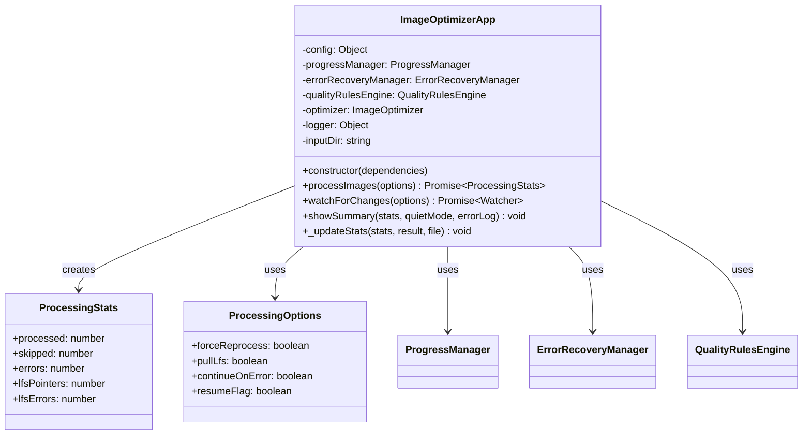

# ImageOptimizerApp

## Overview

The `ImageOptimizerApp` class serves as the main application orchestrator for the image optimization pipeline. It coordinates all components including progress tracking, error recovery, quality rules, and file processing. This class provides the high-level interface for batch processing, watching for changes, and generating comprehensive reports.

## Exports

```javascript
module.exports = ImageOptimizerApp;
```

## Class Definition

```javascript
class ImageOptimizerApp {
  constructor({
    config,
    progressManager,
    errorRecoveryManager,
    qualityRulesEngine,
    optimizer,
    logger,
    inputDir = 'original'
  })
  
  async processImages(options = {})
  async watchForChanges(options = {})
  showSummary(stats, quietMode, errorLog)
  _updateStats(stats, result, file)
}
```

## Rationale

### Why This Module Exists

1. **Application Orchestration**: Coordinates all components in the image processing pipeline
2. **Batch Processing**: Handles processing of multiple images efficiently
3. **Progress Management**: Provides real-time progress tracking and reporting
4. **Error Recovery**: Integrates comprehensive error handling and recovery
5. **File Watching**: Supports real-time processing of new/changed files
6. **Quality Rules**: Applies per-image quality rules automatically
7. **State Management**: Maintains processing state for resumable operations
8. **User Experience**: Provides clear feedback and comprehensive reporting

### Design Patterns

- **Facade Pattern**: Provides simplified interface to complex subsystem
- **Orchestrator Pattern**: Coordinates multiple services and components
- **Observer Pattern**: Watches for file changes and processes accordingly
- **Command Pattern**: Encapsulates processing operations
- **State Pattern**: Manages different processing states
- **Strategy Pattern**: Different processing strategies based on options
- **Template Method**: Consistent processing workflow across different modes

## Class Diagram



## Processing Flow

```mermaid
sequenceDiagram
    participant User as User
    participant App as ImageOptimizerApp
    participant PM as ProgressManager
    participant ERM as ErrorRecoveryManager
    participant QRE as QualityRulesEngine
    participant Opt as ImageOptimizer
    
    User->>App: processImages(options)
    App->>App: Create output directory
    App->>App: Find image files
    App->>PM: start(fileCount)
    App->>ERM: loadState()
    
    loop For each image file
        App->>PM: setFilename(file)
        App->>QRE: getQualityForImage(file)
        QRE-->>App: imageQuality
        App->>App: mergeQuality(config, imageQuality)
        App->>Opt: optimizeImage(file, options)
        Opt-->>App: result
        App->>App: _updateStats(stats, result)
        App->>ERM: recordProcessedFile(file, result)
        
        alt Every 10 files
            App->>ERM: saveState(progress)
        end
    end
    
    App->>PM: finish()
    App->>ERM: clearState() or saveState()
    App-->>User: processingStats
```

## Watch Mode Flow

```mermaid
sequenceDiagram
    participant User as User
    participant App as ImageOptimizerApp
    participant Watcher as File Watcher
    participant QRE as QualityRulesEngine
    participant Opt as ImageOptimizer
    
    User->>App: watchForChanges(options)
    App->>Watcher: watch(inputDir)
    App-->>User: watcher instance
    
    loop File Changes
        Watcher->>App: file added/changed
        App->>App: filter image files
        App->>QRE: getQualityForImage(file)
        QRE-->>App: imageQuality
        App->>Opt: optimizeImage(file, options)
        Opt-->>App: result
        App->>App: log result
    end
```

## Method Documentation

### constructor(dependencies)

Initializes the ImageOptimizerApp with all required dependencies.

**Parameters**:
- `dependencies` (Object): Required dependencies
  - `config` (Object): Application configuration
  - `progressManager` (ProgressManager): Progress tracking component
  - `errorRecoveryManager` (ErrorRecoveryManager): Error handling component
  - `qualityRulesEngine` (QualityRulesEngine): Quality rules component
  - `optimizer` (ImageOptimizer): Image processing component
  - `logger` (Object): Logging interface
  - `inputDir` (string): Input directory path (default: 'original')

### processImages(options)

Processes all images in the input directory with comprehensive error handling and progress tracking.

**Parameters**:
- `options` (Object): Processing options
  - `forceReprocess` (boolean): Force reprocessing of all images
  - `pullLfs` (boolean): Automatically pull Git LFS files
  - `continueOnError` (boolean): Continue processing after errors
  - `resumeFlag` (boolean): Resume from previous state

**Returns**: Promise\<ProcessingStats\>

**ProcessingStats Structure**:
```javascript
{
  processed: number,      // Successfully processed images
  skipped: number,        // Skipped images (up-to-date)
  errors: number,         // Failed processing attempts
  lfsPointers: number,    // Git LFS pointer files found
  lfsErrors: number       // Git LFS related errors
}
```

**Processing Workflow**:
1. Create output directory if it doesn't exist
2. Scan input directory for image files
3. Initialize progress tracking
4. Load previous state (if resuming)
5. Process each image with quality rules applied
6. Handle errors and maintain state
7. Generate final statistics

### watchForChanges(options)

Starts file system watching for real-time processing of new or changed images.

**Parameters**:
- `options` (Object): Watch options
  - `pullLfs` (boolean): Automatically pull Git LFS files

**Returns**: Promise\<Watcher\> - File system watcher instance

**Watch Features**:
- Monitors input directory for changes
- Processes new images automatically
- Re-processes modified images
- Ignores hidden files and directories
- Waits for file stability before processing

### showSummary(stats, quietMode, errorLog)

Displays a formatted summary of processing results.

**Parameters**:
- `stats` (ProcessingStats): Processing statistics
- `quietMode` (boolean): Whether to suppress output
- `errorLog` (string): Path to error log file

**Output Format**:
```
==================================================
✅ Optimization complete!
   Processed: 45 images
   Skipped: 12 images (already up to date)
   Git LFS pointers: 3 files (use --pull-lfs flag)
   Git LFS errors: 0 files
   Errors: 2 images
   Error details logged to: image-optimization-errors.log
==================================================
```

## Usage Examples

### Basic Image Processing

```javascript
const ImageOptimizerApp = require('./image-optimizer-app');

// Initialize with dependencies
const app = new ImageOptimizerApp({
  config: {
    formats: ['webp', 'avif'],
    quality: { webp: 85, avif: 80 },
    outputDir: 'optimized'
  },
  progressManager: new ProgressManager(),
  errorRecoveryManager: new ErrorRecoveryManager(),
  qualityRulesEngine: new QualityRulesEngine(),
  optimizer: new ImageOptimizer(),
  logger: console
});

// Process all images
const stats = await app.processImages({
  forceReprocess: false,
  pullLfs: true,
  continueOnError: true
});

app.showSummary(stats, false, 'errors.log');
```

### Resumable Processing

```javascript
// Process with resume capability
const stats = await app.processImages({
  resumeFlag: true,
  continueOnError: true,
  pullLfs: true
});

if (stats.errors > 0) {
  console.log(`Processing completed with ${stats.errors} errors`);
  console.log('Use resume flag to retry failed images');
}
```

### Watch Mode for Development

```javascript
// Start watching for changes
const watcher = await app.watchForChanges({
  pullLfs: true
});

console.log('👀 Watching for changes... Press Ctrl+C to stop');

// Handle graceful shutdown
process.on('SIGINT', () => {
  console.log('\n🛑 Stopping watcher...');
  watcher.close();
  process.exit(0);
});
```

### Custom Configuration Processing

```javascript
const customApp = new ImageOptimizerApp({
  config: {
    formats: ['webp', 'original'],
    quality: { webp: 90, jpeg: 95 },
    outputDir: 'dist/images',
    generateThumbnails: true,
    thumbnailWidth: 300,
    qualityRules: [
      {
        pattern: '*-hero.*',
        quality: { webp: 95, jpeg: 98 }
      },
      {
        directory: 'gallery/',
        quality: { webp: 80 }
      }
    ]
  },
  // ... other dependencies
});

const stats = await customApp.processImages({
  forceReprocess: true
});
```

### Error Handling and Recovery

```javascript
const processWithErrorHandling = async () => {
  try {
    const stats = await app.processImages({
      continueOnError: true,
      pullLfs: true
    });
    
    if (stats.errors > 0) {
      console.log('⚠️  Some images failed to process');
      
      // Get detailed error report
      const errorReport = app.errorRecoveryManager.generateReport();
      
      console.log('Error Summary:');
      console.log(`- Total errors: ${errorReport.errorCount}`);
      console.log(`- Success rate: ${errorReport.summary.successRate}`);
      
      // Analyze error patterns
      const errorsByType = errorReport.errors.reduce((acc, error) => {
        const type = error.error.code || 'unknown';
        acc[type] = (acc[type] || 0) + 1;
        return acc;
      }, {});
      
      console.log('Error breakdown:', errorsByType);
    }
    
    return stats;
  } catch (error) {
    console.error('Fatal error during processing:', error);
    throw error;
  }
};
```

### Batch Processing with Progress Callbacks

```javascript
const processWithProgress = async () => {
  // Set up progress callbacks
  app.progressManager.on('progress', (data) => {
    console.log(`Progress: ${data.current}/${data.total} (${data.percentage}%)`);
    console.log(`Current: ${data.filename} - ${data.status}`);
  });
  
  app.progressManager.on('complete', (summary) => {
    console.log('Processing complete!');
    console.log(`Processed: ${summary.processed}`);
    console.log(`Errors: ${summary.errors}`);
  });
  
  return await app.processImages({
    continueOnError: true,
    pullLfs: true
  });
};
```

### Quality Rules Integration

```javascript
const processWithCustomQuality = async () => {
  // The app automatically applies quality rules per image
  const stats = await app.processImages();
  
  // Quality rules are applied in this order:
  // 1. Base configuration quality settings
  // 2. Matching quality rules (pattern, directory, size-based)
  // 3. Most specific rules override less specific ones
  
  return stats;
};
```

## Configuration Integration

### Complete Configuration Example

```javascript
const createApp = (configPath) => {
  const config = require(configPath);
  
  return new ImageOptimizerApp({
    config,
    progressManager: new ProgressManager({
      showProgress: !config.quietMode,
      updateInterval: config.progressUpdateInterval || 100
    }),
    errorRecoveryManager: new ErrorRecoveryManager({
      maxRetries: config.maxRetries || 3,
      continueOnError: config.continueOnError,
      stateFile: config.stateFile || '.processing-state.json'
    }),
    qualityRulesEngine: new QualityRulesEngine(config.qualityRules || []),
    optimizer: new ImageOptimizer(config),
    logger: config.logger || console,
    inputDir: config.inputDir || 'original'
  });
};

// Usage
const app = createApp('./config.json');
```

## File Processing Logic

### Image File Detection

```javascript
// Built-in image file detection
const isImageFile = (filename) => {
  return /\.(jpg|jpeg|png|gif|webp)$/i.test(filename);
};

// The app automatically filters for supported image formats
```

### State Persistence

```javascript
// Automatic state saving every 10 processed files
if (processedCount % 10 === 0) {
  await this.errorRecoveryManager.saveState({
    processedCount: processedCount,
    totalCount: totalFiles.length,
    checkpoint: {
      lastProcessedFile: currentFile,
      timestamp: new Date().toISOString()
    }
  });
}
```

## Error Handling Strategies

### Error Classification

```javascript
const handleProcessingResult = (result, file) => {
  switch (result) {
    case 'processed':
      return { status: 'success', message: `Optimized ${file}` };
    
    case 'skipped':
      return { status: 'skipped', message: `${file} is up to date` };
    
    case 'lfs-pointer':
      return { status: 'lfs-pointer', message: `${file} is Git LFS pointer` };
    
    case 'lfs-error':
      return { status: 'lfs-error', message: `Failed to pull LFS file ${file}` };
    
    case 'error':
      return { status: 'error', message: `Failed to process ${file}` };
    
    default:
      return { status: 'unknown', message: `Unknown result for ${file}` };
  }
};
```

### Graceful Degradation

```javascript
// Continue processing even when individual files fail
try {
  const result = await this.optimizer.optimizeImage(filePath, fileName, options);
  this._updateStats(stats, result, fileName);
} catch (error) {
  stats.errors++;
  
  if (continueOnError) {
    this.logger.error(`Error processing ${fileName}:`, error.message);
    // Continue with next file
  } else {
    throw error; // Stop processing
  }
}
```

## Testing Approach

### Unit Tests

```javascript
describe('ImageOptimizerApp', () => {
  let app;
  let mockDependencies;
  
  beforeEach(() => {
    mockDependencies = {
      config: { formats: ['webp'], outputDir: 'test-output' },
      progressManager: { start: jest.fn(), increment: jest.fn(), finish: jest.fn() },
      errorRecoveryManager: { 
        loadState: jest.fn().mockResolvedValue(null),
        saveState: jest.fn(),
        recordProcessedFile: jest.fn()
      },
      qualityRulesEngine: { 
        getQualityForImage: jest.fn().mockResolvedValue({})
      },
      optimizer: { 
        optimizeImage: jest.fn().mockResolvedValue('processed')
      },
      logger: { log: jest.fn(), error: jest.fn() }
    };
    
    app = new ImageOptimizerApp(mockDependencies);
  });
  
  test('should process images successfully', async () => {
    // Mock file system
    jest.spyOn(fs, 'mkdir').mockResolvedValue();
    jest.spyOn(fs, 'readdir').mockResolvedValue(['test.jpg', 'test.png']);
    
    const stats = await app.processImages();
    
    expect(stats.processed).toBe(2);
    expect(stats.errors).toBe(0);
    expect(mockDependencies.progressManager.start).toHaveBeenCalledWith(2);
  });
  
  test('should handle processing errors gracefully', async () => {
    jest.spyOn(fs, 'mkdir').mockResolvedValue();
    jest.spyOn(fs, 'readdir').mockResolvedValue(['error.jpg']);
    
    mockDependencies.optimizer.optimizeImage.mockRejectedValue(new Error('Processing failed'));
    
    const stats = await app.processImages({ continueOnError: true });
    
    expect(stats.errors).toBe(1);
    expect(stats.processed).toBe(0);
  });
});
```

### Integration Tests

```javascript
describe('ImageOptimizerApp Integration', () => {
  test('should process real images', async () => {
    // Set up test directory with real images
    const testDir = './test-images';
    const outputDir = './test-output';
    
    // Create app with real dependencies
    const app = new ImageOptimizerApp({
      config: {
        formats: ['webp'],
        outputDir,
        quality: { webp: 80 }
      },
      // ... real dependencies
      inputDir: testDir
    });
    
    const stats = await app.processImages();
    
    // Verify outputs were created
    expect(stats.processed).toBeGreaterThan(0);
    
    // Clean up
    await fs.rmdir(outputDir, { recursive: true });
  });
});
```

## Performance Considerations

### Memory Management

```javascript
// Process files in batches to manage memory usage
const processBatch = async (files, batchSize = 10) => {
  for (let i = 0; i < files.length; i += batchSize) {
    const batch = files.slice(i, i + batchSize);
    
    for (const file of batch) {
      await processImage(file);
    }
    
    // Allow garbage collection between batches
    if (global.gc) {
      global.gc();
    }
  }
};
```

### I/O Optimization

```javascript
// Optimize file system operations
const optimizeFileOperations = async () => {
  // Pre-create output directories
  const outputDirs = new Set();
  files.forEach(file => {
    const outputDir = path.dirname(getOutputPath(file));
    outputDirs.add(outputDir);
  });
  
  await Promise.all(
    Array.from(outputDirs).map(dir => 
      fs.mkdir(dir, { recursive: true })
    )
  );
};
```

## Benefits

1. **Orchestration**: Coordinates complex image processing pipeline
2. **Progress Tracking**: Real-time progress reporting and feedback
3. **Error Recovery**: Comprehensive error handling and recovery mechanisms
4. **State Management**: Resumable operations with persistent state
5. **Quality Rules**: Automatic application of per-image quality settings
6. **File Watching**: Real-time processing of file changes
7. **Batch Processing**: Efficient handling of large image collections
8. **User Experience**: Clear feedback and comprehensive reporting

## Future Enhancements

1. **Parallel Processing**: Multi-threaded image processing for better performance
2. **Cloud Integration**: Support for cloud storage and processing services
3. **Plugin System**: Extensible plugin architecture for custom processors
4. **Web Interface**: Web-based UI for monitoring and configuration
5. **API Server**: REST API for remote image processing
6. **Metrics Dashboard**: Real-time performance and usage metrics
7. **Scheduling**: Cron-like scheduling for automated processing
8. **Notification System**: Email/Slack notifications for processing completion