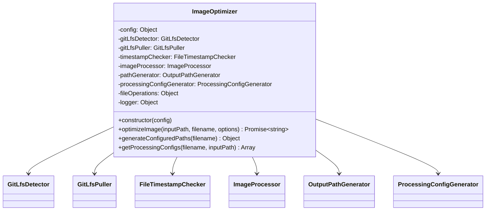
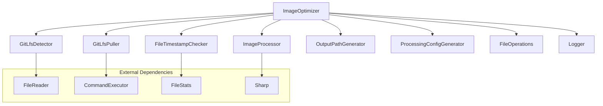
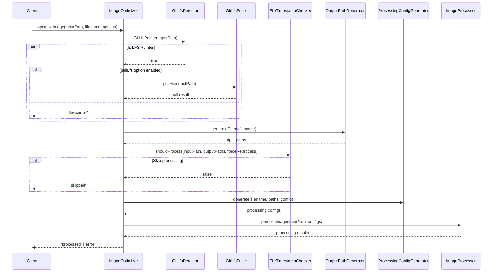

# ImageOptimizer

## Overview

The `ImageOptimizer` class is the core orchestrator that coordinates the entire image optimization process. It integrates multiple specialized components to handle Git LFS detection, timestamp checking, path generation, processing configuration, and actual image processing. This class represents the main business logic layer of the application.

## Exports

```javascript
module.exports = ImageOptimizer;
```

## Class Definition

```javascript
class ImageOptimizer {
  constructor(config = {})
  
  async optimizeImage(inputPath, filename, options = {})
  generateConfiguredPaths(filename)
  getProcessingConfigs(filename, inputPath)  // Legacy fallback
}
```

## Rationale

### Why This Module Exists

1. **Orchestration**: Coordinates multiple specialized components into a cohesive workflow
2. **Business Logic**: Encapsulates the core image optimization business rules
3. **Error Handling**: Provides centralized error handling and recovery
4. **Integration Point**: Bridges between high-level application logic and low-level processing
5. **Workflow Management**: Manages the complex workflow of Git LFS, timestamps, and processing
6. **Result Aggregation**: Provides standardized result codes for different processing outcomes

### Design Patterns

- **Facade**: Provides a simple interface to complex subsystem interactions
- **Template Method**: Defines the optimization workflow template
- **Strategy**: Uses injected components for different processing strategies
- **Dependency Injection**: All dependencies are injected for flexibility and testability

## Class Diagram



## Dependencies



## Optimization Workflow



## Result Codes

The `optimizeImage` method returns standardized result codes:

| Code | Meaning | Description |
|------|---------|-------------|
| `'processed'` | Success | Image was successfully optimized |
| `'skipped'` | Skip | Image was skipped (already up to date) |
| `'lfs-pointer'` | LFS Skip | Git LFS pointer file, not pulled |
| `'lfs-error'` | LFS Error | Failed to pull Git LFS file |
| `'error'` | Error | Processing failed with error |

## Method Documentation

### constructor(config)

Initializes the ImageOptimizer with configuration and dependencies.

**Parameters**:
- `config` (Object): Configuration object containing:
  - Direct config properties (formats, quality, outputDir, etc.)
  - OR dependency injection properties (gitLfsDetector, imageProcessor, etc.)

**Constructor Flexibility**:
```javascript
// Direct configuration
const optimizer = new ImageOptimizer({
  formats: ['webp', 'avif'],
  quality: { webp: 85, avif: 80 },
  outputDir: './optimized'
});

// Dependency injection (preferred for testing)
const optimizer = new ImageOptimizer({
  gitLfsDetector: mockDetector,
  imageProcessor: mockProcessor,
  // ... other dependencies
});
```

### optimizeImage(inputPath, filename, options)

Main method that orchestrates the complete optimization process.

**Parameters**:
- `inputPath` (string): Full path to the input image file
- `filename` (string): Relative filename for output path generation
- `options` (Object): Processing options
  - `pullLfs` (boolean): Whether to pull Git LFS files
  - `forceReprocess` (boolean): Force processing even if up to date

**Returns**: Promise\<string\> - Result code indicating outcome

**Process Steps**:
1. **Git LFS Detection**: Check if input is a Git LFS pointer
2. **LFS Handling**: Pull LFS file if needed and enabled
3. **Path Generation**: Generate output paths based on configuration
4. **Timestamp Check**: Determine if processing is needed
5. **Special Cases**: Handle GIF files (copy-only)
6. **Processing**: Generate configs and process image
7. **Result**: Return standardized result code

### generateConfiguredPaths(filename)

Generates output file paths based on configuration.

**Parameters**:
- `filename` (string): Input filename

**Returns**: Object with format-specific paths

**Example Output**:
```javascript
{
  webp: 'optimized/image.webp',
  avif: 'optimized/image.avif',
  original: 'optimized/image.jpg',
  thumbnail: 'optimized/image-thumb.webp'
}
```

### getProcessingConfigs(filename, inputPath)

Legacy fallback method for generating processing configurations when ProcessingConfigGenerator is not available.

**Parameters**:
- `filename` (string): Input filename
- `inputPath` (string): Full input path

**Returns**: Array of processing configuration objects

## Configuration Schema

```typescript
interface OptimizerConfig {
  // Output formats to generate
  formats: ('webp' | 'avif' | 'original' | 'jpeg' | 'png')[];
  
  // Quality settings for each format
  quality: {
    webp?: number;     // 1-100
    avif?: number;     // 1-100
    jpeg?: number;     // 1-100
    thumbnail?: number; // 1-100
  };
  
  // Output directory
  outputDir: string;
  
  // Thumbnail settings
  generateThumbnails: boolean;
  thumbnailWidth: number;
  
  // Metadata preservation
  preserveMetadata: boolean | MetadataOptions;
  
  // Quality rules for selective processing
  qualityRules?: QualityRule[];
}
```

## Error Handling

The ImageOptimizer implements comprehensive error handling:

```javascript
try {
  const result = await optimizer.optimizeImage(inputPath, filename, options);
  
  switch (result) {
    case 'processed':
      console.log('✅ Successfully optimized');
      break;
    case 'skipped':
      console.log('⏭️  Already up to date');
      break;
    case 'lfs-pointer':
      console.log('⚠️  Git LFS pointer (use --pull-lfs)');
      break;
    case 'lfs-error':
      console.log('❌ Failed to pull LFS file');
      break;
    case 'error':
      console.log('❌ Processing failed');
      break;
  }
} catch (error) {
  console.error('Unexpected error:', error.message);
}
```

## Special File Handling

### GIF Files
- **Behavior**: Copied without processing
- **Rationale**: GIF optimization is complex and may break animations
- **Result**: Returns `'processed'` after copying

### Git LFS Files
- **Detection**: Automatic detection of LFS pointer files
- **Handling**: Optional pulling with `--pull-lfs` flag
- **Fallback**: Clear messaging when LFS files are encountered

## Usage Examples

### Basic Usage

```javascript
const ImageOptimizer = require('./image-optimizer');

const optimizer = new ImageOptimizer({
  formats: ['webp', 'avif'],
  quality: { webp: 85, avif: 80 },
  outputDir: './optimized'
});

const result = await optimizer.optimizeImage(
  '/path/to/image.jpg',
  'image.jpg'
);
```

### With Options

```javascript
const result = await optimizer.optimizeImage(
  '/path/to/image.jpg',
  'image.jpg',
  {
    pullLfs: true,
    forceReprocess: true
  }
);
```

### Batch Processing

```javascript
const images = ['photo1.jpg', 'photo2.png', 'photo3.webp'];

for (const image of images) {
  const result = await optimizer.optimizeImage(
    path.join(inputDir, image),
    image
  );
  console.log(`${image}: ${result}`);
}
```

## Testing

The ImageOptimizer is designed for comprehensive testing:

```javascript
describe('ImageOptimizer', () => {
  let optimizer;
  let mockDependencies;
  
  beforeEach(() => {
    mockDependencies = {
      gitLfsDetector: { isGitLfsPointer: jest.fn() },
      timestampChecker: { shouldProcess: jest.fn() },
      imageProcessor: { processImage: jest.fn() },
      pathGenerator: { generatePaths: jest.fn() },
      processingConfigGenerator: { generate: jest.fn() },
      fileOperations: { copyFile: jest.fn() },
      logger: { log: jest.fn(), error: jest.fn() }
    };
    
    optimizer = new ImageOptimizer(mockDependencies);
  });
  
  it('should skip LFS pointer files when pullLfs is false', async () => {
    mockDependencies.gitLfsDetector.isGitLfsPointer.mockResolvedValue(true);
    
    const result = await optimizer.optimizeImage('test.jpg', 'test.jpg');
    
    expect(result).toBe('lfs-pointer');
  });
});
```

## Performance Considerations

1. **Lazy Evaluation**: Only processes images that need updating
2. **Efficient Path Operations**: Minimal file system operations
3. **Error Isolation**: Single image failures don't affect batch processing
4. **Memory Management**: Delegates heavy processing to specialized components
5. **Concurrent Processing**: Can be used with Promise.all for batch operations

## Benefits

1. **Centralized Logic**: All optimization logic in one place
2. **Flexible Configuration**: Supports various optimization strategies
3. **Robust Error Handling**: Graceful handling of various error conditions
4. **Clear Interface**: Simple method signatures with clear return values
5. **Testable Design**: Dependency injection enables comprehensive testing
6. **Extensible**: Easy to add new processing features
7. **Standards Compliant**: Follows established patterns and practices