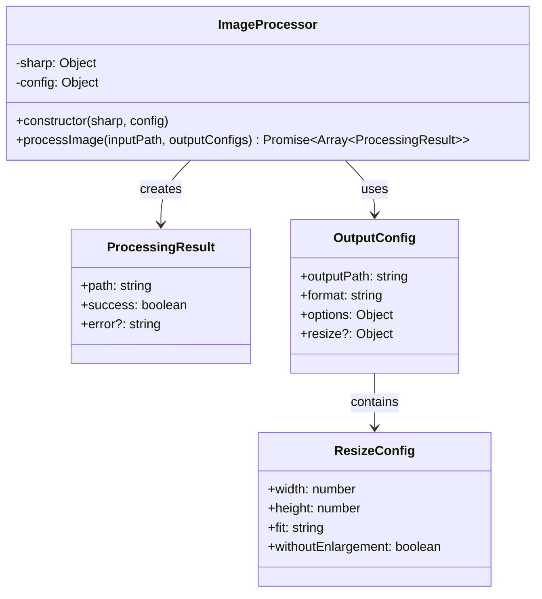
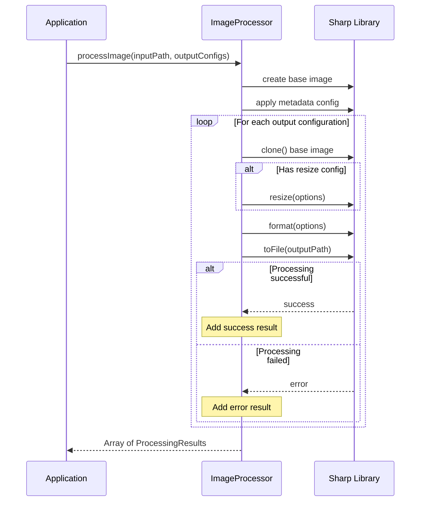

# ImageProcessor

## Overview

The `ImageProcessor` class provides the core image processing functionality using the Sharp library. It handles image transformations, format conversions, quality adjustments, metadata preservation, and generates multiple output formats from a single input image. This class abstracts the complexity of Sharp operations while providing flexible configuration options.

## Exports

```javascript
module.exports = ImageProcessor;
```

## Class Definition

```javascript
class ImageProcessor {
  constructor(sharp, config = {})
  
  async processImage(inputPath, outputConfigs)
}
```

## Rationale

### Why This Module Exists

1. **Image Processing**: Core image manipulation using Sharp library
2. **Format Conversion**: Converts images to multiple formats (WebP, AVIF, JPEG)
3. **Quality Control**: Applies format-specific quality settings
4. **Metadata Handling**: Preserves or strips metadata based on configuration
5. **Batch Operations**: Processes multiple output formats from single input
6. **Error Isolation**: Handles processing errors per output format
7. **Sharp Abstraction**: Provides simplified interface to Sharp functionality

### Design Patterns

- **Factory Pattern**: Creates different image processors based on format
- **Builder Pattern**: Builds complex image processing pipelines
- **Strategy Pattern**: Different processing strategies for different formats
- **Template Method**: Consistent processing workflow across formats
- **Chain of Responsibility**: Sequential application of image transformations

## Class Diagram



## Processing Flow



## Image Processing Pipeline

```mermaid
graph TD
    A[Input Image] --> B[Load with Sharp]
    B --> C[Auto-rotate]
    C --> D{Preserve Metadata?}
    D -->|Yes| E[withMetadata()]
    D -->|No| F[Strip Metadata - Default]
    D -->|Selective| G[withMetadata() - TODO: Selective]
    E --> H[Create Base Processor]
    F --> H
    G --> H
    
    H --> I[For Each Output Config]
    I --> J[Clone Base Processor]
    J --> K{Resize Needed?}
    K -->|Yes| L[Apply Resize]
    K -->|No| M[Apply Format]
    L --> M
    M --> N[Apply Quality Settings]
    N --> O[Save to File]
    O --> P{More Configs?}
    P -->|Yes| I
    P -->|No| Q[Return Results]
```

## Method Documentation

### constructor(sharp, config)

Initializes the ImageProcessor with Sharp library instance and configuration.

**Parameters**:
- `sharp` (Object): Sharp library instance
- `config` (Object): Processing configuration
  - `preserveMetadata` (boolean|Object): Metadata preservation settings
    - `false`: Strip all metadata (default)
    - `true`: Preserve all metadata
    - `Object`: Selective preservation (TODO: not yet implemented)

**Example**:
```javascript
const sharp = require('sharp');
const processor = new ImageProcessor(sharp, {
  preserveMetadata: false
});
```

### processImage(inputPath, outputConfigs)

Processes an input image according to multiple output configurations.

**Parameters**:
- `inputPath` (string): Path to the input image file
- `outputConfigs` (Array\<OutputConfig\>): Array of output configurations

**Returns**: Promise\<Array\<ProcessingResult\>\>

**OutputConfig Structure**:
```javascript
{
  outputPath: string,           // Where to save the processed image
  format: string,               // Output format: 'webp', 'avif', 'jpeg', 'png'
  options: Object,              // Format-specific options (quality, etc.)
  resize?: {                    // Optional resize configuration
    width: number,              // Target width
    height: number,             // Target height
    fit: string,                // Resize fit mode (default: 'inside')
    withoutEnlargement: boolean // Don't enlarge smaller images
  }
}
```

**ProcessingResult Structure**:
```javascript
{
  path: string,        // Output file path
  success: boolean,    // Whether processing succeeded
  error?: string       // Error message if processing failed
}
```

## Usage Examples

### Basic Image Processing

```javascript
const sharp = require('sharp');
const ImageProcessor = require('./image-processor');

const processor = new ImageProcessor(sharp, {
  preserveMetadata: false
});

const outputConfigs = [
  {
    outputPath: 'output/image.webp',
    format: 'webp',
    options: { quality: 85 }
  },
  {
    outputPath: 'output/image.avif',
    format: 'avif',
    options: { quality: 80 }
  }
];

const results = await processor.processImage('input/image.jpg', outputConfigs);

results.forEach(result => {
  if (result.success) {
    console.log(`✅ Created: ${result.path}`);
  } else {
    console.error(`❌ Failed: ${result.path} - ${result.error}`);
  }
});
```

### Processing with Resize

```javascript
const outputConfigs = [
  {
    outputPath: 'output/large.webp',
    format: 'webp',
    options: { quality: 90 },
    resize: {
      width: 2000,
      height: 2000,
      fit: 'inside',
      withoutEnlargement: true
    }
  },
  {
    outputPath: 'output/thumbnail.webp',
    format: 'webp',
    options: { quality: 70 },
    resize: {
      width: 200,
      height: 200,
      fit: 'cover',
      withoutEnlargement: true
    }
  }
];

const results = await processor.processImage('input/photo.jpg', outputConfigs);
```

### Metadata Preservation

```javascript
// Preserve all metadata
const processorWithMetadata = new ImageProcessor(sharp, {
  preserveMetadata: true
});

// Strip all metadata (default)
const processorWithoutMetadata = new ImageProcessor(sharp, {
  preserveMetadata: false
});

// Future: Selective metadata preservation
const processorSelective = new ImageProcessor(sharp, {
  preserveMetadata: {
    copyright: true,
    gps: false,
    camera: true
  }
});
```

### Format-Specific Processing

```javascript
const createFormatConfigs = (basePath, basename) => [
  // WebP with high quality
  {
    outputPath: `${basePath}/${basename}.webp`,
    format: 'webp',
    options: { quality: 85, effort: 6 }
  },
  
  // AVIF with balanced quality/size
  {
    outputPath: `${basePath}/${basename}.avif`,
    format: 'avif',
    options: { quality: 75, effort: 4 }
  },
  
  // JPEG with high quality
  {
    outputPath: `${basePath}/${basename}.jpg`,
    format: 'jpeg',
    options: { 
      quality: 90,
      progressive: true,
      mozjpeg: true
    }
  },
  
  // PNG with compression
  {
    outputPath: `${basePath}/${basename}.png`,
    format: 'png',
    options: { 
      compressionLevel: 9,
      progressive: true
    }
  }
];
```

### Batch Processing with Error Handling

```javascript
const processBatch = async (inputFiles) => {
  const processor = new ImageProcessor(sharp);
  const results = [];
  
  for (const inputFile of inputFiles) {
    try {
      const basename = path.parse(inputFile).name;
      const outputConfigs = createFormatConfigs('output', basename);
      
      const processResults = await processor.processImage(inputFile, outputConfigs);
      
      const summary = {
        input: inputFile,
        outputs: processResults,
        successful: processResults.filter(r => r.success).length,
        failed: processResults.filter(r => !r.success).length
      };
      
      results.push(summary);
      
      console.log(`Processed ${inputFile}: ${summary.successful}/${processResults.length} outputs successful`);
      
    } catch (error) {
      console.error(`Failed to process ${inputFile}:`, error.message);
      results.push({
        input: inputFile,
        error: error.message,
        successful: 0,
        failed: 1
      });
    }
  }
  
  return results;
};
```

### Progressive Quality Processing

```javascript
const createProgressiveQualityConfigs = (outputDir, filename) => {
  const basename = path.parse(filename).name;
  
  return [
    // High quality for hero images
    {
      outputPath: `${outputDir}/high/${basename}.webp`,
      format: 'webp',
      options: { quality: 95 },
      resize: { width: 2000, height: 2000, fit: 'inside' }
    },
    
    // Medium quality for general use
    {
      outputPath: `${outputDir}/medium/${basename}.webp`,
      format: 'webp',
      options: { quality: 85 },
      resize: { width: 1200, height: 1200, fit: 'inside' }
    },
    
    // Low quality for thumbnails
    {
      outputPath: `${outputDir}/thumb/${basename}.webp`,
      format: 'webp',
      options: { quality: 70 },
      resize: { width: 300, height: 300, fit: 'cover' }
    }
  ];
};
```

### Custom Processing Pipeline

```javascript
class CustomImageProcessor extends ImageProcessor {
  async processImage(inputPath, outputConfigs) {
    // Pre-processing validation
    await this.validateInput(inputPath);
    
    // Custom processing logic
    const results = await super.processImage(inputPath, outputConfigs);
    
    // Post-processing validation
    await this.validateOutputs(results);
    
    return results;
  }
  
  async validateInput(inputPath) {
    const stats = await fs.stat(inputPath);
    
    if (stats.size === 0) {
      throw new Error('Input file is empty');
    }
    
    if (stats.size > 50 * 1024 * 1024) { // 50MB
      console.warn(`Large input file: ${inputPath} (${stats.size} bytes)`);
    }
  }
  
  async validateOutputs(results) {
    for (const result of results) {
      if (result.success) {
        try {
          const stats = await fs.stat(result.path);
          if (stats.size === 0) {
            result.success = false;
            result.error = 'Output file is empty';
          }
        } catch (error) {
          result.success = false;
          result.error = `Output validation failed: ${error.message}`;
        }
      }
    }
  }
}
```

## Format-Specific Options

### WebP Options

```javascript
{
  format: 'webp',
  options: {
    quality: 80,        // Quality 1-100
    alphaQuality: 100,  // Alpha channel quality
    lossless: false,    // Lossless compression
    nearLossless: false, // Near-lossless compression
    smartSubsample: false, // Smart subsampling  
    effort: 4           // CPU effort 0-6
  }
}
```

### AVIF Options

```javascript
{
  format: 'avif',
  options: {
    quality: 75,        // Quality 1-100
    lossless: false,    // Lossless compression
    effort: 4,          // CPU effort 0-9
    chromaSubsampling: '4:4:4' // Chroma subsampling
  }
}
```

### JPEG Options

```javascript
{
  format: 'jpeg',
  options: {
    quality: 90,        // Quality 1-100
    progressive: true,  // Progressive JPEG
    mozjpeg: true,      // Use mozjpeg encoder
    trellisQuantisation: false,
    overshootDeringing: false,
    optimiseScans: false
  }
}
```

### PNG Options

```javascript
{
  format: 'png',
  options: {
    compressionLevel: 9,  // Compression level 0-9
    progressive: false,   // Progressive PNG
    palette: false,       // Use palette
    colours: 256,         // Number of colors (palette mode)
    dither: 1.0          // Dithering level
  }
}
```

## Resize Configurations

### Fit Options

```javascript
const resizeOptions = {
  width: 800,
  height: 600,
  fit: 'cover',  // 'cover', 'contain', 'fill', 'inside', 'outside'
  withoutEnlargement: true,
  kernel: 'lanczos3',  // Resampling kernel
  fastShrinkOnLoad: true
};
```

### Crop Strategies

```javascript
// Different resize strategies
const strategies = [
  // Maintain aspect ratio, fit within bounds
  { fit: 'inside', withoutEnlargement: true },
  
  // Fill bounds, crop excess
  { fit: 'cover', position: 'center' },
  
  // Stretch to exact dimensions
  { fit: 'fill' },
  
  // Smart crop (attention-based)
  { fit: 'cover', position: 'attention' }
];
```

## Error Handling

### Processing Error Types

```javascript
const handleProcessingError = (error, outputConfig) => {
  const errorType = error.code || error.message;
  
  if (errorType.includes('ENOENT')) {
    return { type: 'FILE_NOT_FOUND', suggestion: 'Check input file path' };
  }
  
  if (errorType.includes('unsupported')) {
    return { type: 'UNSUPPORTED_FORMAT', suggestion: 'Check input file format' };
  }
  
  if (errorType.includes('memory')) {
    return { type: 'MEMORY_ERROR', suggestion: 'Reduce image size or free memory' };
  }
  
  if (errorType.includes('corrupt')) {
    return { type: 'CORRUPT_IMAGE', suggestion: 'Check image file integrity' };
  }
  
  return { type: 'UNKNOWN_ERROR', suggestion: 'Check logs for details' };
};
```

### Graceful Degradation

```javascript
const processWithFallback = async (inputPath, outputConfigs) => {
  const processor = new ImageProcessor(sharp);
  const results = [];
  
  for (const config of outputConfigs) {
    try {
      const result = await processor.processImage(inputPath, [config]);
      results.push(result[0]);
    } catch (error) {
      // Try with reduced quality on memory errors
      if (error.message.includes('memory')) {
        try {
          const fallbackConfig = {
            ...config,
            options: { ...config.options, quality: 50 },
            resize: config.resize ? {
              ...config.resize,
              width: Math.floor(config.resize.width * 0.5),
              height: Math.floor(config.resize.height * 0.5)
            } : undefined
          };
          
          const result = await processor.processImage(inputPath, [fallbackConfig]);
          results.push({
            ...result[0],
            fallback: true
          });
        } catch (fallbackError) {
          results.push({
            path: config.outputPath,
            success: false,
            error: fallbackError.message
          });
        }
      } else {
        results.push({
          path: config.outputPath,
          success: false,
          error: error.message
        });
      }
    }
  }
  
  return results;
};
```

## Testing Approach

### Unit Tests

```javascript
describe('ImageProcessor', () => {
  let processor;
  let mockSharp;
  
  beforeEach(() => {
    mockSharp = jest.fn().mockReturnValue({
      rotate: jest.fn().mockReturnThis(),
      withMetadata: jest.fn().mockReturnThis(),
      clone: jest.fn().mockReturnThis(),
      resize: jest.fn().mockReturnThis(),
      webp: jest.fn().mockReturnThis(),
      toFile: jest.fn().mockResolvedValue()
    });
    
    processor = new ImageProcessor(mockSharp);
  });
  
  test('should process image with WebP output', async () => {
    const config = [{
      outputPath: 'output.webp',
      format: 'webp',
      options: { quality: 80 }
    }];
    
    const results = await processor.processImage('input.jpg', config);
    
    expect(results).toHaveLength(1);
    expect(results[0].success).toBe(true);
    expect(mockSharp).toHaveBeenCalledWith('input.jpg');
  });
  
  test('should handle processing errors', async () => {
    mockSharp.mockReturnValue({
      rotate: jest.fn().mockReturnThis(),
      clone: jest.fn().mockReturnThis(),
      webp: jest.fn().mockReturnThis(),
      toFile: jest.fn().mockRejectedValue(new Error('Processing failed'))
    });
    
    const config = [{
      outputPath: 'output.webp',
      format: 'webp',
      options: { quality: 80 }
    }];
    
    const results = await processor.processImage('input.jpg', config);
    
    expect(results[0].success).toBe(false);
    expect(results[0].error).toBe('Processing failed');
  });
});
```

### Integration Tests

```javascript
describe('ImageProcessor Integration', () => {
  test('should process real image', async () => {
    const sharp = require('sharp');
    const processor = new ImageProcessor(sharp);
    
    // Create test image
    await sharp({
      create: {
        width: 100,
        height: 100,
        channels: 3,
        background: { r: 255, g: 0, b: 0 }
      }
    }).jpeg().toFile('test-input.jpg');
    
    const config = [{
      outputPath: 'test-output.webp',
      format: 'webp',
      options: { quality: 80 }
    }];
    
    const results = await processor.processImage('test-input.jpg', config);
    
    expect(results[0].success).toBe(true);
    
    // Verify output exists
    const stats = await fs.stat('test-output.webp');
    expect(stats.size).toBeGreaterThan(0);
    
    // Clean up
    await fs.unlink('test-input.jpg');
    await fs.unlink('test-output.webp');
  });
});
```

## Performance Considerations

### Memory Management

```javascript
// Process large images with streaming
const processLargeImage = async (inputPath, outputConfigs) => {
  const processor = new ImageProcessor(sharp);
  
  // Limit concurrent processing to manage memory
  const concurrencyLimit = 2;
  const results = [];
  
  for (let i = 0; i < outputConfigs.length; i += concurrencyLimit) {
    const batch = outputConfigs.slice(i, i + concurrencyLimit);
    const batchResults = await processor.processImage(inputPath, batch);
    results.push(...batchResults);
    
    // Force garbage collection if available
    if (global.gc) {
      global.gc();
    }
  }
  
  return results;
};
```

### Processing Optimization

```javascript
// Optimize Sharp settings for performance
const optimizedProcessor = new ImageProcessor(sharp, {
  preserveMetadata: false // Faster processing
});

// Configure Sharp for performance
sharp.cache(false); // Disable cache for memory-constrained environments
sharp.concurrency(1); // Limit concurrent operations
```

## Benefits

1. **Format Flexibility**: Supports multiple modern image formats
2. **Quality Control**: Fine-grained quality settings per format
3. **Batch Processing**: Efficient processing of multiple outputs
4. **Error Isolation**: Individual format processing doesn't affect others
5. **Metadata Control**: Flexible metadata preservation options
6. **Resize Support**: Comprehensive resizing and cropping options
7. **Sharp Integration**: Leverages powerful Sharp library capabilities

## Future Enhancements

1. **Selective Metadata**: Implement selective metadata preservation
2. **Watermarking**: Add watermark support for processed images
3. **Color Space**: Advanced color space management
4. **Animation**: Support for animated image formats
5. **Progressive Loading**: Generate progressive image variants
6. **HDR Support**: High dynamic range image processing
7. **AI Enhancement**: Integration with AI-based image enhancement
8. **Custom Filters**: Support for custom image filters and effects