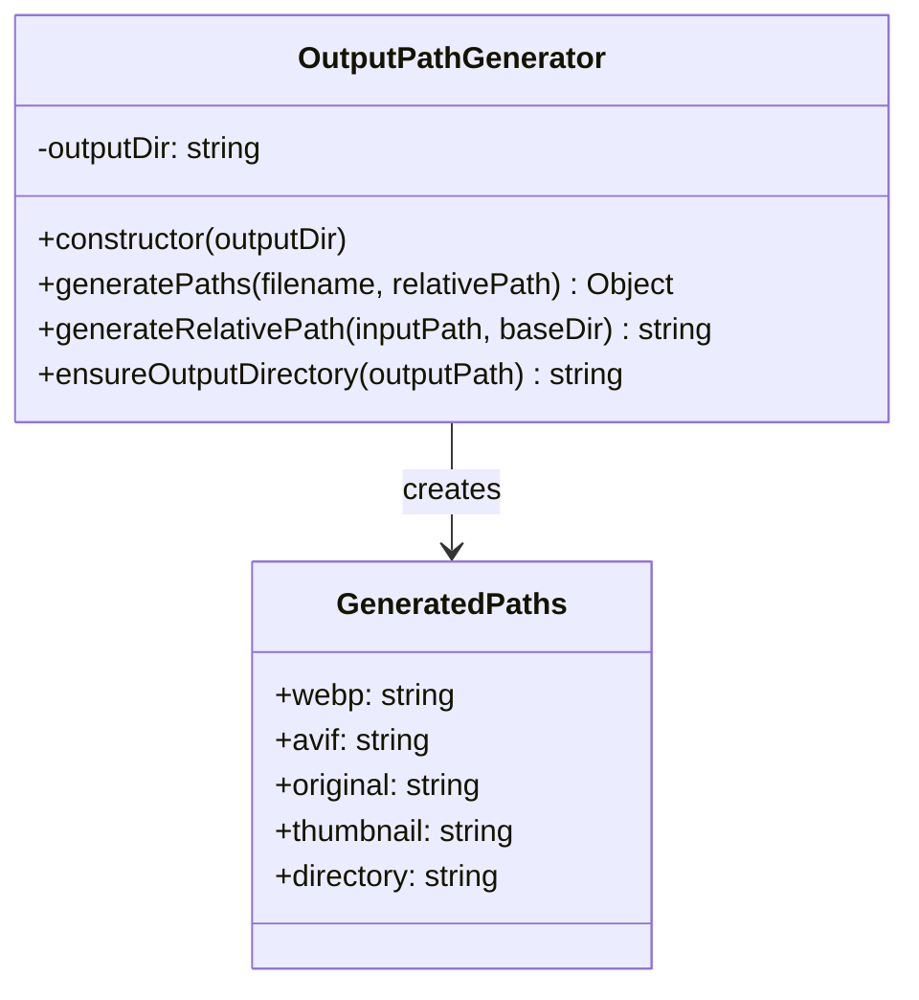
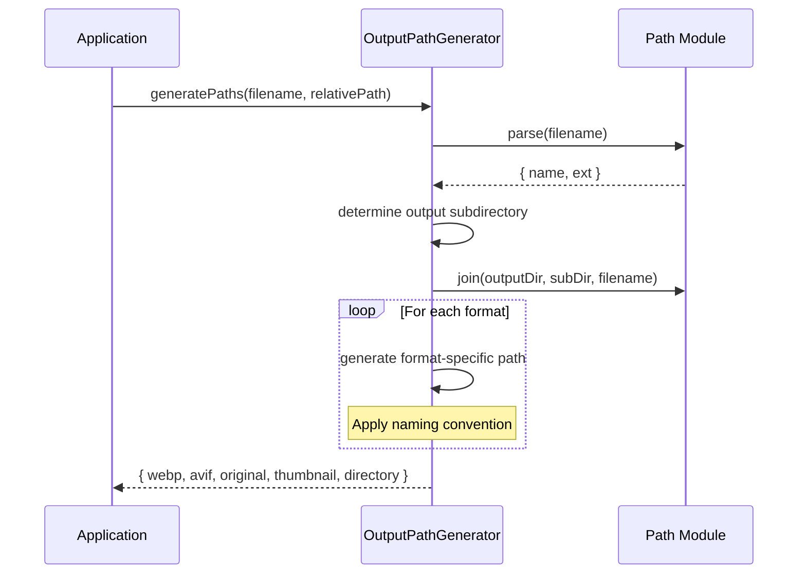
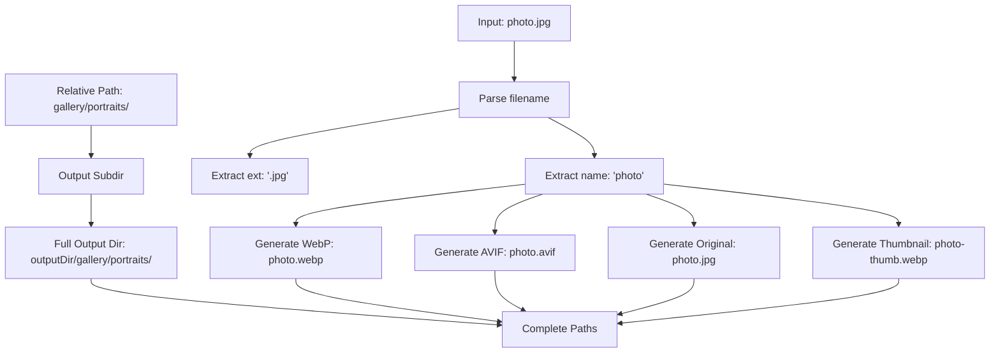

# OutputPathGenerator

## Overview

The `OutputPathGenerator` class provides functionality to generate output file paths for processed images. It handles path construction for different image formats, maintains directory structure, and ensures consistent naming conventions across the optimization pipeline. This class abstracts the complexity of path generation while supporting various output configurations.

## Exports

```javascript
module.exports = OutputPathGenerator;
```

## Class Definition

```javascript
class OutputPathGenerator {
  constructor(outputDir)
  
  generatePaths(filename, relativePath = '')
  generateRelativePath(inputPath, baseDir)
  ensureOutputDirectory(outputPath)
}
```

## Rationale

### Why This Module Exists

1. **Path Management**: Centralizes output path generation logic
2. **Format Consistency**: Ensures consistent naming across different formats
3. **Directory Structure**: Maintains organized output directory structure
4. **Path Abstraction**: Abstracts platform-specific path handling
5. **Naming Conventions**: Enforces standardized file naming patterns
6. **Relative Path Support**: Handles relative path preservation
7. **Extension Management**: Manages file extension conversions

### Design Patterns

- **Factory Pattern**: Creates different path types based on format
- **Builder Pattern**: Constructs complex path structures
- **Template Method**: Consistent path generation algorithm
- **Strategy Pattern**: Different naming strategies for different formats

## Class Diagram



## Path Generation Flow



## Path Structure



## Method Documentation

### constructor(outputDir)

Initializes the OutputPathGenerator with the base output directory.

**Parameters**:
- `outputDir` (string): Base directory for all generated output files

**Example**:
```javascript
const generator = new OutputPathGenerator('optimized');
```

### generatePaths(filename, relativePath)

Generates output paths for all supported formats based on input filename.

**Parameters**:
- `filename` (string): Original filename (e.g., 'photo.jpg')
- `relativePath` (string): Optional relative path from base directory (default: '')

**Returns**: Object with generated paths

**Generated Paths Structure**:
```javascript
{
  webp: string,       // Path for WebP format
  avif: string,       // Path for AVIF format  
  original: string,   // Path for optimized original format
  thumbnail: string,  // Path for thumbnail
  directory: string   // Output directory path
}
```

**Format Conversion Rules**:
- WebP: `name.webp`
- AVIF: `name.avif`
- Original: `name.jpg` (for JPEG/JPG) or `name.png` (for PNG)
- Thumbnail: `name-thumb.webp`

### generateRelativePath(inputPath, baseDir)

Generates relative path from input path and base directory.

**Parameters**:
- `inputPath` (string): Full path to input file
- `baseDir` (string): Base directory to calculate relative path from

**Returns**: string - Relative path

### ensureOutputDirectory(outputPath)

Extracts directory path from output file path.

**Parameters**:
- `outputPath` (string): Full output file path

**Returns**: string - Directory path

## Usage Examples

### Basic Path Generation

```javascript
const OutputPathGenerator = require('./output-path-generator');

const generator = new OutputPathGenerator('optimized');

// Generate paths for a simple filename
const paths = generator.generatePaths('photo.jpg');

console.log(paths);
// Output:
// {
//   webp: 'optimized/photo.webp',
//   avif: 'optimized/photo.avif', 
//   original: 'optimized/photo.jpg',
//   thumbnail: 'optimized/photo-thumb.webp',
//   directory: 'optimized'
// }
```

### Nested Directory Structure

```javascript
// Generate paths preserving directory structure
const paths = generator.generatePaths('photo.jpg', 'gallery/portraits/2024');

console.log(paths);
// Output:
// {
//   webp: 'optimized/gallery/portraits/2024/photo.webp',
//   avif: 'optimized/gallery/portraits/2024/photo.avif',
//   original: 'optimized/gallery/portraits/2024/photo.jpg', 
//   thumbnail: 'optimized/gallery/portraits/2024/photo-thumb.webp',
//   directory: 'optimized/gallery/portraits/2024'
// }
```

### Different File Extensions

```javascript
// PNG file
const pngPaths = generator.generatePaths('logo.png');
console.log(pngPaths.original); // 'optimized/logo.png'

// JPEG file  
const jpegPaths = generator.generatePaths('image.jpeg');
console.log(jpegPaths.original); // 'optimized/image.jpg'

// WebP file (no conversion needed)
const webpPaths = generator.generatePaths('existing.webp');
console.log(webpPaths.webp); // 'optimized/existing.webp'
```

### Integration with File Processing

```javascript
const processImageFile = async (inputPath, baseDir) => {
  const generator = new OutputPathGenerator('dist/images');
  
  // Generate relative path from input
  const relativePath = generator.generateRelativePath(inputPath, baseDir);
  const filename = path.basename(inputPath);
  
  // Generate all output paths
  const outputPaths = generator.generatePaths(filename, relativePath);
  
  // Ensure output directory exists
  const outputDir = generator.ensureOutputDirectory(outputPaths.webp);
  await fs.mkdir(outputDir, { recursive: true });
  
  // Process image to all formats
  const results = await processImage(inputPath, outputPaths);
  
  return {
    input: inputPath,
    outputs: outputPaths,
    results
  };
};
```

### Batch Path Generation

```javascript
const generateBatchPaths = (inputFiles, baseDir, outputDir) => {
  const generator = new OutputPathGenerator(outputDir);
  const pathMappings = [];
  
  for (const inputPath of inputFiles) {
    const relativePath = generator.generateRelativePath(inputPath, baseDir);
    const filename = path.basename(inputPath);
    const outputPaths = generator.generatePaths(filename, relativePath);
    
    pathMappings.push({
      input: inputPath,
      output: outputPaths,
      directory: outputPaths.directory
    });
  }
  
  return pathMappings;
};

// Usage
const inputFiles = [
  'original/gallery/photo1.jpg',
  'original/gallery/photo2.png',
  'original/thumbs/icon.jpg'
];

const mappings = generateBatchPaths(inputFiles, 'original', 'optimized');
console.log(mappings);
```

### Custom Naming Patterns

```javascript
// Extended generator with custom naming
class ExtendedOutputPathGenerator extends OutputPathGenerator {
  generatePaths(filename, relativePath = '', options = {}) {
    const basePaths = super.generatePaths(filename, relativePath);
    const name = path.parse(filename).name;
    const fullOutputDir = basePaths.directory;
    
    // Add custom naming patterns
    const customPaths = {
      ...basePaths,
      // Add timestamp suffix if requested
      timestamped: options.addTimestamp ? 
        path.join(fullOutputDir, `${name}-${Date.now()}.webp`) : null,
      
      // Add size variants
      small: path.join(fullOutputDir, `${name}-small.webp`),
      medium: path.join(fullOutputDir, `${name}-medium.webp`),
      large: path.join(fullOutputDir, `${name}-large.webp`),
      
      // Add retina variants
      retina: path.join(fullOutputDir, `${name}@2x.webp`),
      retina3x: path.join(fullOutputDir, `${name}@3x.webp`)
    };
    
    return customPaths;
  }
}

const extendedGenerator = new ExtendedOutputPathGenerator('assets');
const paths = extendedGenerator.generatePaths('hero.jpg', 'home', { 
  addTimestamp: true 
});
```

### Directory Structure Preservation

```javascript
const preserveStructure = async (sourceDir, targetDir) => {
  const generator = new OutputPathGenerator(targetDir);
  const files = await glob('**/*.{jpg,jpeg,png}', { cwd: sourceDir });
  
  const pathMappings = files.map(file => {
    const fullInputPath = path.join(sourceDir, file);
    const relativePath = path.dirname(file);
    const filename = path.basename(file);
    
    return {
      input: fullInputPath,
      relativePath,
      outputs: generator.generatePaths(filename, relativePath)
    };
  });
  
  // Create all necessary directories
  const directories = [...new Set(pathMappings.map(m => m.outputs.directory))];
  await Promise.all(
    directories.map(dir => fs.mkdir(dir, { recursive: true }))
  );
  
  return pathMappings;
};

// Usage
const mappings = await preserveStructure('photos', 'web-assets');
```

### Format-Specific Path Generation

```javascript
const generateFormatSpecificPaths = (filename, relativePath, formats) => {
  const generator = new OutputPathGenerator('output');
  const allPaths = generator.generatePaths(filename, relativePath);
  
  // Filter to only requested formats
  const filteredPaths = {};
  
  formats.forEach(format => {
    if (allPaths[format]) {
      filteredPaths[format] = allPaths[format];
    }
  });
  
  filteredPaths.directory = allPaths.directory;
  
  return filteredPaths;
};

// Generate only WebP and thumbnail paths
const webpOnlyPaths = generateFormatSpecificPaths(
  'photo.jpg', 
  'gallery', 
  ['webp', 'thumbnail']
);
```

### Path Validation and Sanitization

```javascript
class SafeOutputPathGenerator extends OutputPathGenerator {
  sanitizeFilename(filename) {
    // Remove invalid characters
    return filename
      .replace(/[<>:"/\\|?*]/g, '_')
      .replace(/\s+/g, '-')
      .toLowerCase();
  }
  
  generatePaths(filename, relativePath = '') {
    // Sanitize filename before processing
    const sanitizedFilename = this.sanitizeFilename(filename);
    return super.generatePaths(sanitizedFilename, relativePath);
  }
  
  validatePath(filePath) {
    // Check path length limits
    if (filePath.length > 260) {
      throw new Error(`Path too long: ${filePath}`);
    }
    
    // Check for reserved names (Windows)
    const basename = path.basename(filePath, path.extname(filePath));
    const reserved = ['CON', 'PRN', 'AUX', 'NUL'];
    
    if (reserved.includes(basename.toUpperCase())) {
      throw new Error(`Reserved filename: ${basename}`);
    }
    
    return true;
  }
}
```

## Path Utilities

### Directory Creation Helper

```javascript
const createOutputDirectories = async (pathMappings) => {
  const directories = new Set();
  
  pathMappings.forEach(mapping => {
    directories.add(mapping.outputs.directory);
  });
  
  await Promise.all(
    Array.from(directories).map(dir => 
      fs.mkdir(dir, { recursive: true })
    )
  );
  
  return Array.from(directories);
};
```

### Path Conflict Resolution

```javascript
const resolvePathConflicts = (pathMappings) => {
  const usedPaths = new Set();
  const resolvedMappings = [];
  
  for (const mapping of pathMappings) {
    const resolvedMapping = { ...mapping };
    
    Object.keys(mapping.outputs).forEach(format => {
      if (format === 'directory') return;
      
      let outputPath = mapping.outputs[format];
      let counter = 1;
      
      while (usedPaths.has(outputPath)) {
        const parsed = path.parse(outputPath);
        outputPath = path.join(
          parsed.dir, 
          `${parsed.name}_${counter}${parsed.ext}`
        );
        counter++;
      }
      
      usedPaths.add(outputPath);
      resolvedMapping.outputs[format] = outputPath;
    });
    
    resolvedMappings.push(resolvedMapping);
  }
  
  return resolvedMappings;
};
```

## Testing Approach

### Unit Tests

```javascript
describe('OutputPathGenerator', () => {
  let generator;
  
  beforeEach(() => {
    generator = new OutputPathGenerator('output');
  });
  
  test('should generate correct paths for JPEG file', () => {
    const paths = generator.generatePaths('photo.jpg');
    
    expect(paths.webp).toBe('output/photo.webp');
    expect(paths.avif).toBe('output/photo.avif');
    expect(paths.original).toBe('output/photo.jpg');
    expect(paths.thumbnail).toBe('output/photo-thumb.webp');
    expect(paths.directory).toBe('output');
  });
  
  test('should handle relative paths correctly', () => {
    const paths = generator.generatePaths('image.png', 'gallery/2024');
    
    expect(paths.webp).toBe('output/gallery/2024/image.webp');
    expect(paths.original).toBe('output/gallery/2024/image.png');
    expect(paths.directory).toBe('output/gallery/2024');
  });
  
  test('should convert JPEG extensions to jpg', () => {
    const paths = generator.generatePaths('photo.jpeg');
    
    expect(paths.original).toBe('output/photo.jpg');
  });
  
  test('should generate relative path correctly', () => {
    const relativePath = generator.generateRelativePath(
      '/project/photos/gallery/image.jpg',
      '/project/photos'
    );
    
    expect(relativePath).toBe('gallery/image.jpg');
  });
});
```

### Integration Tests

```javascript
describe('OutputPathGenerator Integration', () => {
  test('should work with real file paths', async () => {
    const testDir = './test-output';
    const generator = new OutputPathGenerator(testDir);
    
    const paths = generator.generatePaths('test.jpg', 'subfolder');
    const outputDir = generator.ensureOutputDirectory(paths.webp);
    
    await fs.mkdir(outputDir, { recursive: true });
    
    // Verify directory was created
    const stats = await fs.stat(outputDir);
    expect(stats.isDirectory()).toBe(true);
    
    // Clean up
    await fs.rmdir(testDir, { recursive: true });
  });
});
```

## Platform Considerations

### Windows Path Handling

```javascript
const normalizePathForWindows = (filePath) => {
  // Handle Windows path length limits
  if (process.platform === 'win32' && filePath.length > 260) {
    // Use UNC path syntax for long paths
    return '\\\\?\\' + path.resolve(filePath);
  }
  return filePath;
};
```

### Unix Path Handling

```javascript
const ensureUnixPathSeparators = (filePath) => {
  // Ensure forward slashes on Unix systems
  return filePath.replace(/\\/g, '/');
};
```

## Benefits

1. **Centralized Logic**: Single source of truth for path generation
2. **Consistent Naming**: Enforces uniform file naming conventions
3. **Structure Preservation**: Maintains input directory structure
4. **Format Flexibility**: Supports multiple output formats seamlessly
5. **Path Safety**: Handles platform-specific path requirements
6. **Extension Management**: Intelligent file extension handling
7. **Directory Organization**: Automatic output directory management

## Future Enhancements

1. **Custom Templates**: Configurable path template system
2. **Collision Handling**: Automatic path conflict resolution
3. **Metadata Integration**: Include metadata in path generation
4. **Compression Ratios**: Add compression ratio to filenames
5. **Date-based Organization**: Organize by creation/modification dates
6. **Hash-based Naming**: Content-based filename generation
7. **Cloud Storage**: Support for cloud storage path conventions
8. **Symbolic Links**: Support for symbolic link creation