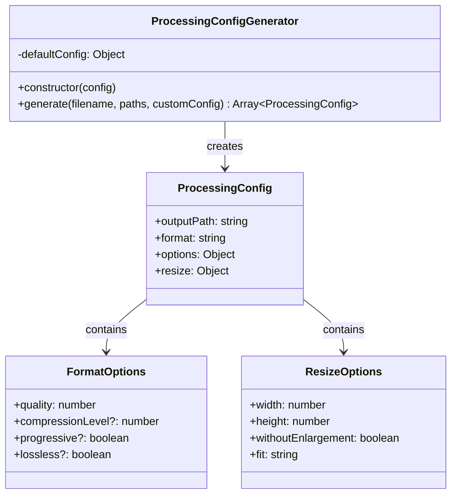
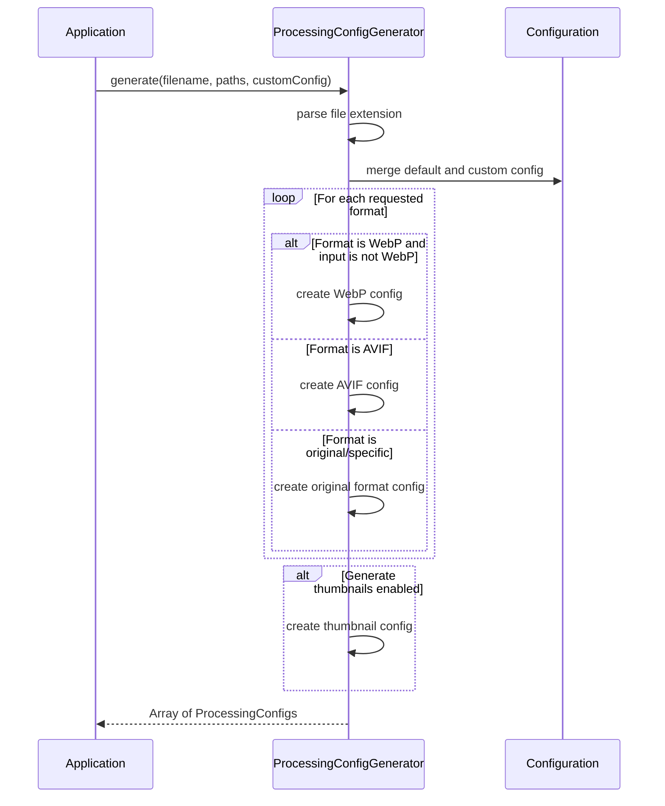
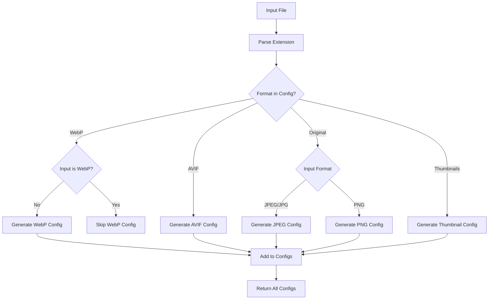

# ProcessingConfigGenerator

## Overview

The `ProcessingConfigGenerator` class creates processing configurations for different image formats based on input file characteristics and user preferences. It generates format-specific settings including quality parameters, resize options, and output specifications. This class serves as the bridge between high-level configuration and format-specific processing parameters.

## Exports

```javascript
module.exports = ProcessingConfigGenerator;
```

## Class Definition

```javascript
class ProcessingConfigGenerator {
  constructor(config = {})
  
  generate(filename, paths, customConfig = {})
}
```

## Rationale

### Why This Module Exists

1. **Configuration Management**: Centralizes processing configuration generation
2. **Format Adaptation**: Creates format-specific processing parameters
3. **Quality Control**: Applies appropriate quality settings per format
4. **Resize Logic**: Manages image resizing and dimension constraints
5. **Format Filtering**: Prevents unnecessary format conversions
6. **Customization**: Supports per-image configuration overrides
7. **Processing Optimization**: Optimizes settings for different image types

### Design Patterns

- **Factory Pattern**: Creates different configurations based on format
- **Builder Pattern**: Constructs complex configuration objects
- **Strategy Pattern**: Different generation strategies for different formats
- **Template Method**: Consistent configuration generation process

## Class Diagram



## Configuration Generation Flow



## Format Processing Logic



## Method Documentation

### constructor(config)

Initializes the ProcessingConfigGenerator with default configuration.

**Parameters**:
- `config` (Object): Default configuration object
  - `formats` (Array): Supported output formats
  - `quality` (Object): Quality settings per format
  - `generateThumbnails` (boolean): Whether to generate thumbnails
  - `thumbnailWidth` (number): Thumbnail width
  - `resize` (Object): Default resize settings

**Example**:
```javascript
const generator = new ProcessingConfigGenerator({
  formats: ['webp', 'avif', 'original'],
  quality: {
    webp: 85,
    avif: 80,
    jpeg: 90,
    thumbnail: 70
  },
  generateThumbnails: true,
  thumbnailWidth: 200
});
```

### generate(filename, paths, customConfig)

Generates processing configurations for all requested formats.

**Parameters**:
- `filename` (string): Input filename to determine format behavior
- `paths` (Object): Output paths for different formats
  - `webp` (string): WebP output path
  - `avif` (string): AVIF output path
  - `original` (string): Original format output path
  - `thumbnail` (string): Thumbnail output path
- `customConfig` (Object): Custom configuration overrides (optional)

**Returns**: Array\<ProcessingConfig\>

**ProcessingConfig Structure**:
```javascript
{
  outputPath: string,           // Where to save processed image
  format: string,               // Processing format ('webp', 'avif', 'jpeg', 'png')
  options: Object,              // Format-specific options
  resize: Object                // Resize configuration
}
```

## Format-Specific Generation

### WebP Configuration

```javascript
// Generated for WebP format (skips WebP-to-WebP conversion)
{
  outputPath: paths.webp,
  format: 'webp',
  options: { quality: config.quality?.webp || 85 },
  resize: {
    width: 2000,
    height: 2000,
    withoutEnlargement: true,
    fit: 'inside'
  }
}
```

### AVIF Configuration

```javascript
// Generated for AVIF format
{
  outputPath: paths.avif,
  format: 'avif',
  options: { quality: config.quality?.avif || 80 },
  resize: {
    width: 2000,
    height: 2000,
    withoutEnlargement: true,
    fit: 'inside'
  }
}
```

### Original Format Configuration

```javascript
// For JPEG input
{
  outputPath: paths.original,
  format: 'jpeg',
  options: { quality: config.quality?.jpeg || 90 },
  resize: {
    width: 2000,
    height: 2000,
    withoutEnlargement: true,
    fit: 'inside'
  }
}

// For PNG input
{
  outputPath: paths.original,
  format: 'png',
  options: { compressionLevel: 9 },
  resize: {
    width: 2000,
    height: 2000,
    withoutEnlargement: true,
    fit: 'inside'
  }
}
```

### Thumbnail Configuration

```javascript
// Generated when generateThumbnails is true
{
  outputPath: paths.thumbnail,
  format: 'webp',
  options: { quality: config.quality?.thumbnail || 70 },
  resize: {
    width: config.thumbnailWidth || 200,
    height: config.thumbnailWidth || 200,
    withoutEnlargement: true,
    fit: 'cover'
  }
}
```

## Usage Examples

### Basic Configuration Generation

```javascript
const ProcessingConfigGenerator = require('./processing-config-generator');

const generator = new ProcessingConfigGenerator({
  formats: ['webp', 'avif', 'original'],
  quality: {
    webp: 85,
    avif: 80,
    jpeg: 90
  },
  generateThumbnails: true,
  thumbnailWidth: 200
});

const paths = {
  webp: 'output/photo.webp',
  avif: 'output/photo.avif',
  original: 'output/photo.jpg',
  thumbnail: 'output/photo-thumb.webp'
};

const configs = generator.generate('photo.jpg', paths);

console.log(`Generated ${configs.length} processing configurations`);
configs.forEach(config => {
  console.log(`${config.format}: ${config.outputPath} (quality: ${config.options.quality})`);
});
```

### Custom Configuration Override

```javascript
// Override configuration for specific image
const customConfig = {
  quality: {
    webp: 95,  // Higher quality for this specific image
    avif: 90
  },
  resize: {
    width: 4000,  // Larger size for hero image
    height: 4000
  }
};

const configs = generator.generate('hero-image.jpg', paths, customConfig);
```

### Format-Specific Processing

```javascript
// Generate only WebP configurations
const webpOnlyGenerator = new ProcessingConfigGenerator({
  formats: ['webp'],
  quality: { webp: 85 },
  generateThumbnails: false
});

const webpConfigs = webpOnlyGenerator.generate('image.jpg', paths);
console.log(webpConfigs.length); // 1 configuration
```

### Dynamic Configuration Based on File

```javascript
const generateAdaptiveConfig = (filename, paths) => {
  const ext = path.extname(filename).toLowerCase();
  const size = getImageDimensions(filename); // Hypothetical function
  
  let baseConfig = {
    formats: ['webp', 'original'],
    quality: { webp: 85, jpeg: 90 },
    generateThumbnails: true
  };
  
  // Adjust based on input format
  if (ext === '.png') {
    baseConfig.formats.push('png');
    baseConfig.quality.png = 9; // Compression level for PNG
  }
  
  // Adjust based on image size
  if (size.width > 3000 || size.height > 3000) {
    baseConfig.quality.webp = 80; // Lower quality for large images
    baseConfig.resize = {
      width: 2000,
      height: 2000,
      withoutEnlargement: true,
      fit: 'inside'
    };
  }
  
  const generator = new ProcessingConfigGenerator(baseConfig);
  return generator.generate(filename, paths);
};
```

### Batch Configuration Generation

```javascript
const generateBatchConfigs = (filePathMappings, baseConfig) => {
  const generator = new ProcessingConfigGenerator(baseConfig);
  const allConfigs = [];
  
  for (const mapping of filePathMappings) {
    const filename = path.basename(mapping.input);
    const configs = generator.generate(filename, mapping.paths);
    
    allConfigs.push({
      input: mapping.input,
      configs: configs
    });
  }
  
  return allConfigs;
};

// Usage
const mappings = [
  { input: 'photos/img1.jpg', paths: { webp: 'out/img1.webp', ... } },
  { input: 'photos/img2.png', paths: { webp: 'out/img2.webp', ... } }
];

const batchConfigs = generateBatchConfigs(mappings, {
  formats: ['webp', 'original'],
  quality: { webp: 85, jpeg: 90 }
});
```

### Quality Rules Integration

```javascript
const generateWithQualityRules = (filename, paths, qualityRules) => {
  // Get base configuration
  const baseConfig = {
    formats: ['webp', 'avif', 'original'],
    quality: { webp: 85, avif: 80, jpeg: 90 }
  };
  
  // Apply quality rules (this would integrate with QualityRulesEngine)
  const appliedQuality = qualityRules.getQualityForImage(filename);
  const mergedConfig = {
    ...baseConfig,
    quality: { ...baseConfig.quality, ...appliedQuality }
  };
  
  const generator = new ProcessingConfigGenerator(mergedConfig);
  return generator.generate(filename, paths);
};
```

### Responsive Image Generation

```javascript
const generateResponsiveConfigs = (filename, basePaths) => {
  const sizes = [
    { suffix: '-small', width: 400, quality: 75 },
    { suffix: '-medium', width: 800, quality: 80 },
    { suffix: '-large', width: 1200, quality: 85 },
    { suffix: '-xlarge', width: 1600, quality: 90 }
  ];
  
  const allConfigs = [];
  
  sizes.forEach(size => {
    const generator = new ProcessingConfigGenerator({
      formats: ['webp'],
      quality: { webp: size.quality },
      resize: {
        width: size.width,
        height: size.width,
        withoutEnlargement: true,
        fit: 'inside'
      }
    });
    
    const name = path.parse(filename).name;
    const responsivePaths = {
      webp: basePaths.webp.replace('.webp', `${size.suffix}.webp`)
    };
    
    const configs = generator.generate(filename, responsivePaths);
    allConfigs.push(...configs);
  });
  
  return allConfigs;
};
```

### Configuration Validation

```javascript
const validateConfigs = (configs) => {
  const errors = [];
  
  configs.forEach((config, index) => {
    // Check required fields
    if (!config.outputPath) {
      errors.push(`Config ${index}: Missing outputPath`);
    }
    
    if (!config.format) {
      errors.push(`Config ${index}: Missing format`);
    }
    
    // Validate quality settings
    if (config.options.quality) {
      const quality = config.options.quality;
      if (quality < 1 || quality > 100) {
        errors.push(`Config ${index}: Invalid quality ${quality} (must be 1-100)`);
      }
    }
    
    // Validate resize settings
    if (config.resize) {
      const { width, height } = config.resize;
      if (width <= 0 || height <= 0) {
        errors.push(`Config ${index}: Invalid resize dimensions ${width}x${height}`);
      }
    }
  });
  
  if (errors.length > 0) {
    throw new Error(`Configuration validation failed:\n${errors.join('\n')}`);
  }
  
  return true;
};
```

## Advanced Configuration Patterns

### Conditional Format Generation

```javascript
class ConditionalProcessingConfigGenerator extends ProcessingConfigGenerator {
  generate(filename, paths, customConfig = {}) {
    const baseConfigs = super.generate(filename, paths, customConfig);
    const ext = path.extname(filename).toLowerCase();
    
    // Filter configurations based on input format
    const filteredConfigs = baseConfigs.filter(config => {
      // Skip WebP generation if input is already WebP
      if (config.format === 'webp' && ext === '.webp') {
        return false;
      }
      
      // Skip AVIF for animated images (not yet supported)
      if (config.format === 'avif' && ext === '.gif') {
        return false;
      }
      
      return true;
    });
    
    return filteredConfigs;
  }
}
```

### Progressive Quality Configuration

```javascript
const generateProgressiveConfigs = (filename, paths, targetSizes) => {
  const configs = [];
  
  targetSizes.forEach(targetSize => {
    // Calculate quality based on target file size
    const quality = calculateQualityForSize(filename, targetSize);
    
    const generator = new ProcessingConfigGenerator({
      formats: ['webp'],
      quality: { webp: quality }
    });
    
    const progressivePaths = {
      webp: paths.webp.replace('.webp', `-${targetSize}kb.webp`)
    };
    
    const config = generator.generate(filename, progressivePaths)[0];
    config.targetSize = targetSize;
    
    configs.push(config);
  });
  
  return configs;
};

const calculateQualityForSize = (filename, targetSizeKb) => {
  // Simplified calculation - in practice this would be more sophisticated
  const baseQuality = 85;
  const sizeAdjustment = Math.min(targetSizeKb / 100, 1);
  return Math.max(50, Math.floor(baseQuality * sizeAdjustment));
};
```

## Testing Approach

### Unit Tests

```javascript
describe('ProcessingConfigGenerator', () => {
  let generator;
  
  beforeEach(() => {
    generator = new ProcessingConfigGenerator({
      formats: ['webp', 'avif', 'original'],
      quality: { webp: 85, avif: 80, jpeg: 90 },
      generateThumbnails: true,
      thumbnailWidth: 200
    });
  });
  
  test('should generate correct number of configurations', () => {
    const paths = {
      webp: 'out/test.webp',
      avif: 'out/test.avif',
      original: 'out/test.jpg',
      thumbnail: 'out/test-thumb.webp'
    };
    
    const configs = generator.generate('test.jpg', paths);
    
    // Should generate WebP, AVIF, original JPEG, and thumbnail
    expect(configs).toHaveLength(4);
  });
  
  test('should skip WebP-to-WebP conversion', () => {
    const paths = {
      webp: 'out/test.webp',
      avif: 'out/test.avif',
      original: 'out/test.jpg',
      thumbnail: 'out/test-thumb.webp'
    };
    
    const configs = generator.generate('test.webp', paths);
    
    // Should not include WebP conversion
    const webpConfig = configs.find(c => c.format === 'webp' && c.outputPath === paths.webp);
    expect(webpConfig).toBeUndefined();
  });
  
  test('should apply custom configuration', () => {
    const paths = { webp: 'out/test.webp' };
    const customConfig = {
      quality: { webp: 95 },
      resize: { width: 1000, height: 1000 }
    };
    
    const configs = generator.generate('test.jpg', paths, customConfig);
    const webpConfig = configs.find(c => c.format === 'webp');
    
    expect(webpConfig.options.quality).toBe(95);
    expect(webpConfig.resize.width).toBe(1000);
  });
  
  test('should handle PNG files correctly', () => {
    const paths = { original: 'out/test.png' };
    
    const configs = generator.generate('test.png', paths);
    const originalConfig = configs.find(c => c.format === 'png');
    
    expect(originalConfig).toBeDefined();
    expect(originalConfig.options.compressionLevel).toBe(9);
  });
});
```

### Integration Tests

```javascript
describe('ProcessingConfigGenerator Integration', () => {
  test('should work with real file processing', async () => {
    const generator = new ProcessingConfigGenerator({
      formats: ['webp'],
      quality: { webp: 80 }
    });
    
    const paths = { webp: './test-output.webp' };
    const configs = generator.generate('test-input.jpg', paths);
    
    expect(configs).toHaveLength(1);
    expect(configs[0].format).toBe('webp');
    expect(configs[0].outputPath).toBe('./test-output.webp');
  });
});
```

## Performance Considerations

### Configuration Caching

```javascript
class CachedProcessingConfigGenerator extends ProcessingConfigGenerator {
  constructor(config) {
    super(config);
    this.cache = new Map();
  }
  
  generate(filename, paths, customConfig = {}) {
    const cacheKey = JSON.stringify({ filename, paths, customConfig });
    
    if (this.cache.has(cacheKey)) {
      return this.cache.get(cacheKey);
    }
    
    const configs = super.generate(filename, paths, customConfig);
    this.cache.set(cacheKey, configs);
    
    return configs;
  }
  
  clearCache() {
    this.cache.clear();
  }
}
```

### Batch Optimization

```javascript
const generateBatchOptimized = (fileMappings, baseConfig) => {
  const generator = new ProcessingConfigGenerator(baseConfig);
  
  // Group by similar configurations to optimize batch processing
  const configGroups = new Map();
  
  fileMappings.forEach(mapping => {
    const filename = path.basename(mapping.input);
    const ext = path.extname(filename);
    
    if (!configGroups.has(ext)) {
      configGroups.set(ext, []);
    }
    
    configGroups.get(ext).push(mapping);
  });
  
  // Generate configurations per group
  const results = [];
  
  configGroups.forEach((mappings, ext) => {
    mappings.forEach(mapping => {
      const filename = path.basename(mapping.input);
      const configs = generator.generate(filename, mapping.paths);
      
      results.push({
        input: mapping.input,
        configs: configs,
        group: ext
      });
    });
  });
  
  return results;
};
```

## Benefits

1. **Format Awareness**: Intelligent format-specific configuration generation
2. **Quality Control**: Precise quality settings per format and use case
3. **Customization**: Flexible override system for special requirements
4. **Efficiency**: Avoids unnecessary format conversions
5. **Consistency**: Standardized configuration structure across formats
6. **Extensibility**: Easy to add new formats and options
7. **Integration**: Seamless integration with processing pipeline

## Future Enhancements

1. **Format Detection**: Automatic format selection based on image analysis
2. **Size Optimization**: Dynamic quality adjustment based on target file sizes
3. **Content Analysis**: Configuration based on image content (photos vs graphics)
4. **Performance Profiles**: Predefined configuration profiles for different use cases
5. **A/B Testing**: Support for generating multiple variants for testing
6. **Machine Learning**: AI-driven quality and format selection
7. **Progressive Enhancement**: Automatic generation of progressive image variants
8. **Accessibility**: Configuration options for accessibility requirements