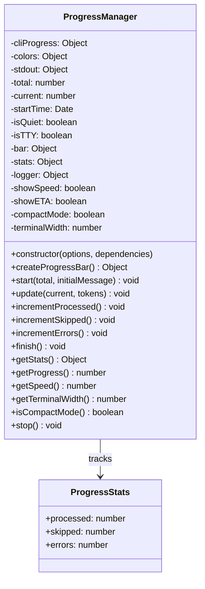
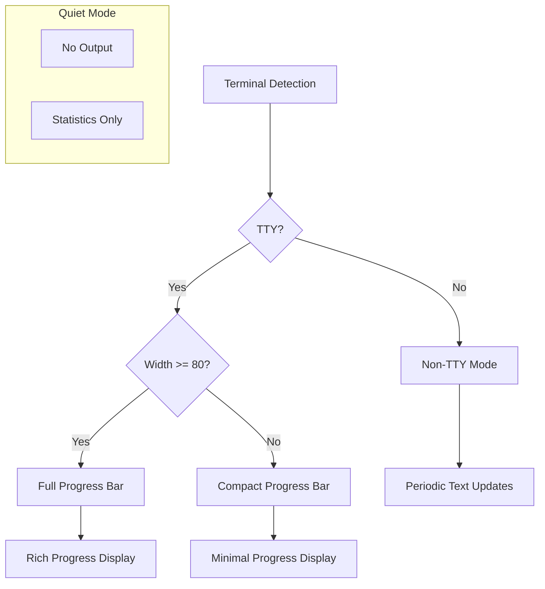
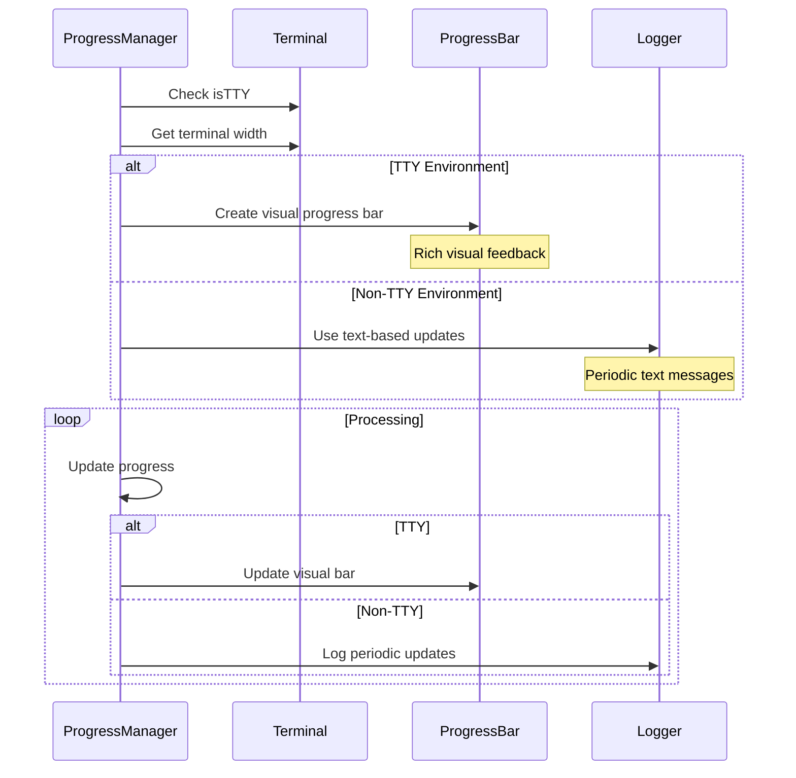

# ProgressManager

## Overview

The `ProgressManager` class provides comprehensive progress tracking and visualization for batch image processing operations. It adapts to different terminal environments (TTY vs non-TTY), supports various display modes, and tracks detailed statistics about processing operations.

## Exports

```javascript
module.exports = ProgressManager;
```

## Class Definition

```javascript
class ProgressManager {
  constructor(options = {}, dependencies = {})
  
  createProgressBar()
  start(total, initialMessage = '')
  update(current, tokens = {})
  incrementProcessed()
  incrementSkipped() 
  incrementErrors()
  finish()
  getStats()
  getProgress()
  getSpeed()
  getTerminalWidth()
  isCompactMode()
  stop()
}
```

## Rationale

### Why This Module Exists

1. **User Experience**: Provides visual feedback during long-running batch operations
2. **Progress Tracking**: Monitors completion status and processing statistics
3. **Adaptive Display**: Adjusts output format based on terminal capabilities
4. **Performance Metrics**: Tracks processing speed and estimated completion time
5. **Environment Awareness**: Handles TTY, non-TTY, and CI environments appropriately
6. **Error Reporting**: Integrates error tracking with progress visualization

### Design Patterns

- **Strategy**: Different display strategies for TTY vs non-TTY environments
- **Observer**: Tracks and reports on processing events
- **Adapter**: Adapts to different terminal capabilities and widths
- **Template Method**: Consistent progress tracking workflow

## Class Diagram



## Display Modes



## Progress Bar Formats

### Full Format (Wide Terminals)
```
Processing images ████████████████████████████████████ 75% | 📸 75/100 | ⚡ 2.5 img/s | ⏱️ 00:30 | ETA: 00:10 | 💾 image.jpg
```

### Compact Format (Narrow Terminals)
```
[████████████████████████████████████] 75% | 75/100 | image.jpg
```

### Non-TTY Format (CI/Scripts)
```
Processing 100 images...
Progress: 10/100 (10%)
Progress: 20/100 (20%)
...
Processing complete!
```

## Constructor Options

```typescript
interface ProgressOptions {
  total?: number;           // Total items to process
  quiet?: boolean;          // Suppress all output
  logger?: Object;          // Custom logger instance
  showSpeed?: boolean;      // Show processing speed (default: true)
  showETA?: boolean;        // Show estimated time (default: true)
  compact?: boolean;        // Force compact mode (default: auto-detect)
}

interface ProgressDependencies {
  cliProgress?: Object;     // cli-progress library
  colors?: Object;          // ansi-colors library
  stdout?: Object;          // stdout stream
}
```

## Method Documentation

### constructor(options, dependencies)

Initializes the progress manager with configuration and dependencies.

**Parameters**:
- `options` (Object): Configuration options
- `dependencies` (Object): Injected dependencies for testing

### start(total, initialMessage)

Starts progress tracking for a batch operation.

**Parameters**:
- `total` (number): Total number of items to process
- `initialMessage` (string): Optional initial message to display

**Behavior by Environment**:
- **TTY**: Creates and displays progress bar
- **Non-TTY**: Displays initial text message
- **Quiet**: No output, statistics tracking only

### update(current, tokens)

Updates the current progress and optional display tokens.

**Parameters**:
- `current` (number): Current progress value
- `tokens` (Object): Optional tokens for display formatting
  - `filename` (string): Current file being processed
  - `status` (string): Processing status ('processed', 'skipped', 'error')
  - Any custom tokens for progress bar formatting

### incrementProcessed() / incrementSkipped() / incrementErrors()

Convenience methods to increment specific statistics counters.

### finish()

Completes the progress tracking and displays final summary.

**Summary Includes**:
- Total processing time
- Items processed, skipped, and failed
- Final success/failure counts
- Performance metrics

### getStats()

Returns current processing statistics.

**Returns**:
```javascript
{
  processed: number,  // Successfully processed items
  skipped: number,    // Skipped items (already up to date)
  errors: number      // Failed items
}
```

### getProgress()

Returns current progress percentage.

**Returns**: number (0-100)

### getSpeed()

Returns current processing speed in items per second.

**Returns**: number

## Usage Examples

### Basic Usage

```javascript
const ProgressManager = require('./progress-manager');

const progressManager = new ProgressManager();

// Start tracking
progressManager.start(100, 'Starting image optimization...');

// Update progress
for (let i = 1; i <= 100; i++) {
  await processImage(images[i]);
  progressManager.update(i, { 
    filename: images[i],
    status: 'processed'
  });
  progressManager.incrementProcessed();
}

// Finish
progressManager.finish();
```

### With Custom Configuration

```javascript
const progressManager = new ProgressManager({
  quiet: false,
  showSpeed: true,
  showETA: true,
  compact: false
});
```

### For Testing

```javascript
const mockStdout = { write: jest.fn(), isTTY: false };
const mockColors = { cyan: jest.fn(str => str) };
const mockCliProgress = { SingleBar: jest.fn() };

const progressManager = new ProgressManager(
  { quiet: true },
  {
    stdout: mockStdout,
    colors: mockColors,
    cliProgress: mockCliProgress
  }
);
```

## Environment Adaptation



## Statistics Tracking

The ProgressManager maintains detailed statistics throughout processing:

```javascript
// Internal statistics object
{
  processed: 0,     // Successfully processed files
  skipped: 0,       // Files skipped (up to date)
  errors: 0,        // Files that failed processing
  startTime: Date,  // Processing start time
  currentSpeed: 0,  // Current processing rate (files/sec)
  eta: 0           // Estimated time to completion
}
```

## Responsive Design

The progress display adapts to terminal width:

| Terminal Width | Mode | Features |
|----------------|------|----------|
| < 80 columns | Compact | Basic bar, percentage, file count |
| ≥ 80 columns | Full | Rich display with speed, ETA, emojis |
| Non-TTY | Text | Periodic text updates every 10 items |

## Error Integration

Progress tracking integrates with error handling:

```javascript
try {
  await processImage(imagePath);
  progressManager.incrementProcessed();
} catch (error) {
  progressManager.incrementErrors();
  progressManager.update(currentIndex, { 
    filename: imagePath,
    status: 'error' 
  });
}
```

## Performance Metrics

The ProgressManager calculates several performance metrics:

- **Processing Speed**: Files processed per second
- **ETA**: Estimated time to completion based on current speed
- **Elapsed Time**: Total time since start
- **Success Rate**: Percentage of successfully processed files

## CI/CD Integration

Designed for continuous integration environments:

- **Non-TTY Detection**: Automatically switches to text mode
- **Periodic Updates**: Prevents CI timeout with regular output
- **Final Summary**: Provides clear success/failure information
- **Exit Codes**: Integrates with error tracking for proper exit codes

## Testing

The ProgressManager is designed for comprehensive testing:

```javascript
describe('ProgressManager', () => {
  it('should track progress correctly', () => {
    const pm = new ProgressManager({ quiet: true });
    pm.start(10);
    
    pm.incrementProcessed();
    pm.incrementProcessed();
    pm.incrementSkipped();
    
    const stats = pm.getStats();
    expect(stats.processed).toBe(2);
    expect(stats.skipped).toBe(1);
    expect(stats.errors).toBe(0);
  });
  
  it('should calculate progress percentage', () => {
    const pm = new ProgressManager({ quiet: true });
    pm.start(100);
    pm.update(25);
    
    expect(pm.getProgress()).toBe(25);
  });
});
```

## Benefits

1. **User Experience**: Clear visual feedback during long operations
2. **Adaptive**: Works well in all terminal environments
3. **Informative**: Rich statistics and performance metrics
4. **Testable**: Dependency injection enables easy testing
5. **Responsive**: Adapts to terminal capabilities
6. **Integration-Friendly**: Works well with CI/CD systems
7. **Error-Aware**: Integrates error tracking with progress display