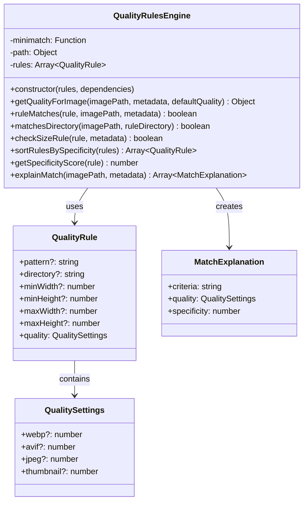
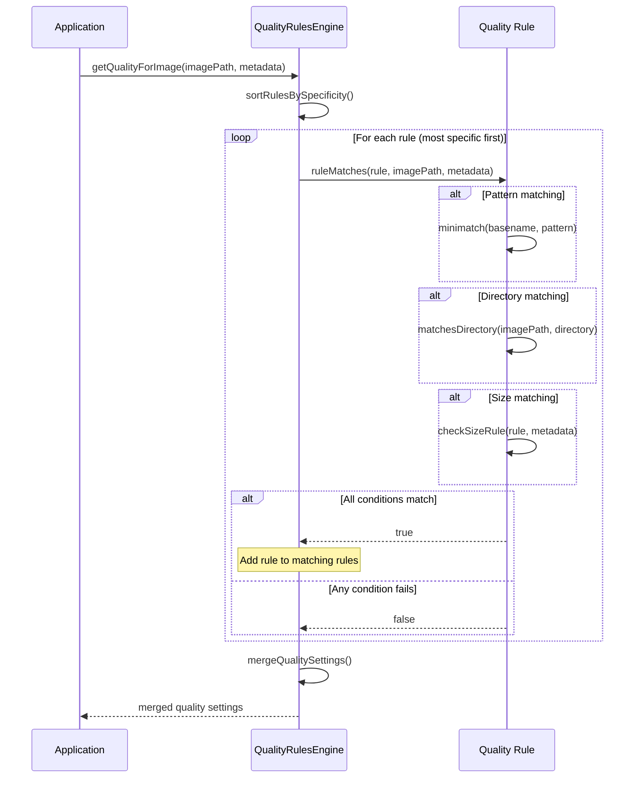
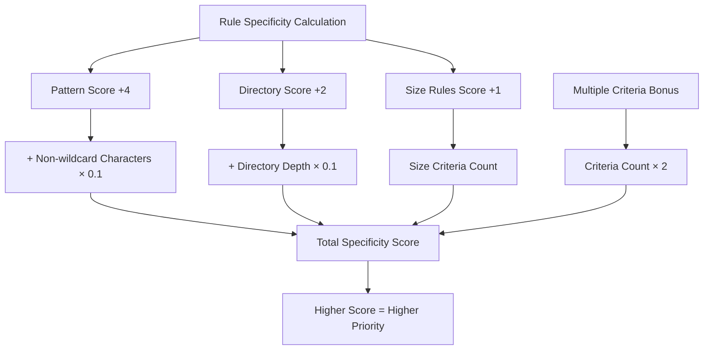

# QualityRulesEngine

## Overview

The `QualityRulesEngine` class implements a sophisticated rule-based system for applying different quality settings to images based on various criteria. It supports pattern matching, directory-based rules, and size-based conditions with intelligent specificity scoring to ensure the most appropriate quality settings are applied to each image.

## Exports

```javascript
module.exports = QualityRulesEngine;
```

## Class Definition

```javascript
class QualityRulesEngine {
  constructor(rules = [], dependencies = {})
  
  getQualityForImage(imagePath, metadata, defaultQuality = {})
  ruleMatches(rule, imagePath, metadata)
  matchesDirectory(imagePath, ruleDirectory)
  checkSizeRule(rule, metadata)
  sortRulesBySpecificity(rules)
  getSpecificityScore(rule)
  explainMatch(imagePath, metadata)
}
```

## Rationale

### Why This Module Exists

1. **Flexible Quality Control**: Apply different quality settings based on image characteristics
2. **Pattern Matching**: Support for glob patterns to match specific files
3. **Directory-based Rules**: Apply rules based on image location in directory structure
4. **Size-based Rules**: Quality adjustments based on image dimensions
5. **Rule Prioritization**: Intelligent specificity scoring for rule precedence
6. **Performance Optimization**: Higher quality for important images, lower for thumbnails
7. **Workflow Integration**: Seamless integration with existing image processing pipelines

### Design Patterns

- **Rules Engine**: Implements configurable business rules for quality decisions
- **Strategy Pattern**: Different matching strategies for different rule types
- **Chain of Responsibility**: Rules are evaluated in order of specificity
- **Specification Pattern**: Complex matching criteria are encapsulated in rule specifications
- **Composite Pattern**: Combines multiple matching criteria into single rules

## Class Diagram



## Rule Processing Flow



## Rule Specificity Scoring



## Method Documentation

### constructor(rules, dependencies)

Initializes the QualityRulesEngine with rules and optional dependencies.

**Parameters**:
- `rules` (Array\<QualityRule\>): Array of quality rules to apply
- `dependencies` (Object): Optional dependencies for testing
  - `minimatch` (Function): Glob pattern matching function
  - `path` (Object): Path manipulation utilities

**QualityRule Structure**:
```javascript
{
  // Matching criteria (at least one required)
  pattern?: string,        // Glob pattern for filename matching
  directory?: string,      // Directory path matching
  minWidth?: number,       // Minimum image width
  minHeight?: number,      // Minimum image height
  maxWidth?: number,       // Maximum image width
  maxHeight?: number,      // Maximum image height
  
  // Quality settings to apply when rule matches
  quality: {
    webp?: number,         // WebP quality (1-100)
    avif?: number,         // AVIF quality (1-100)
    jpeg?: number,         // JPEG quality (1-100)
    thumbnail?: number     // Thumbnail quality (1-100)
  }
}
```

### getQualityForImage(imagePath, metadata, defaultQuality)

Determines quality settings for a specific image by applying matching rules.

**Parameters**:
- `imagePath` (string): Path to the image file
- `metadata` (Object): Image metadata (width, height, etc.)
- `defaultQuality` (Object): Default quality settings to use as base

**Returns**: Object - Merged quality settings

**Processing Logic**:
1. Sort rules by specificity (most specific first)
2. Find all matching rules for the image
3. Apply rules in reverse specificity order (least to most specific)
4. Return merged quality settings

### ruleMatches(rule, imagePath, metadata)

Checks if a specific rule matches the given image and metadata.

**Parameters**:
- `rule` (QualityRule): Rule to evaluate
- `imagePath` (string): Path to the image
- `metadata` (Object): Image metadata

**Returns**: boolean - True if rule matches

### matchesDirectory(imagePath, ruleDirectory)

Checks if an image path matches a directory rule.

**Parameters**:
- `imagePath` (string): Path to check
- `ruleDirectory` (string): Directory pattern to match

**Returns**: boolean - True if path contains the directory

### checkSizeRule(rule, metadata)

Validates image metadata against size-based rule criteria.

**Parameters**:
- `rule` (QualityRule): Rule containing size criteria
- `metadata` (Object): Image metadata with width/height

**Returns**: boolean - True if size criteria are met

### getSpecificityScore(rule)

Calculates specificity score for rule prioritization.

**Returns**: number - Specificity score (higher = more specific)

**Scoring Algorithm**:
- Pattern matching: +4 points + non-wildcard character bonus
- Directory matching: +2 points + directory depth bonus
- Size rules: +1 point
- Multiple criteria: +2 points per additional criterion

### explainMatch(imagePath, metadata)

Provides detailed explanation of which rules matched and why.

**Parameters**:
- `imagePath` (string): Path to analyze
- `metadata` (Object): Image metadata

**Returns**: Array\<MatchExplanation\> - Detailed rule matching information

## Usage Examples

### Basic Quality Rules

```javascript
const QualityRulesEngine = require('./quality-rules-engine');

const rules = [
  // High quality for hero images
  {
    pattern: '*-hero.*',
    quality: {
      webp: 95,
      avif: 90,
      jpeg: 95
    }
  },
  
  // Lower quality for thumbnails
  {
    pattern: '*-thumb.*',
    quality: {
      webp: 70,
      jpeg: 80
    }
  },
  
  // Gallery images get medium quality
  {
    directory: 'gallery/',
    quality: {
      webp: 80,
      avif: 75
    }
  }
];

const engine = new QualityRulesEngine(rules);

// Apply rules to specific image
const quality = engine.getQualityForImage(
  'assets/images/homepage-hero.jpg',
  { width: 1920, height: 1080 },
  { webp: 85, avif: 80, jpeg: 90 } // default quality
);

console.log(quality); // { webp: 95, avif: 90, jpeg: 95 }
```

### Size-Based Quality Rules

```javascript
const sizeBasedRules = [
  // High quality for large images
  {
    minWidth: 1500,
    minHeight: 1000,
    quality: {
      webp: 90,
      avif: 85,
      jpeg: 92
    }
  },
  
  // Medium quality for medium images
  {
    minWidth: 800,
    maxWidth: 1499,
    quality: {
      webp: 80,
      avif: 75,
      jpeg: 85
    }
  },
  
  // Lower quality for small images (thumbnails)
  {
    maxWidth: 799,
    quality: {
      webp: 70,
      avif: 65,
      jpeg: 75
    }
  }
];

const sizeEngine = new QualityRulesEngine(sizeBasedRules);

// Large image gets high quality
const largeImageQuality = sizeEngine.getQualityForImage(
  'large-photo.jpg',
  { width: 2000, height: 1500 }
);

// Small image gets lower quality
const smallImageQuality = sizeEngine.getQualityForImage(
  'thumbnail.jpg',
  { width: 300, height: 200 }
);
```

### Complex Rule Combinations

```javascript
const complexRules = [
  // Very specific: Large hero images in homepage directory
  {
    pattern: '*-hero.*',
    directory: 'homepage/',
    minWidth: 1200,
    quality: {
      webp: 98,
      avif: 95,
      jpeg: 98
    }
  },
  
  // Specific: All hero images
  {
    pattern: '*-hero.*',
    quality: {
      webp: 90,
      avif: 85,
      jpeg: 92
    }
  },
  
  // General: Homepage directory
  {
    directory: 'homepage/',
    quality: {
      webp: 85,
      avif: 80,
      jpeg: 88
    }
  },
  
  // Fallback: Large images
  {
    minWidth: 1000,
    quality: {
      webp: 80,
      avif: 75,
      jpeg: 85
    }
  }
];

const complexEngine = new QualityRulesEngine(complexRules);

// This will match the most specific rule (first one)
const quality = complexEngine.getQualityForImage(
  'homepage/main-hero.jpg',
  { width: 1920, height: 1080 }
);
// Result: { webp: 98, avif: 95, jpeg: 98 }
```

### Integration with Image Processing

```javascript
const processImageWithQualityRules = async (imagePath, metadata) => {
  const qualityRules = [
    {
      pattern: '*-product.*',
      quality: { webp: 90, jpeg: 92 }
    },
    {
      directory: 'blog/',
      quality: { webp: 75, jpeg: 80 }
    }
  ];
  
  const engine = new QualityRulesEngine(qualityRules);
  
  // Get quality settings for this specific image
  const imageQuality = engine.getQualityForImage(
    imagePath,
    metadata,
    { webp: 85, jpeg: 88 } // default fallback quality
  );
  
  // Process image with determined quality settings
  const processedImages = await processImage(imagePath, {
    formats: ['webp', 'jpeg'],
    quality: imageQuality
  });
  
  return processedImages;
};
```

### Rule Debugging and Explanation

```javascript
const debugQualityRules = (imagePath, metadata) => {
  const engine = new QualityRulesEngine(rules);
  
  // Get explanation of which rules matched
  const explanation = engine.explainMatch(imagePath, metadata);
  
  console.log(`Quality rules for ${imagePath}:`);
  explanation.forEach((match, index) => {
    console.log(`${index + 1}. ${match.criteria}`);
    console.log(`   Quality: ${JSON.stringify(match.quality)}`);
    console.log(`   Specificity: ${match.specificity}`);
  });
  
  // Get final merged quality
  const finalQuality = engine.getQualityForImage(imagePath, metadata);
  console.log(`\nFinal quality: ${JSON.stringify(finalQuality)}`);
};

// Debug specific image
debugQualityRules(
  'gallery/portraits/professional-headshot.jpg',
  { width: 1200, height: 1600 }
);
```

### Dynamic Rule Generation

```javascript
const generateQualityRules = (config) => {
  const rules = [];
  
  // Generate rules for different image types
  if (config.heroImages) {
    rules.push({
      pattern: '*-hero.*',
      quality: config.heroImages.quality
    });
  }
  
  if (config.productImages) {
    rules.push({
      pattern: '*-product.*',
      quality: config.productImages.quality
    });
  }
  
  // Generate directory-based rules
  Object.entries(config.directories || {}).forEach(([dir, settings]) => {
    rules.push({
      directory: dir,
      quality: settings.quality
    });
  });
  
  // Generate size-based rules
  if (config.sizeRules) {
    config.sizeRules.forEach(sizeRule => {
      rules.push({
        minWidth: sizeRule.minWidth,
        maxWidth: sizeRule.maxWidth,
        minHeight: sizeRule.minHeight,
        maxHeight: sizeRule.maxHeight,
        quality: sizeRule.quality
      });
    });
  }
  
  return new QualityRulesEngine(rules);
};

// Usage
const config = {
  heroImages: {
    quality: { webp: 95, jpeg: 95 }
  },
  directories: {
    'blog/': { quality: { webp: 75, jpeg: 80 } },
    'products/': { quality: { webp: 85, jpeg: 88 } }
  },
  sizeRules: [
    {
      minWidth: 1500,
      quality: { webp: 90, jpeg: 92 }
    }
  ]
};

const engine = generateQualityRules(config);
```

### Batch Processing with Quality Rules

```javascript
const processBatchWithQualityRules = async (imagePaths, rules) => {
  const engine = new QualityRulesEngine(rules);
  const results = [];
  
  for (const imagePath of imagePaths) {
    try {
      // Get image metadata (dimensions, etc.)
      const metadata = await getImageMetadata(imagePath);
      
      // Apply quality rules
      const quality = engine.getQualityForImage(
        imagePath,
        metadata,
        { webp: 85, avif: 80, jpeg: 88 }
      );
      
      // Process image with determined quality
      const processResult = await processImage(imagePath, {
        quality,
        formats: ['webp', 'avif', 'original']
      });
      
      results.push({
        input: imagePath,
        quality: quality,
        outputs: processResult.outputs,
        appliedRules: engine.explainMatch(imagePath, metadata)
      });
      
    } catch (error) {
      results.push({
        input: imagePath,
        error: error.message
      });
    }
  }
  
  return results;
};
```

## Advanced Rule Patterns

### Conditional Quality Rules

```javascript
const conditionalRules = [
  // High quality for hero images, but only if they're large enough
  {
    pattern: '*-hero.*',
    minWidth: 1200,
    quality: { webp: 95, jpeg: 95 }
  },
  
  // Medium quality for smaller hero images
  {
    pattern: '*-hero.*',
    maxWidth: 1199,
    quality: { webp: 85, jpeg: 88 }
  },
  
  // Portfolio images get different quality based on size
  {
    directory: 'portfolio/',
    minWidth: 2000,
    quality: { webp: 92, jpeg: 94 }
  },
  {
    directory: 'portfolio/',
    maxWidth: 1999,
    quality: { webp: 80, jpeg: 85 }
  }
];
```

### Format-Specific Rules

```javascript
const formatSpecificRules = [
  // High AVIF quality for modern browsers
  {
    pattern: '*-modern.*',
    quality: { avif: 85, webp: 80, jpeg: 85 }
  },
  
  // Conservative JPEG quality for compatibility
  {
    pattern: '*-legacy.*',
    quality: { jpeg: 95 }
  },
  
  // Aggressive compression for thumbnails
  {
    pattern: '*-thumb.*',
    quality: { webp: 60, avif: 55, jpeg: 70 }
  }
];
```

## Testing Approach

### Unit Tests

```javascript
describe('QualityRulesEngine', () => {
  let engine;
  let mockMinimatch;
  
  beforeEach(() => {
    mockMinimatch = jest.fn();
    
    const rules = [
      {
        pattern: '*-hero.*',
        quality: { webp: 95 }
      },
      {
        directory: 'gallery/',
        quality: { webp: 80 }
      }
    ];
    
    engine = new QualityRulesEngine(rules, {
      minimatch: mockMinimatch,
      path: require('path')
    });
  });
  
  test('should apply pattern-based rules', () => {
    mockMinimatch.mockReturnValue(true);
    
    const quality = engine.getQualityForImage(
      'images/homepage-hero.jpg',
      { width: 1920, height: 1080 },
      { webp: 85 }
    );
    
    expect(quality.webp).toBe(95);
    expect(mockMinimatch).toHaveBeenCalledWith('homepage-hero.jpg', '*-hero.*', { nocase: true });
  });
  
  test('should apply directory-based rules', () => {
    mockMinimatch.mockReturnValue(false);
    
    const quality = engine.getQualityForImage(
      'gallery/photos/image.jpg',
      { width: 800, height: 600 },
      { webp: 85 }
    );
    
    expect(quality.webp).toBe(80);
  });
  
  test('should handle size-based rules', () => {
    const sizeRules = [
      {
        minWidth: 1000,
        quality: { webp: 90 }
      }
    ];
    
    const sizeEngine = new QualityRulesEngine(sizeRules);
    
    const quality = sizeEngine.getQualityForImage(
      'large-image.jpg',
      { width: 1500, height: 1000 },
      { webp: 85 }
    );
    
    expect(quality.webp).toBe(90);
  });
  
  test('should calculate specificity correctly', () => {
    const rule1 = { pattern: '*-hero.*', quality: { webp: 95 } };
    const rule2 = { directory: 'gallery/', quality: { webp: 80 } };
    const rule3 = { pattern: '*-hero.*', directory: 'homepage/', quality: { webp: 98 } };
    
    const score1 = engine.getSpecificityScore(rule1);
    const score2 = engine.getSpecificityScore(rule2);
    const score3 = engine.getSpecificityScore(rule3);
    
    expect(score3).toBeGreaterThan(score1);
    expect(score1).toBeGreaterThan(score2);
  });
});
```

### Integration Tests

```javascript
describe('QualityRulesEngine Integration', () => {
  test('should work with real file paths and minimatch', () => {
    const rules = [
      {
        pattern: '*-hero.{jpg,png}',
        quality: { webp: 95, jpeg: 95 }
      },
      {
        directory: 'assets/images/',
        quality: { webp: 80, jpeg: 85 }
      }
    ];
    
    const engine = new QualityRulesEngine(rules);
    
    const quality = engine.getQualityForImage(
      'assets/images/homepage-hero.jpg',
      { width: 1920, height: 1080 },
      { webp: 85, jpeg: 88 }
    );
    
    // Should match both rules, with pattern taking precedence
    expect(quality.webp).toBe(95);
    expect(quality.jpeg).toBe(95);
  });
});
```

## Performance Considerations

### Rule Optimization

```javascript
const optimizeRules = (rules) => {
  // Sort rules by specificity once during initialization
  const sortedRules = rules.sort((a, b) => {
    return getSpecificityScore(b) - getSpecificityScore(a);
  });
  
  // Group rules by type for faster matching
  const groupedRules = {
    pattern: sortedRules.filter(r => r.pattern),
    directory: sortedRules.filter(r => r.directory),
    size: sortedRules.filter(r => r.minWidth || r.maxWidth || r.minHeight || r.maxHeight)
  };
  
  return groupedRules;
};
```

### Caching for Repeated Queries

```javascript
class CachedQualityRulesEngine extends QualityRulesEngine {
  constructor(rules, dependencies) {
    super(rules, dependencies);
    this.cache = new Map();
  }
  
  getQualityForImage(imagePath, metadata, defaultQuality) {
    const cacheKey = JSON.stringify({ imagePath, metadata, defaultQuality });
    
    if (this.cache.has(cacheKey)) {
      return this.cache.get(cacheKey);
    }
    
    const quality = super.getQualityForImage(imagePath, metadata, defaultQuality);
    this.cache.set(cacheKey, quality);
    
    return quality;
  }
  
  clearCache() {
    this.cache.clear();
  }
}
```

## Benefits

1. **Flexible Quality Control**: Fine-grained control over image quality based on multiple criteria
2. **Pattern Matching**: Powerful glob pattern support for filename-based rules
3. **Directory Awareness**: Apply different settings based on image location
4. **Size Intelligence**: Automatic quality adjustment based on image dimensions
5. **Rule Prioritization**: Intelligent specificity scoring ensures correct rule precedence
6. **Debugging Support**: Detailed explanation of rule matching for troubleshooting
7. **Performance Optimization**: Optimized rule evaluation for high-throughput processing

## Future Enhancements

1. **Regular Expressions**: Support for regex patterns in addition to glob patterns
2. **Metadata Rules**: Rules based on EXIF data, color depth, file size
3. **Content Analysis**: AI-based content analysis for automatic quality decisions
4. **Dynamic Rules**: Rules that adjust based on processing performance metrics
5. **Rule Templates**: Predefined rule sets for common use cases
6. **Statistical Learning**: Machine learning to optimize rules based on usage patterns
7. **Real-time Adjustment**: Dynamic quality adjustment based on system load
8. **A/B Testing**: Support for quality experimentation and optimization