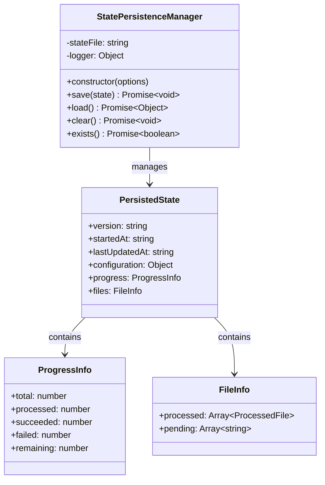
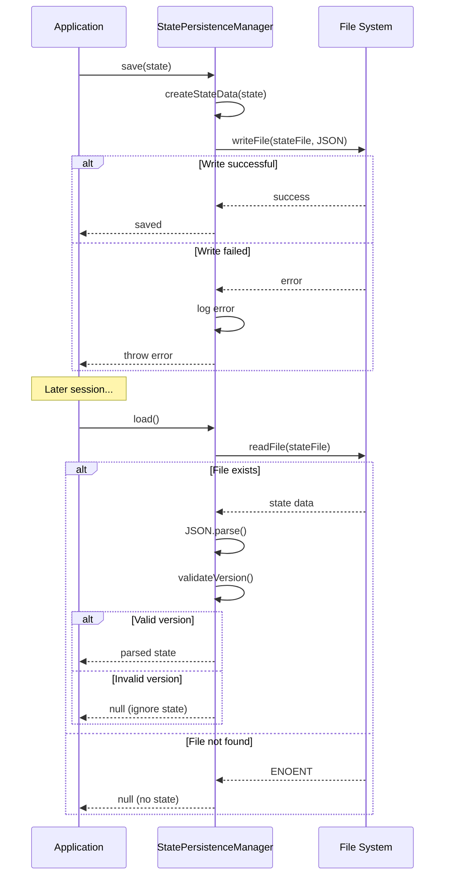
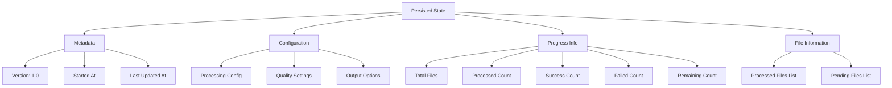

# StatePersistenceManager

## Overview

The `StatePersistenceManager` class provides functionality to save and restore application state across sessions. It enables resumable operations by persisting processing progress, configuration, and file lists to disk. This class ensures that long-running image processing tasks can be safely interrupted and resumed without losing progress.

## Exports

```javascript
module.exports = StatePersistenceManager;
```

## Class Definition

```javascript
class StatePersistenceManager {
  constructor(options = {})
  
  async save(state)
  async load()
  async clear()
  async exists()
}
```

## Rationale

### Why This Module Exists

1. **Resumable Operations**: Enables interrupting and resuming long-running processes
2. **Progress Preservation**: Saves processing progress across application restarts
3. **Error Recovery**: Maintains state information for recovery after failures
4. **Session Management**: Persists user configuration and preferences
5. **Batch Processing**: Supports checkpoint-based batch processing
6. **Reliability**: Ensures work is not lost due to system crashes or interruptions
7. **Development Workflow**: Facilitates debugging by preserving application state

### Design Patterns

- **Memento Pattern**: Captures and restores object state
- **Repository Pattern**: Abstracts state storage operations
- **Versioning Pattern**: Supports state schema versioning
- **Template Method**: Consistent state serialization/deserialization

## Class Diagram



## State Persistence Flow



## State Structure



## Method Documentation

### constructor(options)

Initializes the StatePersistenceManager with configuration options.

**Parameters**:
- `options` (Object): Configuration options
  - `stateFile` (string): Path to state file (default: '.image-optimization-state.json')
  - `logger` (Object): Logger interface (default: console)

**Example**:
```javascript
const manager = new StatePersistenceManager({
  stateFile: '.processing-state.json',
  logger: customLogger
});
```

### save(state)

Saves the current application state to the persistence file.

**Parameters**:
- `state` (Object): State information to save
  - `startedAt` (string): When processing started
  - `configuration` (Object): Processing configuration
  - `progress` (Object): Current progress information
  - `files` (Object): File processing information

**Returns**: Promise\<void\>

**State Data Structure**:
```javascript
{
  version: '1.0',
  startedAt: '2024-01-15T10:00:00.000Z',
  lastUpdatedAt: '2024-01-15T10:30:00.000Z',
  configuration: {
    formats: ['webp', 'avif'],
    quality: { webp: 85, avif: 80 },
    outputDir: 'optimized'
  },
  progress: {
    total: 100,
    processed: 45,
    succeeded: 42,
    failed: 3,
    remaining: 55
  },
  files: {
    processed: [
      { path: 'image1.jpg', status: 'success', timestamp: '...' },
      { path: 'image2.jpg', status: 'failed', error: '...' }
    ],
    pending: ['image3.jpg', 'image4.jpg', '...']
  }
}
```

### load()

Loads previously saved state from the persistence file.

**Returns**: Promise\<Object|null\> - Loaded state or null if no valid state exists

**Version Validation**:
- Checks state file version compatibility
- Returns null for incompatible versions
- Logs warning for version mismatches

### clear()

Removes the state file from disk.

**Returns**: Promise\<void\>

**Error Handling**:
- Ignores ENOENT errors (file doesn't exist)
- Logs and throws other errors

### exists()

Checks if a state file exists on disk.

**Returns**: Promise\<boolean\> - True if state file exists

## Usage Examples

### Basic State Management

```javascript
const StatePersistenceManager = require('./state-persistence-manager');

const stateManager = new StatePersistenceManager({
  stateFile: '.image-processing-state.json'
});

// Save current state
const currentState = {
  startedAt: new Date().toISOString(),
  configuration: {
    formats: ['webp', 'avif'],
    outputDir: 'optimized'
  },
  progress: {
    total: 100,
    processed: 25,
    succeeded: 23,
    failed: 2,
    remaining: 75
  },
  files: {
    processed: [
      { path: 'img1.jpg', status: 'success' },
      { path: 'img2.jpg', status: 'failed', error: 'corrupt file' }
    ],
    pending: ['img3.jpg', 'img4.jpg']
  }
};

await stateManager.save(currentState);

// Later, load saved state
const savedState = await stateManager.load();

if (savedState) {
  console.log('Resuming from previous session...');
  console.log(`Progress: ${savedState.progress.processed}/${savedState.progress.total}`);
} else {
  console.log('Starting fresh processing...');
}
```

### Resumable Image Processing

```javascript
const processImagesWithResume = async (inputFiles, config) => {
  const stateManager = new StatePersistenceManager();
  
  // Try to load previous state
  let savedState = await stateManager.load();
  let processedFiles = new Set();
  let startIndex = 0;
  
  if (savedState) {
    console.log('Found previous session, resuming...');
    
    // Restore processed files
    savedState.files.processed.forEach(file => {
      processedFiles.add(file.path);
    });
    
    // Calculate where to start
    startIndex = savedState.progress.processed || 0;
    
    console.log(`Resuming from file ${startIndex + 1}/${inputFiles.length}`);
  }
  
  const stats = {
    total: inputFiles.length,
    processed: startIndex,
    succeeded: 0,
    failed: 0
  };
  
  // Process remaining files
  for (let i = startIndex; i < inputFiles.length; i++) {
    const file = inputFiles[i];
    
    // Skip if already processed
    if (processedFiles.has(file)) {
      continue;
    }
    
    try {
      await processImage(file, config);
      stats.succeeded++;
      console.log(`✅ Processed: ${file}`);
    } catch (error) {
      stats.failed++;
      console.error(`❌ Failed: ${file} - ${error.message}`);
    }
    
    stats.processed++;
    
    // Save state every 10 files
    if (stats.processed % 10 === 0) {
      await stateManager.save({
        startedAt: savedState?.startedAt || new Date().toISOString(),
        configuration: config,
        progress: {
          ...stats,
          remaining: inputFiles.length - stats.processed
        },
        files: {
          processed: inputFiles.slice(0, stats.processed).map(path => ({
            path,
            status: processedFiles.has(path) ? 'success' : 'unknown'
          })),
          pending: inputFiles.slice(stats.processed)
        }
      });
    }
  }
  
  // Clear state on successful completion
  if (stats.failed === 0) {
    await stateManager.clear();
    console.log('Processing completed successfully, state cleared');
  } else {
    console.log(`Processing completed with ${stats.failed} errors`);
    console.log('State preserved for retry');
  }
  
  return stats;
};
```

### Checkpoint-Based Processing

```javascript
const processWithCheckpoints = async (tasks, checkpointInterval = 5) => {
  const stateManager = new StatePersistenceManager({
    stateFile: '.checkpoint-state.json'
  });
  
  let checkpoint = await stateManager.load();
  let startIndex = checkpoint?.progress?.processed || 0;
  
  const results = [];
  
  for (let i = startIndex; i < tasks.length; i++) {
    const task = tasks[i];
    
    try {
      const result = await executeTask(task);
      results.push({ task: task.id, success: true, result });
    } catch (error) {
      results.push({ task: task.id, success: false, error: error.message });
    }
    
    // Create checkpoint
    if ((i + 1) % checkpointInterval === 0) {
      await stateManager.save({
        startedAt: checkpoint?.startedAt || new Date().toISOString(),
        progress: {
          total: tasks.length,
          processed: i + 1,
          remaining: tasks.length - (i + 1)
        },
        results: results,
        lastCheckpoint: new Date().toISOString()
      });
      
      console.log(`Checkpoint created at task ${i + 1}/${tasks.length}`);
    }
  }
  
  // Clear state on completion
  await stateManager.clear();
  
  return results;
};
```

### State Analysis and Reporting

```javascript
const analyzeState = async () => {
  const stateManager = new StatePersistenceManager();
  
  const exists = await stateManager.exists();
  
  if (!exists) {
    return { hasState: false, message: 'No saved state found' };
  }
  
  const state = await stateManager.load();
  
  if (!state) {
    return { hasState: false, message: 'State file exists but is invalid' };
  }
  
  const analysis = {
    hasState: true,
    sessionInfo: {
      startedAt: new Date(state.startedAt),
      lastUpdatedAt: new Date(state.lastUpdatedAt),
      duration: Date.now() - new Date(state.startedAt).getTime()
    },
    progress: state.progress,
    configuration: state.configuration,
    recommendations: []
  };
  
  // Add recommendations based on state
  if (state.progress.failed > 0) {
    analysis.recommendations.push('Some files failed to process - consider investigating errors');
  }
  
  if (state.progress.remaining > state.progress.processed) {
    analysis.recommendations.push('More than half the work remains - consider resuming');
  }
  
  const sessionAge = Date.now() - new Date(state.lastUpdatedAt).getTime();
  if (sessionAge > 24 * 60 * 60 * 1000) { // 24 hours
    analysis.recommendations.push('Session is old - consider starting fresh');
  }
  
  return analysis;
};

// Usage
const analysis = await analyzeState();

if (analysis.hasState) {
  console.log('Previous session found:');
  console.log(`- Started: ${analysis.sessionInfo.startedAt}`);
  console.log(`- Progress: ${analysis.progress.processed}/${analysis.progress.total}`);
  console.log(`- Success rate: ${(analysis.progress.succeeded / analysis.progress.processed * 100).toFixed(1)}%`);
  
  if (analysis.recommendations.length > 0) {
    console.log('\nRecommendations:');
    analysis.recommendations.forEach(rec => console.log(`- ${rec}`));
  }
}
```

### Configuration Persistence

```javascript
const persistConfiguration = async (config) => {
  const stateManager = new StatePersistenceManager({
    stateFile: '.config-state.json'
  });
  
  await stateManager.save({
    startedAt: new Date().toISOString(),
    configuration: config,
    metadata: {
      configVersion: '2.0',
      platform: process.platform,
      nodeVersion: process.version
    }
  });
};

const loadConfiguration = async () => {
  const stateManager = new StatePersistenceManager({
    stateFile: '.config-state.json'
  });
  
  const state = await stateManager.load();
  
  if (state && state.configuration) {
    return state.configuration;
  }
  
  // Return default configuration
  return {
    formats: ['webp', 'avif'],
    quality: { webp: 85, avif: 80 },
    outputDir: 'optimized'
  };
};
```

### Multi-Session State Management

```javascript
class SessionManager {
  constructor(sessionId) {
    this.sessionId = sessionId;
    this.stateManager = new StatePersistenceManager({
      stateFile: `.session-${sessionId}-state.json`
    });
  }
  
  async saveSession(data) {
    await this.stateManager.save({
      sessionId: this.sessionId,
      ...data
    });
  }
  
  async loadSession() {
    return await this.stateManager.load();
  }
  
  async clearSession() {
    await this.stateManager.clear();
  }
  
  static async listSessions() {
    const fs = require('fs').promises;
    const files = await fs.readdir('.');
    
    const sessionFiles = files.filter(file => 
      file.startsWith('.session-') && file.endsWith('-state.json')
    );
    
    const sessions = [];
    
    for (const file of sessionFiles) {
      const sessionId = file.match(/\.session-(.+)-state\.json/)[1];
      const manager = new StatePersistenceManager({ stateFile: file });
      const state = await manager.load();
      
      if (state) {
        sessions.push({
          sessionId,
          startedAt: state.startedAt,
          lastUpdatedAt: state.lastUpdatedAt,
          progress: state.progress
        });
      }
    }
    
    return sessions;
  }
}

// Usage
const session = new SessionManager('batch-2024-01-15');
await session.saveSession({
  taskType: 'image-optimization',
  progress: { total: 100, processed: 25 }
});

// List all sessions
const allSessions = await SessionManager.listSessions();
console.log('Active sessions:', allSessions);
```

## Error Handling

### File System Errors

```javascript
const handleStateErrors = async (operation) => {
  const stateManager = new StatePersistenceManager();
  
  try {
    return await operation(stateManager);
  } catch (error) {
    if (error.code === 'ENOENT') {
      console.log('No state file found, starting fresh');
      return null;
    } else if (error.code === 'EACCES') {
      console.error('Permission denied accessing state file');
      throw new Error('Cannot access state file - check permissions');
    } else if (error.code === 'ENOSPC') {
      console.error('No space left on device');
      throw new Error('Cannot save state - disk full');
    } else {
      console.error('Unexpected error with state file:', error);
      throw error;
    }
  }
};
```

### JSON Corruption Handling

```javascript
const loadWithFallback = async () => {
  const stateManager = new StatePersistenceManager();
  
  try {
    return await stateManager.load();
  } catch (error) {
    if (error instanceof SyntaxError) {
      console.warn('State file is corrupted, starting fresh');
      
      // Backup corrupted file
      const fs = require('fs').promises;
      const timestamp = new Date().toISOString().replace(/[:.]/g, '-');
      await fs.rename(
        stateManager.stateFile,
        `${stateManager.stateFile}.corrupted.${timestamp}`
      );
      
      return null;
    }
    
    throw error;
  }
};
```

## Testing Approach

### Unit Tests

```javascript
describe('StatePersistenceManager', () => {
  let manager;
  let testStateFile;
  
  beforeEach(() => {
    testStateFile = './test-state.json';
    manager = new StatePersistenceManager({
      stateFile: testStateFile
    });
  });
  
  afterEach(async () => {
    try {
      await manager.clear();
    } catch (error) {
      // Ignore cleanup errors
    }
  });
  
  test('should save and load state correctly', async () => {
    const state = {
      configuration: { format: 'webp' },
      progress: { total: 10, processed: 5 }
    };
    
    await manager.save(state);
    const loaded = await manager.load();
    
    expect(loaded.configuration).toEqual(state.configuration);
    expect(loaded.progress).toEqual(state.progress);
    expect(loaded.version).toBe('1.0');
  });
  
  test('should return null when no state file exists', async () => {
    const loaded = await manager.load();
    expect(loaded).toBeNull();
  });
  
  test('should handle version mismatch', async () => {
    const fs = require('fs').promises;
    await fs.writeFile(testStateFile, JSON.stringify({
      version: '2.0',
      data: 'incompatible'
    }));
    
    const consoleSpy = jest.spyOn(console, 'warn').mockImplementation();
    const loaded = await manager.load();
    
    expect(loaded).toBeNull();
    expect(consoleSpy).toHaveBeenCalledWith(
      'State file version mismatch, ignoring saved state'
    );
    
    consoleSpy.mockRestore();
  });
  
  test('should check file existence correctly', async () => {
    let exists = await manager.exists();
    expect(exists).toBe(false);
    
    await manager.save({ test: 'data' });
    
    exists = await manager.exists();
    expect(exists).toBe(true);
  });
});
```

### Integration Tests

```javascript
describe('StatePersistenceManager Integration', () => {
  test('should persist state across manager instances', async () => {
    const stateFile = './integration-test-state.json';
    
    // Save with first instance
    const manager1 = new StatePersistenceManager({ stateFile });
    await manager1.save({
      configuration: { test: 'value' },
      progress: { total: 100, processed: 50 }
    });
    
    // Load with second instance
    const manager2 = new StatePersistenceManager({ stateFile });
    const loaded = await manager2.load();
    
    expect(loaded.configuration.test).toBe('value');
    expect(loaded.progress.processed).toBe(50);
    
    // Clean up
    await manager2.clear();
  });
});
```

## Performance Considerations

### Atomic Writes

```javascript
const atomicSave = async (stateFile, data) => {
  const fs = require('fs').promises;
  const path = require('path');
  
  const tempFile = `${stateFile}.tmp`;
  
  try {
    // Write to temporary file first
    await fs.writeFile(tempFile, JSON.stringify(data, null, 2));
    
    // Atomic rename
    await fs.rename(tempFile, stateFile);
  } catch (error) {
    // Clean up temporary file on error
    try {
      await fs.unlink(tempFile);
    } catch (cleanupError) {
      // Ignore cleanup errors
    }
    
    throw error;
  }
};
```

### Large State Optimization

```javascript
const saveCompressed = async (stateFile, data) => {
  const fs = require('fs').promises;
  const zlib = require('zlib');
  
  const jsonString = JSON.stringify(data);
  const compressed = zlib.gzipSync(jsonString);
  
  await fs.writeFile(`${stateFile}.gz`, compressed);
};

const loadCompressed = async (stateFile) => {
  const fs = require('fs').promises;
  const zlib = require('zlib');
  
  try {
    const compressed = await fs.readFile(`${stateFile}.gz`);
    const jsonString = zlib.gunzipSync(compressed).toString();
    return JSON.parse(jsonString);
  } catch (error) {
    if (error.code === 'ENOENT') {
      return null;
    }
    throw error;
  }
};
```

## Benefits

1. **Resumable Operations**: Enables interruption and resumption of long processes
2. **Progress Preservation**: Maintains processing progress across sessions
3. **Error Recovery**: Facilitates recovery from unexpected failures
4. **Version Compatibility**: Handles state schema evolution gracefully
5. **Simple Interface**: Easy-to-use API for state management
6. **Atomic Operations**: Ensures state consistency during writes
7. **Cross-Platform**: Works consistently across different operating systems

## Future Enhancements

1. **State Compression**: Compress large state files to save disk space
2. **Encryption**: Encrypt sensitive state information
3. **Database Backend**: Support for database-based state storage
4. **State Migration**: Automatic migration between state schema versions
5. **Distributed State**: Support for distributed state management
6. **State Validation**: JSON schema validation for state data
7. **Backup/Restore**: Automatic state backup and restore functionality
8. **Monitoring**: Integration with monitoring systems for state tracking